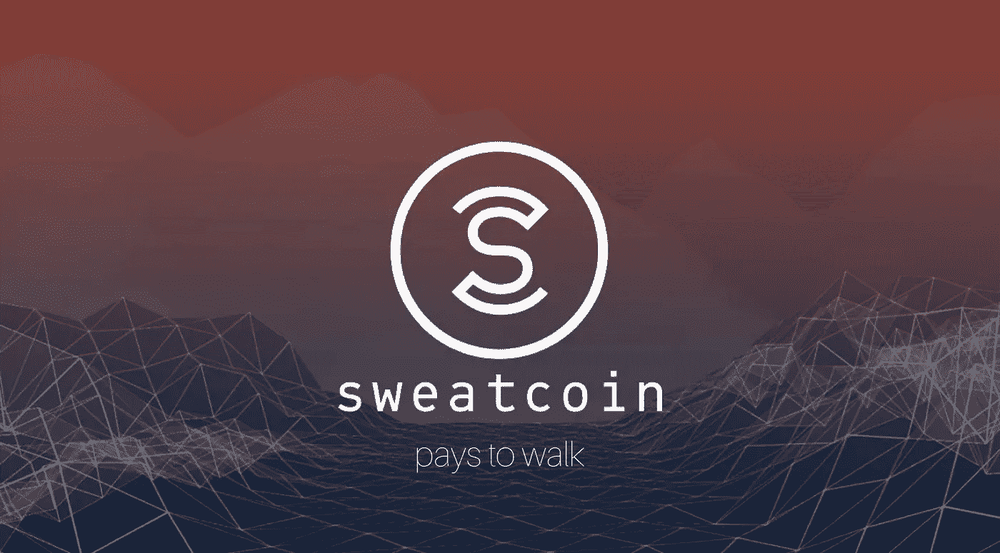

# 运动硬币——在 13 楼为密码行走。2022 年 9 月！

> 原文：<https://medium.com/coinmonks/sweatcoin-walk-for-crypto-on-13-september-2022-84c6ce602d94?source=collection_archive---------4----------------------->

Image by [https://sweatco.in/i/atchantix](https://sweatco.in/i/atchantix)

2022 年 9 月 13 日是这一天。Sweatcoin 终于推出了加密货币 SWEAT。到目前为止，通过行走来收集运动币是可能的，但是这些只有在应用程序自己的商店里才有价值。

从 9 月 13 日起，将可以交换、发送、交易，当然还有赚取硬币。为了做到这一点，需要下载…