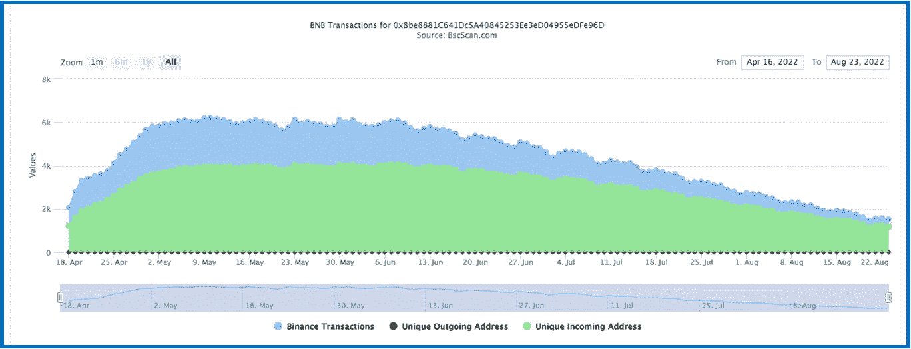
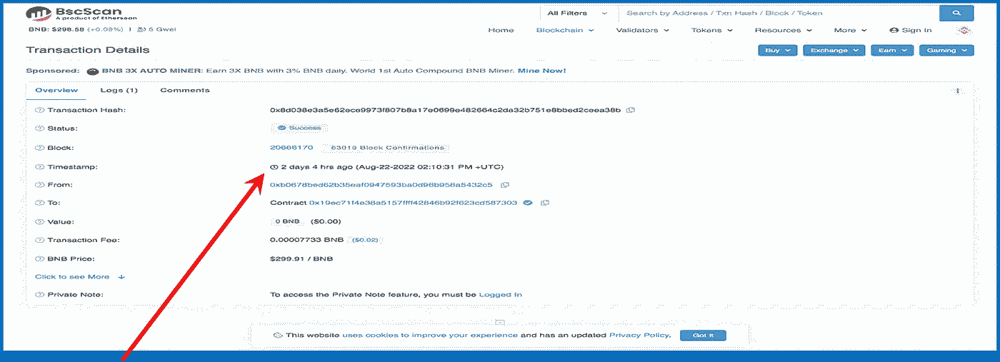
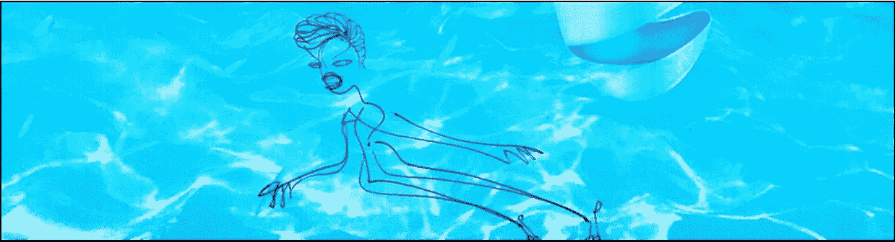

# 甜:侏罗纪农作物农民所有权放弃！

> 原文：<https://medium.com/coinmonks/sweet-ownership-renounced-3bce652e9610?source=collection_archive---------4----------------------->

“所有权放弃”可能会开创一个口袋改变加密项目的新时代。

The best of both worlds: The Crops Farmers meet up with Jurassic Dino & create a fabulous new love-child!

*现在一切都取决于 1&0……*

这周我很开心，因为在这个秘密空间的角落里，诚实很有希望融入到可持续发展中，我很高兴能搭上顺风车…

## 两全其美

> 在我的世界里，一个最成功的零花钱矿工开发团队已经开始使用我最喜欢的被动收入加密赌注协议之一…
> 
> 美丽的混血结果是出生三天的[侏罗纪农作物农夫](https://jurassicbusd.cropsfarmer.online/?ref=0x024ee915c2BF9d12F98b750119051A752e18CAa0)。

我很兴奋。这似乎是一个伟大的项目，我觉得随着时间的推移，它会提供巨大的被动收入收益。毫无疑问，这不是一个快速致富的场景。它每天有 5%的投资回报，内置了一系列智能的可持续/长寿和反鲸功能。所以你不会每天都有 5%的收入，但你会的。关于这一点，请继续往下看…

该项目的最好部分可能是开发商的声誉…

An accomplished earlier project from this team — BUSD Crops Farmer — still continues(-ish)…Nicely productive over the last 5 months counts as success in this DeFi corner.

> [作物种植者](https://home.cropsfarmer.online/)开发团队拥有长期&小型采矿协议的成功历史。这对二人组的创作者跨越了无数个区块链，一路建立了他们的声誉。他们的一些协议比其他协议持续的时间更长；然而，没有一个是地毯拉。
> 
> 每一个连续的项目似乎都在一点点接近最难以捉摸的 DeFi 独角兽:永动机投资回报率口袋改变采矿机，这是我们都梦想…至少我有。

Above is the BUSD Crops Farmer BscScan Analytics graph. It had a fantastic run & is working itself toward the natural end of its contract. Another protocol lead the way — see the deep dives into the progenitor of this protocol: [Running up that hill](/coinmonks/running-up-that-hill-with-no-problems-f268d879a206).

## 成功的项目

上面是一个很好的例子。来自 BUSD 作物农民项目的步行交通图——衡量唯一的传入地址，或项目的新投资者——显示了矿工的自然生命周期。项目的 TVL 慢慢减少，回报也随着时间减少。这张图描绘了协议在绿色山丘的另一边舒适地走着，来到一个美好、自然的结论/合同结束(很快)。

这是他们工作的一个例子:好的、强有力的合同持续，然后是——也许不是——不可避免的衰落。

这个新协议有什么不同？

## 仪表板

我爱上了另一个项目中一个非常酷的——可能非常可持续的——仪表盘投资平台，并从中获得了很多投资回报。有一段时间，它被[克隆&令人作呕地分叉](/coinmonks/attack-of-the-forking-clones-302b5718d0f5) — &现在依然如此。

> 一个问题是:它的合同很容易被邪恶的开发商篡改，制造了一个又一个的丑闻。一些新的矿工是合法的，然而，这个协议不再值得信任了…我当然不信任它。

出现了侏罗纪农作物农民…再次，如果有可能融合一个诚实的开发者与一个可持续的和成功的口袋改变加密矿工，我准备继续阅读…

**邪恶的丑闻** & **螺旋式下降 TVL 的**是导致许多 DeFi 投资项目失败的两件事。我们都在这里寻找诚实的可持续发展的项目。

> 我能相信种植庄稼的农民不会稍微扭曲合同，最终破坏这个项目吗？**是的，我确实信任他们。**

## 原因如下:

合同一生效，他们就放弃了所有权。把手拿开。

> 没有人可以干预 TVL 号码，或者将账户持有人列入黑名单，或者攫取最后的 10 万英镑&在别的地方重新开始。如果契约所有权确实被放回到永久契约协议中，那么那些不幸的事情就不会在这里发生。

请注意页面顶部侏罗纪农作物农民仪表盘上的蓝色所有权放弃徽章。点击它会变成蓝色，并把你带到下面的页面，在币安区块链。根据不可改变的合同，开发商在 3 天前放弃了全部所有权

Ownership Renounced — the contract no longer has the hand of a human guiding it — it’s all up to the ones & zeros now…

放弃他们的所有权利益的农作物农民创造者说了很多。它告诉我，困扰这些袖珍改变矿工协议的 2 个主要问题中，至少有一个在这里得到了解决。拉地毯的问题感觉解决了。太好了。

> *我探索&剖析新的口袋变化加密赌注协议。我要么把他们分开，要么决定投资这个项目，鼓励他们的可持续性发展。这些矿工中很少有人会升到最高层；那些是我正在寻找的。*

## [侏罗纪农作物农夫](https://jurassicbusd.cropsfarmer.online/?ref=0x024ee915c2BF9d12F98b750119051A752e18CAa0)深潜:

投资前需要了解的一些但肯定不是全部的事情…

[**电报**](https://t.me/busdcropfarmer) **:** 电报组超级活跃——有 3420 个成员，在线的有 287 个，当时我是。

> 让我印象深刻的是，其中一名开发人员&合同审计员——Ryker Dane 和 George Stamp——正在主持这个小组。这什么时候发生过？！Ryker 提到 George 现在是平台的所有者，并且也执行了审计。很好。

**审计:**我的期望是，有了[乔治·斯坦普](https://georgestamp.xyz)协议的所有者&同时也是合同审计员，这里就不会有扯皮……利益冲突？值得怀疑——这两个人名声在外。他们的既定目标不是从不知情的人那里偷钱，而是提供一个将长期持续的平台，从他们所有的辛勤工作中创造正当的个人收入。

**白皮书:**我还没有找到这个项目的白皮书。然而，我已经读了从这个协议的最初克隆中产生的 3 篇论文，&它们都是相当重复的。再次强调，阅读《克隆协议的克隆》白皮书是糟糕的时间管理练习。

**Dashboard 投资平台:**这是我最初参与这个项目的原因。这是一个易于理解的仪表板——稍微摆弄一下，看看它是如何工作的。它让你知道什么时候复合——复合也不是在你面前:无论什么时候你准备好了，过一段时间，就去做；否则，如果你跳过天，你不会得到同样多的回报。它让你确切地知道你将在什么时候收到多少钱(扣除税款)。

> 几个月来，我一直喜欢使用这种仪表板，我的期望是，这种原型最终将成为完全可持续的零钱投资平台的未来模式。交叉手指表情符号…

## 快速数学

如上所述，有许多内置的安全措施有助于项目的可持续性和持久性。

如果我今天投资价值 100 美元的 BUSD 到《侏罗纪农作物农夫》, 4 个星期后我将收回全部投资回报，7 个星期后我的投资回报率将翻倍。

## 方法如下:

今天投资 100 美元&我每天复利一次(大约同一时间是有帮助的)。我的回报率是 5%，即每天 5 美元。一周后，我被允许提款:7 天 x 5 美元/天，第一周是 35 美元。

> 另一个可持续性特征在这里发挥作用&我可以取出一半的钱。我的另一半资金仍留在账户中，并被添加到下周的余额中。

因此，第**个星期**我收到 17.50 美元，减去 5%的出境税(可持续发展——该税将返回 TVL)，我的口袋里有**16.62 美元**，账户上还有 17.50 美元(剩余资金没有出境税)。

**第 2 周**，我的账户从第一周的 17.50 美元开始。我收到了 7 天的 5 美元/天，还是 35 美元。在第二周结束时，把它加到我账户上的 17.50 美元中，得到 52.50 美元。我可以提取其中的一半:26.25 美元减去出境税，第二周是 24.94 美元。

到目前为止，我口袋里总共有 41.56 美元。我的账户里总共还有 43.75 美元(17.50 美元+26.25 美元)。

普通的 35 美元加上 43.75 美元(我的账户上有多少)就是 78.75 美元。出口税后的一半**是:37.41 美元进口袋**。

三周加起来总共: **$78.97** 。

**第四周我的总投资回报率为 114.30 美元，即 114.3 美元的投资回报率。我已经赚回了我的钱，外加 14%的利息。但是这个项目才刚刚开始…**

> **缩放它；加一个零:**如果我今天投资 1000 美元，我希望在 9 月 15 日之前收回 1143 美元，外加 114.30 美元的利润。
> 
> 从今天(247，476 美元)开始，将 TLV 与 9 月 15 日锁定的总价值进行比较，这将是一个有趣的数字

## 需要注意的一点是:

更可持续:该协议在 3 倍投资回报后终止。在上面的例子中，我的 100 美元将使我得到 300 美元的回报；所以我口袋里有 400 美元。

**如果我不想停止怎么办**…用上面的例子，继续让你的钱赚更多钱的关键是:

> 如果我每 4 周再投资一次，而不是把每次提款都装进口袋，我就增加了我的复利能力，这为我进一步推动了合同。此后的每 4 周复利会进一步推动合约。只要合约还在继续，我的收益也会继续，用这种复利方法。

## 我的令牌学

*注意:当我成功地从一个协议中赚了钱——不一定是我的全部投资回报，只是现在——我会写下我的经历，就像这样。*

> *如果你喜欢这个协议&决定投资进去，那就是我的目标——&我很激动。该项目的可持续性绝对受益于此。*
> 
> ***使用我的文章中的推荐链接将为我提供一点补偿&是让我知道这些对话是有益的一种奇妙方式。如果你使用我的推荐链接，谢谢！***

## **这是我做的……**

完全公开。该协议提供了 4%的推荐奖金。所以使用上面的例子:如果你使用我的推荐链接，并投资到该项目中，我将获得 4 美元，每投资 100 美元。

## 奇斯托索…

[JurassicCropsFarmer](https://jurassicbusd.cropsfarmer.online/?ref=0x024ee915c2BF9d12F98b750119051A752e18CAa0) 也很有幽默感(这也是另一个可持续发展的特征——想想吧！):>

**这有什么好笑的:**

> 因为**(聪明！)50%提款/50%再投资概念**，4 美元转介对我来说第一周是 2 美元，第二周是 1 美元；然后是 0.50 美元以下，直到它不再是一个整数。我想我会停止收取低于一美元的费用，因为到那时，汽油费就算扯平了…

显然，推荐奖励并不是任何人推荐这种零花钱矿工的理由。

> 我的理由是，我已经投资并相信这个协议，我希望它成功。
> 
> 我的期望是，这个仪表板，这个团队，可能会开创一个新时代的口袋改变矿工协议。我想在这里见证和投资。

Ever imagine investing hard-earned crypto pocket-change into something called Jurassic Crops Farmer? Me neither. However, here I am…

谢谢你走到这一步。我希望你能在这篇关于我们生活的疯狂密码世界的评论文章中找到一些有价值的东西。我不是财务顾问；我喜欢研究密码。

总是很高兴有你跟着我

*我鼓励朋友们只玩你不需要的东西。又是 Thx。*

Shameless Plug! Borrowed from @shamelesslyplugged

# 不要脸塞:

> 如果你知道 DeFi 的这个角落，那么想象一下[的侏罗纪农民](https://jurassicbusd.cropsfarmer.online/?ref=0x024ee915c2BF9d12F98b750119051A752e18CAa0)类似于[的滴滴网络](https://drip.community/faucet?buddy=0x024ee915c2BF9d12F98b750119051A752e18CAa0)，但是每天有 5%的回报，而不是每天 1%的回报。我信任滴滴，因为它已经存在了相当长的时间，拥有一个不断壮大的支持者和投资者群体。
> 
> 同样，我信任作物种植者组织，因为他们已经存在很长时间了，有一群忠实的支持者和投资者。

然而，滴滴有许多不同的特点&没有终点。只要我继续定期复利——除了获得定期利润——我从项目中获得的收入就会继续上升。这是我最喜欢的被动收入…

# 稍微慢下来…

我和其他人一样欣赏高风险/高回报的协议。

不过，最终让我感到相当欣慰的是，投资时的压力有所减轻。滴滴已经是可持续发展了……

> 我把这个协议称为我的退休账户:

Drip Community

> [滴滴网络的水龙头](http://drip.community/faucet?buddy=0x024ee915c2BF9d12F98b750119051A752e18CAa0)是一种低风险、高回报的合约，运作方式类似于高收益存单，每天支付 1%的投资回报，最高可达 365%。投资者可以通过存款&复利&扩展他们的收益。我将很快进入更深的潜水…

我是**隐孢子虫滴注**团队的一员。我们是一个欢迎和乐于助人的全球滴滴爱好者社区。我们在自己的私人电报小组上交流，分享点滴提示、策略、突发新闻等等。如果你想加入对话，请加入 Cryptozoa 团队(购买进入[滴滴](http://drip.community/faucet?buddy=0x024ee915c2BF9d12F98b750119051A752e18CAa0)并使用上面我的好友地址)，然后前往 [Cryptozoa 电报网关](https://t.me/+58cJQwtqVoU4MTc5)。让值班管理员知道**克鲁卡斯**派你来的——然后一旦你上船，找到我并给我发短信，我很乐意收到你的来信！

**滴光纸**——[https://www.docdroid.net/0i3RJTu/drip-lightpaper-pdf](https://www.docdroid.net/0i3RJTu/drip-lightpaper-pdf)

如果我启发了你&你希望我成为你在滴滴网 *( &在财务自由之旅)*的好友，我将不胜荣幸！**注:**没有一个哥们儿就不能投资*。*

我的推荐链接:[0x 024 ee 915 C2 BF 9d 12 f 98 b 750119051 a 752 e 18 CAA 0](http://drip.community/faucet?buddy=0x024ee915c2BF9d12F98b750119051A752e18CAa0)

我承诺做你的点滴指导:我会成为你的好伙伴和良师益友，鼓励你，帮助你提高收益和投资回报率。我们在 Telegram 上还有一个非常活跃的私人小组，在那里你可以得到其他滴滴爱好者的支持。

# 如何从滴滴开始

1.  去[https://DRIP . community/fountain](http://drip.community/faucet?buddy=0x024ee915c2BF9d12F98b750119051A752e18CAa0)用 **BNB** 换**滴滴**。
2.  然后进入:[https://drip . community/水龙头](http://drip.community/faucet?buddy=0x024ee915c2BF9d12F98b750119051A752e18CAa0)，向下滚动获得好友。
3.  你必须在**推荐**部分输入一个**好友地址**。考虑为您的**好友** : [添加我的地址 0x 024 ee 915 C2 BF 9d 12 f 98 b 750119051 a 752 e 18 CAA 0](http://drip.community/faucet?buddy=0x024ee915c2BF9d12F98b750119051A752e18CAa0)(如果您使用上面的链接到达那里，您可以单击“检测到好友”按钮。
4.  然后向上滚动到存款，至少存入 **1 滴**(确保你有足够的 **BNB** 来支付油费。)
5.  你在 [**上设置了**](http://drip.community/faucet?buddy=0x024ee915c2BF9d12F98b750119051A752e18CAa0) **。**准备好每天领取 1%的红利吧！

又是 Thx。下次见。

我哥们什么都画！我称之为他的账本系列。我喜欢下图…

Rex & Ruben

> 交易新手？尝试[加密交易机器人](/coinmonks/crypto-trading-bot-c2ffce8acb2a)或[复制交易](/coinmonks/top-10-crypto-copy-trading-platforms-for-beginners-d0c37c7d698c)