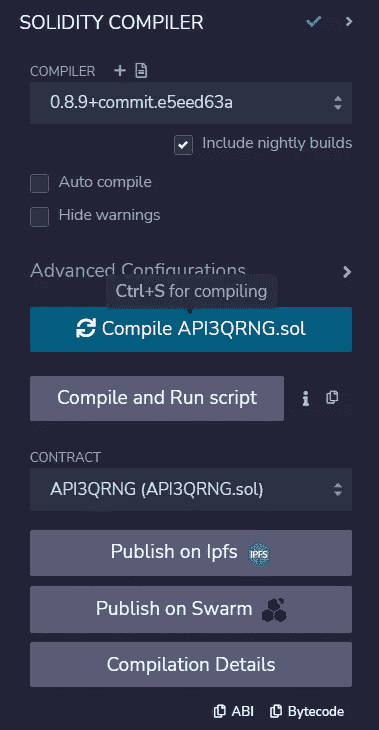
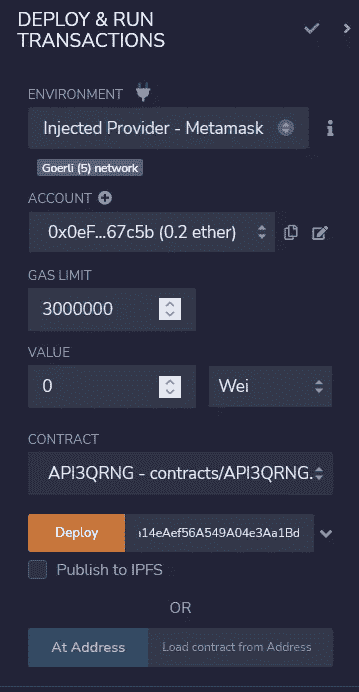
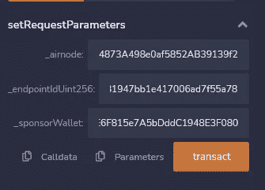
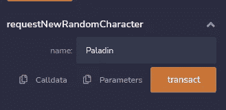
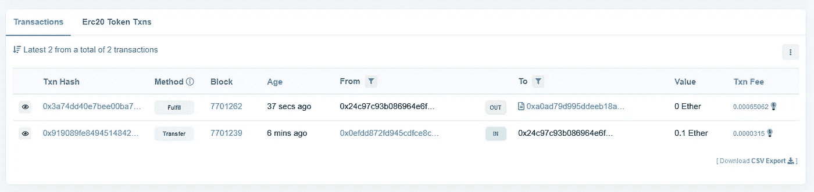
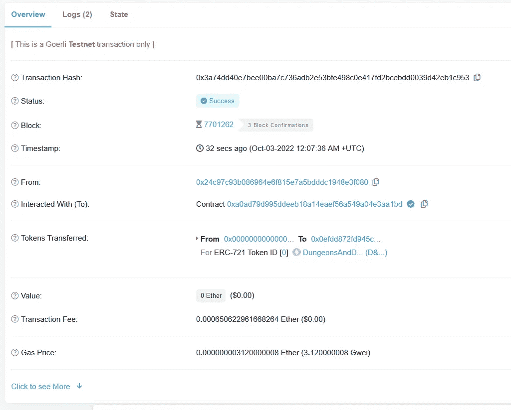
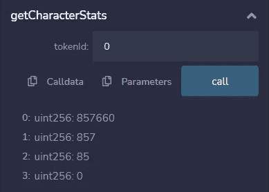

# 从 VRF 链环切换到 API3 QRNG

> 原文：<https://medium.com/coinmonks/switching-from-chainlink-vrf-to-api3-qrng-b7939c5a4760?source=collection_archive---------10----------------------->

从 Chainlink VRFs 切换到 API3 QRNG 以生成 NFT，并在您的薄荷糖中利用真正的量子随机性。


Photo by [Yassine Khalfalli](https://unsplash.com/@yassine_khalfalli?utm_source=medium&utm_medium=referral) on [Unsplash](https://unsplash.com?utm_source=medium&utm_medium=referral)

> 我在上一篇文章中已经讨论了在智能合约中产生真正随机性的问题。这将是一个更高级的版本。这里可以看[。](https://vanshwassan.medium.com/a-guide-to-using-anus-quantum-random-number-generator-in-your-smart-contracts-21be5bed5aba)

# 介绍

在本教程中，我们将制作一个简单的铸造合同，并为一个随机的龙与地下城角色铸造一个 NFT，利用 API3 的量子随机数生成(QRNG)赋予它属性/统计数据来显示它的力量、法力、智力和经验。我是在浏览 Patrick Collins 的教程时得到这个想法的，但是我们将利用 API3 的 QRNG，而不是使用 Chainlink 的 vrf 来生成和设置随机属性。

要阅读更多关于 qrg 是什么和它是如何工作的，点击[这里](https://docs.api3.org/qrng/)。

> [API 3 QRNG 服务是免费的，并且在所有主要的 EVM 兼容测试网上运行。](https://docs.api3.org/qrng/reference/chains.html)

帕特里克·科林斯写的[指南](https://blog.chain.link/random-numbers-nft-erc721/)使用链环 VRF 为角色生成随机属性。我在上一篇文章中已经讨论了使用第三方 oracle 网络的缺点，我还发现在您的智能合约中设置链接令牌支出限制有些复杂(这不是免费服务)。但是，API3 QRNG 是完全免费的，集成起来容易得多。您不需要在智能合同中设置任何支出限制，而是只需为一个简单的赞助商钱包提供资金，该钱包使用链条的本地天然气令牌来支付所有天然气成本。

# NFT 合同编码

让我们从创建一个具有五个主要属性的基本角色开始:

`strength`、`intelligence`、`mana`、`experience`和`name`。我们将把所有这些属性存储在一个字符结构下。每当我们创建一个新角色时，这些属性都会被随机设置。

然后，我们定义一个字符数组，该数组定义了契约中存在的所有字符。

我们已经导入了 *RrpRequesterV0.sol* ，它是链上 [RRP 协议契约](https://docs.api3.org/airnode/v0.8/concepts/)*(*[*airnoderrpv 0 . sol*](https://docs.api3.org/airnode/v0.8/concepts/#airnoderrpv0-sol)*)*。它负责向 QRNG Airnode 发出实际的完整请求。发出请求后，离线 Airnode 获取事件日志，并获得请求的随机数，然后对请求者执行回调。

我们还从 OpenZeppelin 进口了 *ERC721.sol* 和 *Ownable.sol* 来制造和铸造 NFT。

`airnode`是 QRNG Airnode 的地址，`endpointIdUint256` 指定 QRNG API 路径的端点，`sponsorWallet`将是发出实际请求的钱包。我们以后需要资助这个钱包。

`expectingRequestWithIdToBeFulfilled`映射将跟踪我们的请求，并检查它是否已经完成。

`requestToCharacterName`映射跟踪每个随机性请求，因为它与角色的名字相关联。

每个角色都有一个唯一的 ID 来代表它，它被映射到`requestToTokenId`。与铸造 NFT 的地址联系在一起。

构造函数将接受`_airnodeRrp`地址作为参数。

ERC721 有两个参数，令牌的名称和符号。这里的名字是`DungeonsAndDragonsCharacter`，符号是`D&D`。

*setRequestParameters* 函数将设置请求参数。

*requestNewRandomCharacter*函数将向 Airnode 请求随机性。它将角色的名字作为输入。然后，它调用 [AirnodeRrpV0.sol](https://docs.api3.org/airnode/v0.8/concepts/#airnoderrpv0-sol) 协议契约的 *makeFullRequest* 函数，该函数将请求添加到其存储中，并返回一个`requestId.`。`requestId`将用于设置函数中的所有映射。

一旦请求被发送到 Airnode，我们现在等待它被完成，这将通过函数*fulfillnommandations*来完成。

目标链外 QRNG [Airnode](https://docs.api3.org/airnode/v0.8/concepts/airnode.html) 收集请求，并使用随机数(`qrngUint256`)对请求者执行回调(使用*fulfillmonrandoms*函数)。

使用`qrngUint256`，我们现在可以为我们的角色设置属性，并将角色推送到数组中。

最后，我们将铸造令牌，并把它连同它的 *Id* 一起发送到发出随机请求的地址。

*getCharacterStats* 是一个视图函数，它将获取角色的统计数据。它接纳了`tokenId`。

我们现在可以向前推进，部署和编译智能合同。

# 编制和部署 NFT 合同

前往 [Remix IDE](https://remix.ethereum.org) ，制作合同并粘贴[API3QRNG](https://gist.github.com/vanshwassan/48baa25995ef3c556ebf208c725f7a86)代码。现在点击仪表板右侧的 compile，编译智能合约。



我们将在 Goerli 测试网上部署它。确保你的钱包里有足够的 testnet ETH 来部署合同并在以后为`sponsorWallet`提供资金。你可以从这里买到一些。

开始部署和运行事务，并选择 Environment 下的 Injected Provider-meta mask 选项。连接您的元掩码。确保你在格利测试网上。



`_rrpAddress`号是主*号航母。*RRP 合同已经在链上部署。您可以在这里查看您的具体链条[。](https://docs.api3.org/qrng/reference/chains.html)

填写`_rrpAddress`并点击部署。确认元掩码上的事务，并等待它部署请求者契约。

# 调用合同

当您的 *API3QRNG* 被部署后，前往 Deploy & run transactions 并在 Deployed Contracts 下点击您的请求者的下拉菜单。

现在选择 *setRequestParameters* 下拉菜单来设置所有参数。



你可以在这里找到*_ air node*(qrg Provider air node 地址)和*_ endpointiduint 256*[。](https://docs.api3.org/qrng/reference/providers.html)

*_sponsortWallet* 是您的钱包，由请求者合同地址、Airnode 地址和 Airnode xpub 派生而来。钱包用于支付汽油费用以获得一个随机数。必须使用管理 CLI 中的命令[derive-sponsor-wallet-address](https://docs.api3.org/airnode/v0.7/reference/packages/admin-cli.html#derive-sponsor-wallet-address)派生赞助商钱包。使用命令输出的*赞助商钱包地址*的值。确保你的钱包里有足够的测试 ETH，因为它会发出实际的请求。

点击交易按钮并确认交易以设置参数。

现在我们可以前进，要求一个随机字符。为此，点击*requestNewRandomCharacter*并给你的角色起个名字。点击交易。



现在，你可以前往[https://goer Li . ethers can . io](https://goerli.etherscan.io)查看你的*赞助商名单*中的任何新交易。

> 您可能需要等待一段时间，因为 Airnode 调用 AirnodeRrpV0.sol 中的`fulfill()`函数，该函数将使用函数`fulfillFunctionId`在`fulfillAddress`回调请求者契约，以交付`data`(随机数)。



在这里，我们可以看到最新的*完成*交易。你可以点击它，看到 D & D NFT 已经被铸造出来，并发送到你的地址。



要检查你的角色统计数据，回到 Remix，点击 *getCharcterStats* 并输入你的 tokenId(本例中为 0)



这里，这些是我们角色的属性。

所以我们请求并利用量子随机性创造了一个新角色 NFT。

查看 [Github repo](https://github.com/vanshwassan/QRNG-NFT-Mint) 获取本指南中使用的所有代码。

阅读更多关于 [API3 QRNG](https://docs.api3.org/qrng/) 的信息。

```
**Any questions?** Check out [**API3’s Discord Server**](https://discord.com/invite/qnRrcfnm5W) and drop your queries there!
```

> 交易新手？尝试[加密交易机器人](/coinmonks/crypto-trading-bot-c2ffce8acb2a)或[复制交易](/coinmonks/top-10-crypto-copy-trading-platforms-for-beginners-d0c37c7d698c)