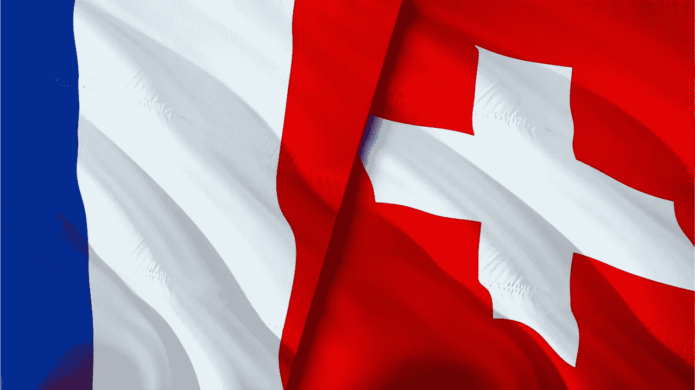
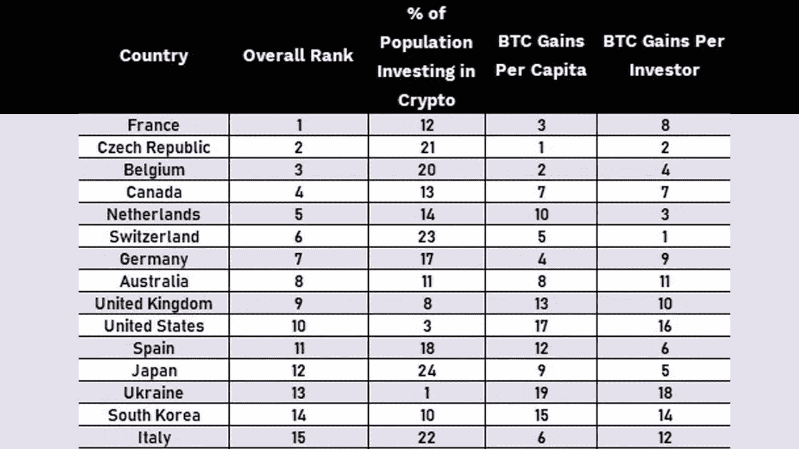

# 研究显示，瑞士拥有全球“最赚钱的比特币交易商”，而法国“是最好的比特币交易国”

> 原文：<https://medium.com/coinmonks/switzerland-has-the-most-profitable-bitcoin-traders-wordwide-while-france-is-the-best-bitcoin-252725c11aa5?source=collection_archive---------46----------------------->

投资和教育平台 Invezz 最近发表了一项研究，根据这项研究，瑞士拥有全球最赚钱的比特币交易商。这是根据 Chainalysis、Worldometers 和 Triple-A 的数据得出的，这些数据帮助 Invezz 根据最赚钱的比特币交易给每个国家打分。

# ***研究人员按国家对最好的比特币交易国家和最赚钱的比特币交易者进行排名***

*本周，invezz.com 的研究人员发表了一项研究，通过利用多个数据集的统计数据，研究了各国最赚钱的交易员。该研究的作者 Dan Ashmore 解释了一个来自 Chainalysis 的数据集，该数据集显示了 2020 年世界上 25 个国家实现的比特币收益。*

*这是这项研究的背景，因为 Invezz.com 研究团队还利用了 Worldometers 和 AAA 的统计数据。尽管数据显示瑞士目前拥有全球最赚钱的* ***比特币交易商*** *。法国是“最好的* ***比特币交易*** *国家”中排名第***的国家。**

**法国在该国投资于加密的百分比中排名第 12 位(3.3%)，但在人均比特币收益***和人均比特币收益***中分别排名第三和第八，分别为 275 美元和 13 美元。阿什莫尔的报告解释说，虽然大多数其他国家在其他类别中排名很好。法国是唯一一个在三个方面都高于平均水平的国家。****

*****“法国蝉联最佳比特币交易商称号，瑞士拥有最赚钱的交易商，每名投资者收益 1268 美元”Invezz.com 研究*****

***紧随法国之后的国家名单上的* ***捷克*** *和* ***比利时*** *分别是比特币交易最好的* ***和*** *国家的第二和第三名。然后还有******荷兰*******瑞士*******德国*******澳大利亚*******英国***乌克兰*******韩国*** *和**意大利***** *其他值得注意的国家分别包括* ***阿根廷*** *，* ***越南* 在所有列出的国家中，瑞士的 ***比特币交易商*** *统治了烤据****BTC*******收益*** *而言。************

**“瑞士拥有最赚钱的交易商，每个投资者的收益为 1268 美元，然而该国只有 1.8%的人投资于加密，他们被挤到了第六名。捷克共和国也类似”，Invezz 研究的细节。但瑞士和捷克共和国在 24 个国家中分别排名第 23 位和第 21 位，就投资于加密的人口比例(1.8%和 2.2%)而言，它最终扼杀了这些机会，”安石的报告说。invezz.com 研究员总结道:**

*“法国是最好的比特币交易者。但欧洲大陆的水中肯定有什么东西，因为他们在榜首的统治地位是显而易见的。”*

> *交易新手？试试[密码交易机器人](/coinmonks/crypto-trading-bot-c2ffce8acb2a)或者[复制交易](/coinmonks/top-10-crypto-copy-trading-platforms-for-beginners-d0c37c7d698c)*