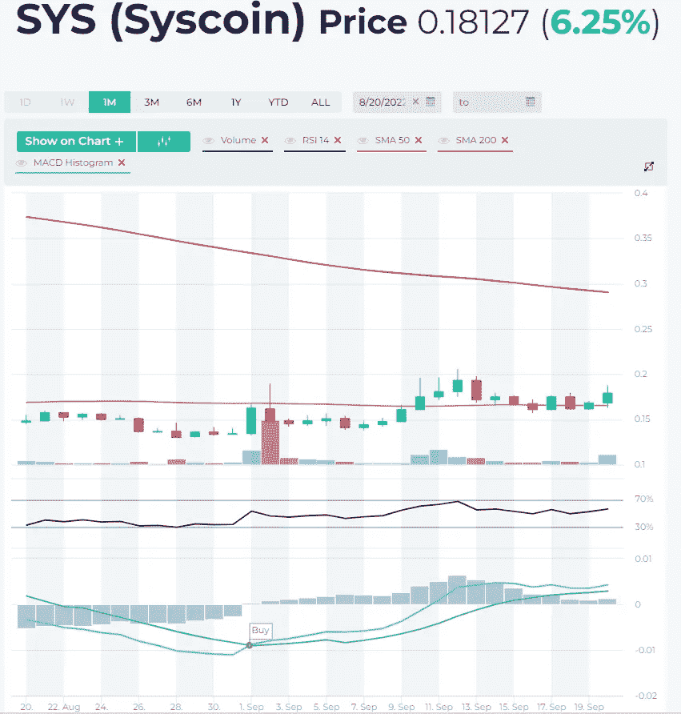
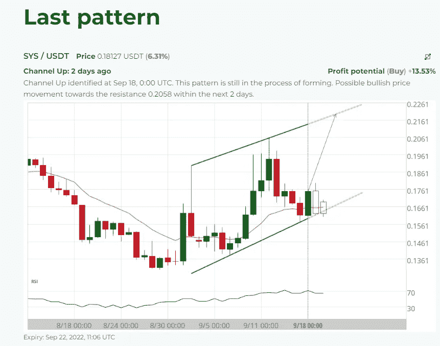
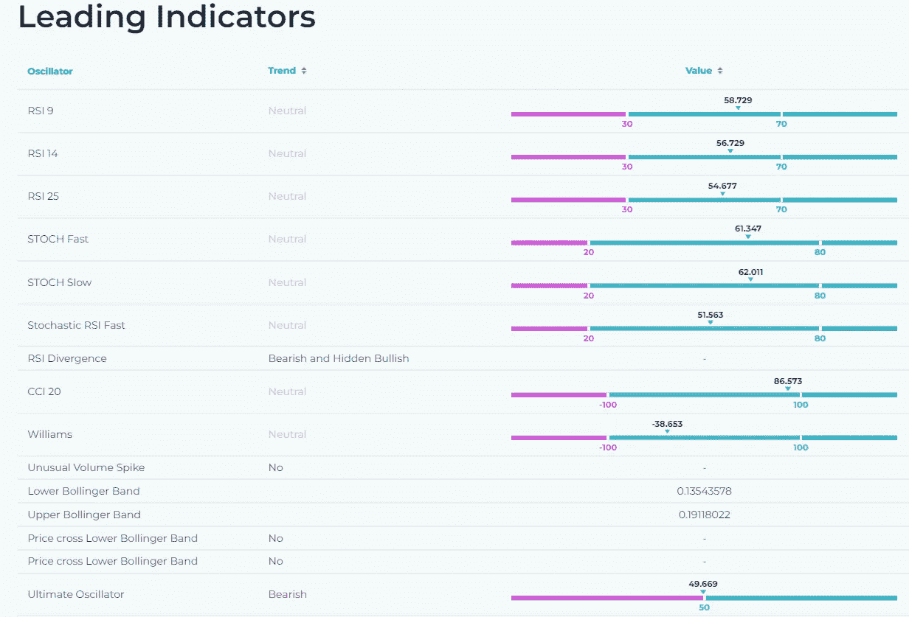
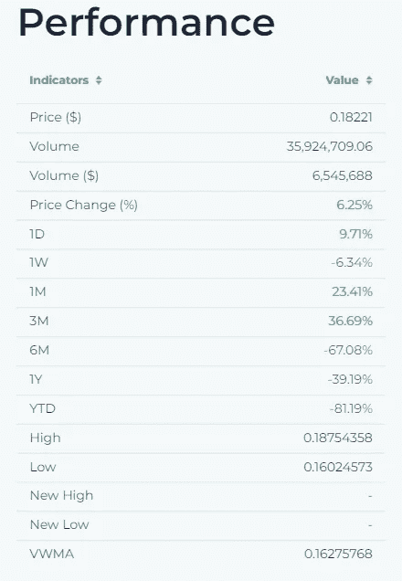
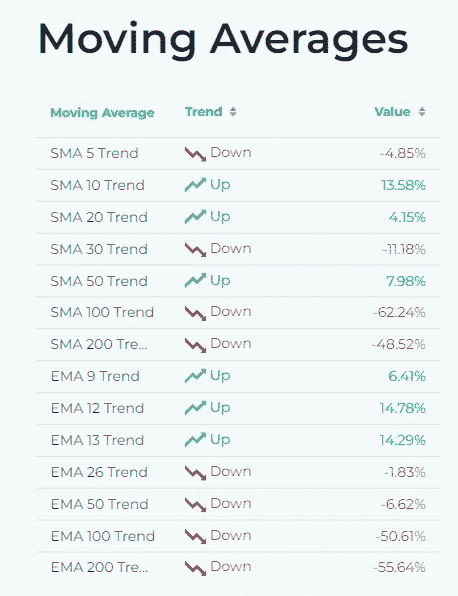
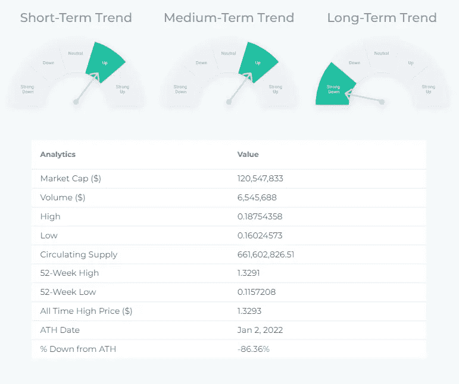
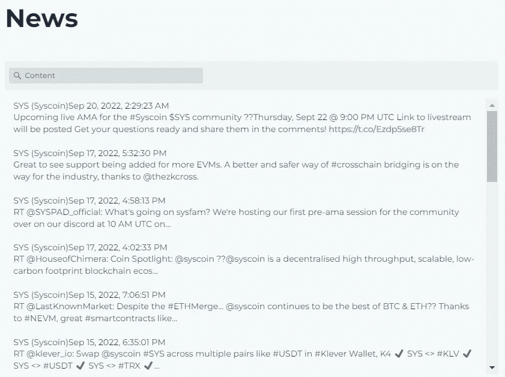

# 价格图表，图表模式，技术指标，新闻…

> 原文：<https://medium.com/coinmonks/sys-syscoin-price-chart-chart-patterns-technical-indicators-news-21e3f7445460?source=collection_archive---------35----------------------->

## 一个强大而安全的可编程区块链开发平台 Syscoin 试图集成比特币和以太坊的最大功能。交易费用便宜 96%的 100%以太坊兼容智能合约也与比特币融合，作为工作安全的证明。

## 除了提供公共去中心化区块链、开发平台和令牌平台之外，Syscoin Platform (SYS)还为令牌化资产提供高吞吐量和跨链互操作性，为 Syscoin 平台令牌(SPT)提供以太坊智能合约，为其他区块链和 DLT 提供可扩展性解决方案。

## Syscoin 平台旨在通过合并挖掘、简单的令牌创建和减少网络膨胀的布局来提供合理的费用和安全性。

## Syscoin 的价格图表(1 个月间隔):

Source: [altFINS](https://altfins.com/screener)

Source: [altFINS](https://altfins.com/screener)

Source: [altFINS](https://altfins.com/screener)

Source: [altFINS](https://altfins.com/screener)

> 交易新手？试试[加密交易机器人](/coinmonks/crypto-trading-bot-c2ffce8acb2a)或者[复制交易](/coinmonks/top-10-crypto-copy-trading-platforms-for-beginners-d0c37c7d698c)