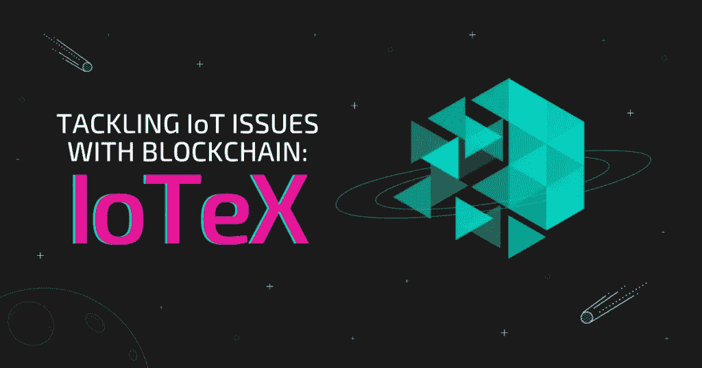

# 用区块链解决物联网问题:IoTeX (IOTX)项目分解

> 原文：<https://medium.com/coinmonks/tackling-iot-issues-with-blockchain-iotex-iotx-project-breakdown-e81c11851ec1?source=collection_archive---------17----------------------->

IoTeX 是第 1 层区块链，专注于人类和机器之间的交互。区块链利用物联网技术，也与以太坊虚拟机(EVM)兼容，这有助于 dApp 的开发。IoTeX 还声称是市场上最快、最安全、最可扩展的区块链平台。

这个区块链网络试图提升物联网(IoT)生态系统。换句话说，它旨在为数十亿设备和分散式应用(dApps)提供物理和数字支持。本页将教你需要了解的关于这个物联网相关区块链的信息，包括它是如何工作的，以及它的独特之处。你也会发现这个项目是否是一个合适的投资。

# IoTeX 是如何工作的？

IoTeX 对其网络的可扩展性和效率引以为豪。该协议主要通过同时运行在几个指定的区块链上来实现这些功能。它的主根链管理所有其他独立的链。这样，网络可以尽可能地最大化生产力。

类似地，IoTeX 由 80 多个代表监管，包括 DraperDragon、Blockfolio 和币安。它的 IOTX 令牌支持智能合约，并允许持有者参与赌注和治理。作为 EVM 兼容的区块链解决方案，IOTX 支持不断扩展的智能设备、dApps 和数字资产生态系统。该团队设想未来所有物联网设备都可以在 IoTeX 区块链上注册其数据和操作。

# IOTX 是用来做什么的？

IoTeX 已经在现实世界的应用程序中使用，例如 Pebble 和 Ucam 的开发。Pebble 是一种数据解析设备，可用于实时跟踪 IoTeX 区块链上的任何对象。同样，Ucam 是一个总部位于区块链的家庭安全摄像机，它采用端到端加密来保护您的个人视频。

此外，IoTeX 区块链支持 ioPay 和 ioTube 等服务。此外，它的生态系统为迪菲和 NFT 地区的许多 dApps 提供了动力，包括 Mimoswap 和 PixieWorld。

同样，物联网加密公司也打算通过将真实世界的数据引入其生态系统来引入一种新的分散式公用事业。例如，通过 IoTeX，用户可以根据现实世界的行动获得一些 IOTX。

反过来，IOTX 令牌可以在整个 IoTeX 设备和市场网络中进行交易、交易或使用。此外，IOTX 利益相关方将拥有参与治理的投票权。

# 是什么让 IoTeX 独一无二？

IoTeX 生态系统的独特架构是其最显著的特征之一。它的设计是在几个可互操作的区块链上委托和操作，这使它与大多数协议大不相同。

此外，它的网络由许多专门的层组成，如分散的身份识别、真实世界的数据 oracles 和安全硬件。所有这些加起来使 IoTeX 成为一个全面的生态系统。

IOTX 具有内置的隐私系统，使消费者能够更好地控制自己的个人信息。它还为消费者提供了将他们的数据货币化的选择。所有这些都是其效率和可伸缩性背景下的重要属性。

# IoTeX 的创始人是谁？

IoTeX 始于 2017 年的一行代码，现已成为当今最著名的区块链之一。注重隐私的区块链是由四个受欢迎的人创立的。Raullen Chai 在谷歌和甲骨文等科技巨头担任技术职务后，与他人共同创立了 IoTeX。在组建 IoTeX 之前，他的最新职位是优步的密码学主管。

另一位联合创始人是孙静，他曾在几家大公司做过投资人。她还担任过 Rippling、Theta Labs 和 Silver.tv 的天使投资人。Xinxin Fan 也是 IoTeX 的创始成员，拥有 15 年的密码学研究和行业经验。前研究科学家和工程经理 Qevan Guo 是最终的创始成员。

# 发展和路线图

IoTeX 是为了在未来的机器经济中保护数百万用户的数据和设备而从头开始创建的。从那以后，它的技术以惊人的速度经历了巨大的进步。

IoTeX 于 2018 年 1 月举行了私人出售，并在 ETH 筹集了 2500 万美元。IOTX 社区的另一个值得注意的事件是 2019 年 mainnet alpha 的推出。同年，它还推出了 mainnet 测试版。生态系统的最新发展包括 burn-drop 初始化以及 Ucam 和 Pebble Tracker 的推出。

该团队目前正在开发 machine fi——他们试图为 Web3 的未来做准备。IoTeX 还打算将机器资源金融化以提供价值，因为它相信机器将在不久的将来成为主导产业。

根据路线图，MachineFi 市场将于今年晚些时候，即第三季度和第四季度推出。最后，该团队计划在年底前开发一个跨链数据桥。

# IoTeX:主要特点

IoTeX 解决了随着区块链中节点和事务数量的增长而出现的可伸缩性问题。它利用了四个关键组件:

# 滚动式 dpo

Roll-DPoS consensus 是委托利益证明(DPoS)的变体，旨在支持物联网的高可扩展性。这与 DPOS 不同，因为 Roll-DPoS 每小时随机选择一些社区投票最高的代表进行挖掘。该系统在保持良好性能的同时，显著提高了网络的安全性和分散性。

# 第 2 层链

第 2 层链的使用使 IoTeX 的区块链区块链网络成为可能。第 2 层链支持添加基于不同加密货币的不同用例及应用。它通过由同一组随机选择的代表建立的相互协作的信任来实现这一点。这进一步导致子链的简单创建，以包括不同的物联网设备。

# 边缘计算

边缘计算是指让计算和数据存储更接近数据的来源。在 IoTeX 生态系统中拥有这一功能有望缩短响应时间并节省带宽。这种区块链支持边缘计算，同时使用第 2 层链构建注重隐私的 dApps。

# 跨网络通信

IoTeX 的根链通过促进与所有子链的通信来提供跨链交互和治理。跨链通信涉及一个或多个区块链之间的数据交换。块终结机制是指构造良好的块的不可逆性，它支持该过程。这确保了其操作期间的隐私。

# IOTX 标记组学

目前有 95.4 亿个 IOTX 令牌在 6 月/22 日流通，当前总供应量为 96 亿个令牌。IOTX 令牌的供应量有限，固定在 100 亿。在撰写本文时，IoTeX 的市值也只有 2.72 亿美元。

# IoTeX:利弊

就像任何其他加密货币项目一样，IoTeX 有很多优点和缺点。

# 赞成的意见

## 每笔交易成本低

该协议为用户提供了快速、安全和透明的交易。此外，IoTeX 的第 2 层链有助于区块链提高交易速度，同时保持最低成本。这反过来又吸引了更多用户加入 IoTeX 生态系统。

## 隐私

IoTeX 通过利用区块链和安全硬件来解决物联网的隐私问题。IoTeX 架构是为了在协议层面保护隐私而从头开始创建的。它基于适当的签名方案，使用设备上的随机性来保护用户的隐私和利益。

## 互用性

IoTeX 已经为人和机器创建了独一无二的分散身份系统。这意味着人和设备可以直接相互交易，因为他们的身份可以跨平台互操作和标准化。

# 骗局

## 不完全分权

Roll-DPoS 共识并不像看起来那样完全分散。共识仅选择管理区块链网络的特定授权人。

## 高波动性

加密货币市场的一个典型特征是其波动性，IOTX 也不例外。高市场波动性意味着更大的投资风险以及更高的成功回报。它非常不稳定，价格也会波动。

# IoTeX (IOTX)是一个好的投资吗？

IoTeX 有很大的潜力，有一天可能会引领 IoT 和区块链的潮流。在一个由数据引导和驱动的世界里，毫无疑问，IoTeX 的项目在其中占有一席之地。

还有其他一些因素表明，该项目和它的令牌可以有一个美好的未来。其中一个因素可能是备受期待的 MachineFi 的推出。随着使用物联网的设备数量持续增长，这一创新可能变得更加重要。

IoTeX 的通缩模型也确保了其代币的价值随着网络变得更受欢迎而增加。其丰富的团队成员也意味着 IoTeX 爱好者可以对该系统有一定程度的信任。区块链公司总部位于硅谷，由 30 多名顶级工程师和研究人员组成的全球团队提供支持。其团队包括来自谷歌、脸书、优步、博世和其他科技公司的专家。

物联网(IoT)可能会在未来影响全球，而 IoTeX 可能会在这一转变中发挥重要作用。如果出现这种情况，IOTX 的价值可能会大幅攀升，使 IOTX 持有者获利。此外，IOTX 目前的价格似乎非常低，比历史高点低了 80%以上。谁知道长期投资者的未来会怎样？

# 交换 IOTX

使用 Swapzone 交换任何加密资产都是轻而易举的事情，swap zone 会比较超过 15 个交易所，以确保您支付较低的交易费用。例如，要[购买带有 ETH](https://swapzone.io/currencies/iotex) 的 IOTX，请遵循以下简单步骤:

1.  访问 [ETH to IOTX](https://swapzone.io/currencies/iotex) 交流页面。
2.  输入您想要交换的 ETH 总量。
3.  选择最佳的 ETH-IOTX 汇率。
4.  单击“交换”按钮。
5.  输入您的钱包地址，以便在您的钱包中接收 IOTX。
6.  将您的 ETH 存入生成的地址。
7.  等待 ETH-IOTX 交换的执行。

# 结束语

IoTeX 是最独特的以隐私为中心的计划之一，到目前为止，它似乎已经发布了几个伟大的现实世界的产品。该项目预计将获得更多的蒸汽，现在区块链正在致力于其 Web3 机器经济，MachineFI。随着 Pebble Tracker 的全面推出，用户的参与度也可能会提高。

总的来说，IOTX 似乎有坚实的基础和良好的用例。它也很有可能被看好，尤其是考虑到它的市值很小。

> 交易新手？试试[密码交易机器人](/coinmonks/crypto-trading-bot-c2ffce8acb2a)或[复制交易](/coinmonks/top-10-crypto-copy-trading-platforms-for-beginners-d0c37c7d698c)