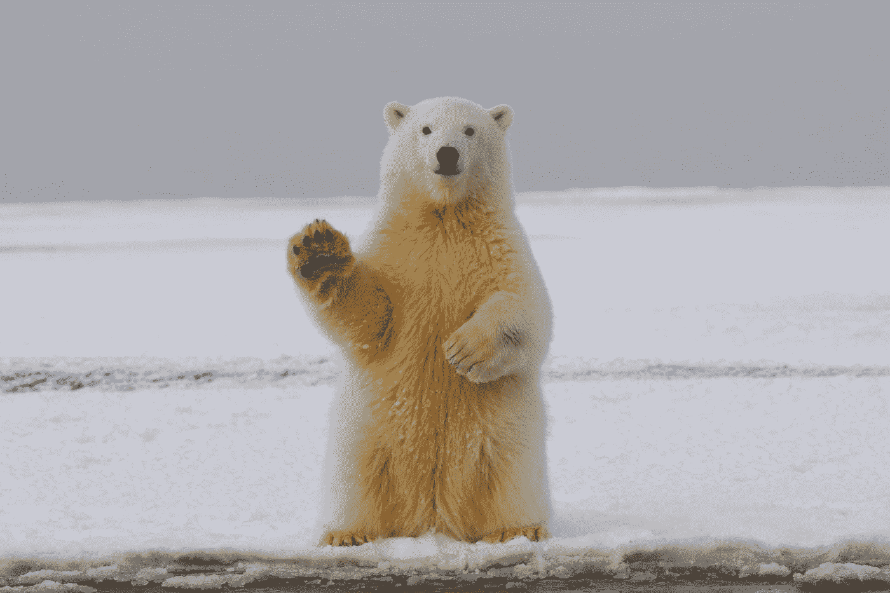
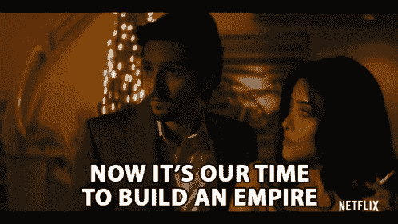
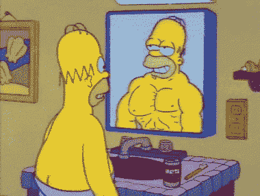
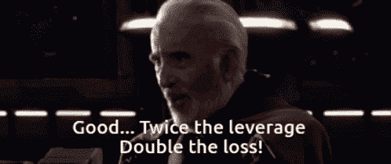
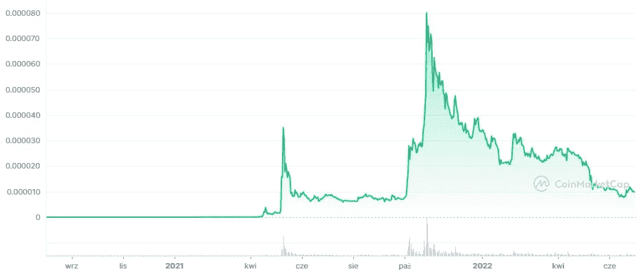
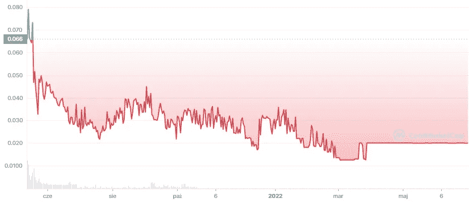
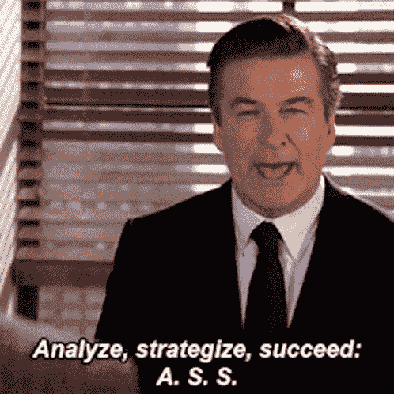
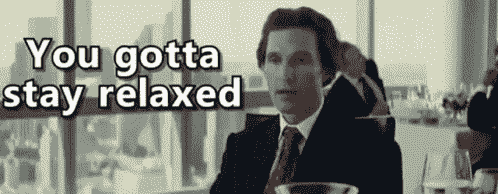
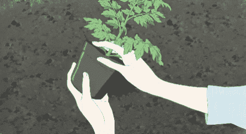

# 熊市——智者的祝福

> 原文：<https://medium.com/coinmonks/take-advantage-of-bear-market-244c8b5dde9?source=collection_archive---------31----------------------->

## 熊市是建立和学习的时候了，在空间和网络中与加密伙伴一起试验。

Photo by [Hans-Jurgen Mager](https://unsplash.com/@hansjurgen007?utm_source=medium&utm_medium=referral) on [Unsplash](https://unsplash.com?utm_source=medium&utm_medium=referral)

## **简介**

几年前，当我第一次登上这个舞台时，我无意中发现了一句大胆的话:“*熊市是福*”。老实说，我认为说这话的人疯了，或者不知所措，他在到处寻找一线希望。

现在我在这里，提出同样的要求。我的投资组合亏损如此之深，还是说我现在比新手时更了解市场了？

## 牛市结束了怎么办？

去度假。那是肯定的。给自己时间思考，冷静下来，远离市场。让你的情绪和心灵休息一下，充电。

好吧，你有几周或几个月的空闲时间。现在怎么办？

现在是时候回答一些问题了。

在资金停止流动之前，在加密领域是否有同行压力来创造一些东西？你是否感觉到有必要吸引尽可能多的新客户进入社交炒作领域？

我希望你在这里看到一个新兴的模式。

熊市给你时间来建立像样的项目，在这个领域建立真正的友谊，并为下一轮牛市创造一个持久的战略。

## **是时候回顾一下了**

> 没有对过去市场的了解，你就无法为未来做好准备。

现在我们有一些时间来思考和回顾我们在牛市中的行为，我们应该用它来浏览我们的投资或交易日志并分析内容。

如果你至今没有写日记，我强烈建议你写下以下问题。将它们写在纸上或笔记本上是至关重要的。写作帮助我们思考我们所写问题的答案。

你从最近的牛市中学到了什么？

你犯过哪些错误？

这次你会有什么不同的做法？

在你最大的胜败中，你有什么感觉，之后你做了什么？

你处理情绪的能力如何？

你跟随炒作而不是做出有意识的决定的例子有哪些？

## **真*你***

在你回答完问题后，我们可以从你的回答中提炼出所有的知识和经验。

从右到左阅读图表是一件轻而易举的事情——价格上升，价格一直下降。好吧，但这能证明什么？

它展示了真实的你。

当你审视自己在最近的牛市中特定时刻的表现时，你可以抛弃所有关于自己的错误形象。假设你有一个策略，你坚持你的策略有多好？

在这个残酷的揭露之后，你们中的一些人可能已经不再阅读这篇文章了。真相并不总是令人愉快的，关于市场需要记住的一件关键事情是。

如果你在扮演一个大男人时没有真实地面对自己的感觉和情绪，你的损失将是毁灭性的。与数百万的风险投资相比，你算什么？谁对市场有更好的了解和理解？

你对比特币了解多少？

你对以太坊了解多少？

那些项目的风险是什么？

你能对这些问题给出经过充分研究的答案吗？

如果没有，你什么时候才能为理解整个加密领域的核心项目打下坚实的基础？

好吧。所以现在我希望我们已经澄清了一些事情。让我们现在就行动起来，利用熊市为我们带来优势。

## **制定战略的时间**

> “战术就是知道在有事情要做的时候该做什么。战略就是知道在无事可做的时候该做什么。”
> 
> ~萨维利·塔尔塔科弗

我想不出更好的引语来说明战术大师(牛市中的快速行动)和大战略家(在恶劣的市场条件下制定长期计划)之间的区别。

上述问题的所有答案将为你写下策略打下基础。它必须是一份复杂的 10 页长的草稿，还是可以简化成几个句子？只要有利可图，即使在恶劣的条件下你也能坚持下去，这都没关系。

这不是长度的问题。它是关于封装基本规则的。

《孙子兵法》虽然篇幅不长，但却成为在许多领域创造战略的最佳资源之一。

你的策略应该包括什么？最重要的几点如下:

提取项目的规则

进入和退出位置的级别

投资组合管理—以百分比表示(%)

在哪里寻找高质量的信息

情绪管理——既赢又输

如果你被炒作或负面情绪冲昏了头脑，如何找回状态

好吧，你知道如何为下一个牛市建立策略，但是熊市的时候呢？剩下的时间，你应该专注于磨练你的技能和知识，以创造技能杠杆，而不是使用金融杠杆，如果你不是专家投资者，就不要碰金融杠杆。

## **是时候学习如何利用炒作了**

最近的牛市给了我们人们痴迷的被夸大的趋势。聚集了最多人的两个趋势是 NFT 和以狗为主题的硬币。

NFT 仍然是一个东西，并且会一直存在，不是以 PFPs 的形式，而是作为一种技术——你可能会在我关于 NFT 未来的文章中读到它。另一方面，像柴犬这样以狗为主题的硬币只有一个目的，那就是利用炒作赚钱。

Shiba Inu chart

所以，当我们发现炒作越来越多的时候，我们应该变得谨慎，离开这个空间，或者至少离开被炒作的区域？不一定。

渴望金融公司决定通过创造一种“Woofy”硬币来从炒作中获利。因此，如果像 YFI 这样的项目从炒作的趋势中获利，你为什么不可以呢？

Woofy chart

如果我们发现越来越多的炒作，知道这是另一个泵和转储场景？难道我们不能利用它并从中获利吗？事实上我们可以，但是要弹好它需要很多经验。

熊市给了我们时间来回顾最近的趋势，不带感情和信息的偏见。我们可以进行“事后”分析，寻找共同的特征和机制。我们分析的主题不应该仅仅是项目或趋势，还应该是“投资者”的心理和他们的市场行为。

除了柴犬，各种以狗为主题的硬币也出现了，多吉龙·马尔斯、比奇巴或柴犬的妻子，不一而足。如果你没有看到这些项目价格上涨并获得社会炒作的警报，什么会说服你意识到牛市进入了最后阶段？2018 年的耶稣硬币和 2021 年的柴犬的妻子有什么不同？

学会观察模式，评估市场状况。

> 项目和趋势在变，但情绪永远不变。

## **保持活跃的时间**

牛市结束了，情绪也结束了。空间变得越来越平静。音乐变得如此安静，对一些市场参与者来说，这意味着派对结束了。

但是，对于每个人来说，派对结束了吗？

还有比无聊和情绪低落的时候更适合研究和分析项目的时候吗？让空间升温、扰乱常识的“爆料”新闻数量接近于零。即使有一些积极的消息出现，人们也不能全信。

熊市是建立和寻找未来投资机会的时候。这也是在下一轮牛市中保持活跃并寻找潜在大玩家的时候。投资回报率最高的项目，如 Solana 或 Terra Luna，是在最近的熊市期间创建的，所以让我们稍微挖掘一下，寻找未来的宝石。

## **网络时间**

在熊市期间，有多少人会离开加密空间？这很难说，但是你给的任何数字都是不够的。

谁在这个领域保持活跃？

那些有长远眼光的。

如果你想成长并成为一名更好的投资者，你应该接触这些人。那些将保持活跃的人，甚至是新来的人，有一个难以置信的机会去接触个人，问问题或者在建设项目中提供他们的帮助。这个空间充满了很好的人，他们很乐意帮助你或者给你指出正确的方向。尤其是在熊市期间，所有靠炒作赚钱的人都走了。

如果你一直在建立友谊，市场就不是零和游戏。

## **情绪上休息的时间**

最后，在经历了牛市的所有情绪挣扎后，给自己时间从市场中情绪化地退出。关注你的家人、朋友或你的动物伴侣。照顾好和你在乎的人之间的纽带，把你的时间投入到那些人身上。金钱并不是生活中最重要的目标，尤其是当你没有人和你一起珍惜幸福时光的时候。

好吧，好吧，但我们必须在一些平静的时刻后工作，不是吗？

的确，我们有。当我们休息一会儿，让头脑冷静下来，我们可能会重新开始学习，用我们所掌握的工具进行实验。也许和 StarkNet 这样的第二层测试网一起工作？*埃克赫姆*

## **结论**

下一轮牛市迟早会到来。不要怀疑。

这不是我第一次看到“比特币死了，整个加密技术也死了”的说法，也绝对不是最后一次。

与此同时，致力于在之前牛市中获得的知识和经验上加倍下注。如果你是这个领域的新手，花点时间学习基础知识，建立坚实的知识基础。熊市给了你学习的机会，没有信息偏见和投资上的“错失机会”。

对于所有新投资者来说，还有一件事，如果你以前没有经历过牛市，请考虑到你无法确定自己的情绪，以及在极端情况下，无论是赢还是输，你将如何处理它们。在制定长期战略时，请考虑这一点。

> 有时间播种，也有时间收获。

注意安全！

保持活跃！

如果你喜欢这篇文章，请留下反馈或“鼓掌”并关注，因为这对我意义重大。

~法医。