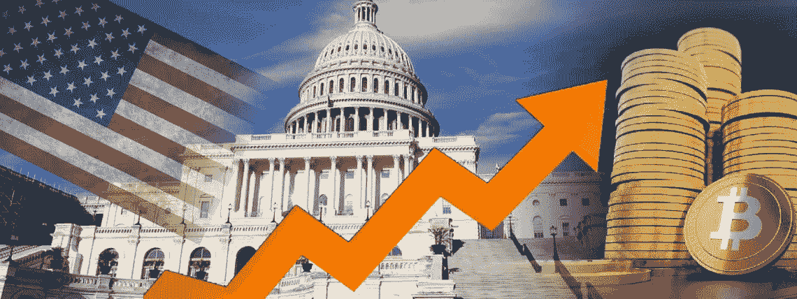

# 起飞的 Cryptos 案例等待美联储的通胀率？

> 原文：<https://medium.com/coinmonks/takeoff-of-cryptos-case-of-waiting-for-the-feds-inflation-rate-3e12e6a49bab?source=collection_archive---------38----------------------->

## 加密货币投资

## 如果通胀目标上调，对 cryptos 有什么影响？

> 引发央行货币政策收紧的通胀，是导致下跌的主要因素