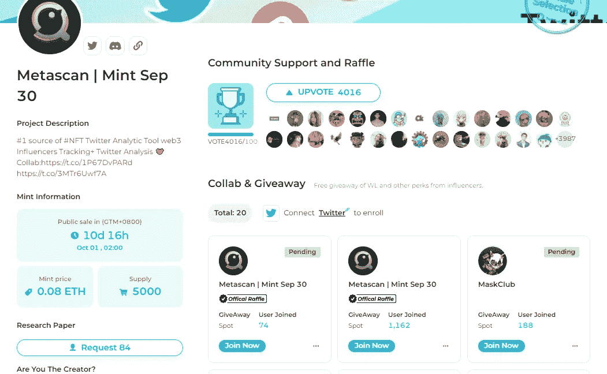

# 高价接手 BAYC，18 天损失 694.9ETH

> 原文：<https://medium.com/coinmonks/taking-over-the-bayc-at-a-high-price-and-losing-694-9eth-in-18-days-fd45e900320b?source=collection_archive---------38----------------------->

9 月 19 日，加密市场全线大跌，比特币再次跌破 18500 美元，至 18232，跌幅超过 7.3%。

前两天以太坊合并成功，今天市场反馈。

以太坊跌破 1300 美元，至 1280 美元，跌幅超过 9.5%，回到 7 月价格。

以太坊的暴跌也导致以太坊合约 24 小时清算 1.47 亿美元，全网清算 3.4 美元。

在如此巨大的波动下，合约球员毫无反抗之力，直接平仓。

Bitcoin falls to $18,232

随着密码市场的暴跌，各种 NFT 也是如此。

BAYC 的底价最近从 4 月空投前的 150 ETH 下降到 70-80 ETH 左右。

根据 USDT 标准，随着 ETH 继续下跌，几个月前买入该指数的人现在面临双重下行压力。

BYAC#6588

比如 BAYC #6588，8 月 31 日在 769.9ETH 交易，当时以以太坊的价格交易了 99 万多美元，今天却以 75ETH 的价格交易！

18 天，他损失了 694.9 ETH，近 90 万美元，这真的是一笔大买卖。

当然，这背后是不是钱包的排列，或者是不是左手和右手颠倒，都不在讨论范围之内。

BAYC #6588Recent Transactions

ETH 大幅下跌，蓝筹 NFT 的地板价也持续走低。

投资非金融交易需要承担 NFT 价格和 ETH 价格下跌的风险。

如果市场暴跌，就会出现大幅上涨。熊市有很多 freemint 项目，上涨出乎意料。

如果能参与到优质项目的发布阶段，也可能是赢家。

比如通过 Twitterscan NFT 工具平台，可以提前了解即将推出的项目、市场人气、NFT 鲸的关注度，做好埋伏的准备。

Twitterscan NFT projects that are about to go live

玩家可以在他们的 NFT 页面上看到即将到来的 NFT 项目。

这些项目的 Twitter 关注者，NFT 鲸关注者的数量，社区用户的数量，造币价格，推出时间等。，可以直接获得。

你可以通过项目的受欢迎程度来了解是否需要花费时间和金钱来跟踪。

比如这款 Wulfz，Wulfz，计划 9 月 20 日在 freemint 上线。目前网站有 9w 粉丝，89 个大 v 在关注该项目。

还有超级受欢迎的 Memeland，有 391 只鲸鱼关注它，并在 109 条推文中提到它。它尚未推出，已有超过 70 万社区和 Twitter 粉丝。

如果你想关注各种新 NFT 项目，不妨关注一下 twitterscan，或许有机会一探究竟。

Upcoming Wulfz

除了提前了解即将推出的 NFT 项目，还可以通过平台关注行业 kol。

新玩家经常问 ChuxiaoChain，Twitter 上有哪些 kol 可以关注？

可以通过平台找到行业内的 kol，也可以通过 VC 和平台 kol 了解最近有哪些项目被投资和关注，提前了解。

Twitterscan platform pass card

目前 Twitterscan 即将推出平台通卡，价格为 0.08ETH，造币时间为 9 月 30 日。

有通行证的玩家可以使用高级产品功能；

并拥有 TwitterScan 未来身份系统门票；

最重要的是优先获得 NFT 项目白名单，在 TwitterScan 平台进行抽奖和推广；

另外，最近 WEB3 域名的热度特别高。通行证持有者可以优先注册。nft 域名。这是玩家的 DID 去中心化身份系统。

Twitterscan pass card popularity

NFT 的风险很大，尤其是高价接手的话，基本上是被困住了。

就像在 150ETH 买的无聊猿，不知道什么时候会涨回来，很多项目只有一次爆发的机会，剩下的都是零结局。

如果能在早期看到项目，参与低成本低风险的项目，机会更多。

就像如果去年 5 月份可以用 0.08ETH 铸造出无聊的猿猴，那么今天 73ETH 的楼面价还是很赚钱的。

找到合适的工具，并保持关注，从中寻找机会。

以上只是我个人的看法和总结，不含投资建议，读者的任何投资行为与作者无关。

我是褚小莲，我在了解区块链，关注元宇宙和 NFT，关注 web3。

> 交易新手？试试[加密交易机器人](/coinmonks/crypto-trading-bot-c2ffce8acb2a)或者[复制交易](/coinmonks/top-10-crypto-copy-trading-platforms-for-beginners-d0c37c7d698c)