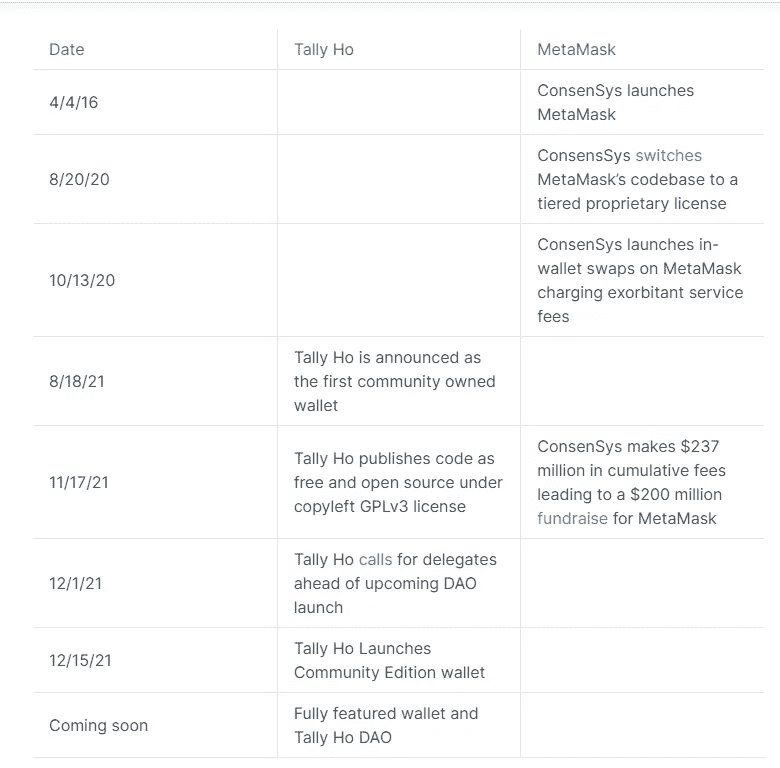
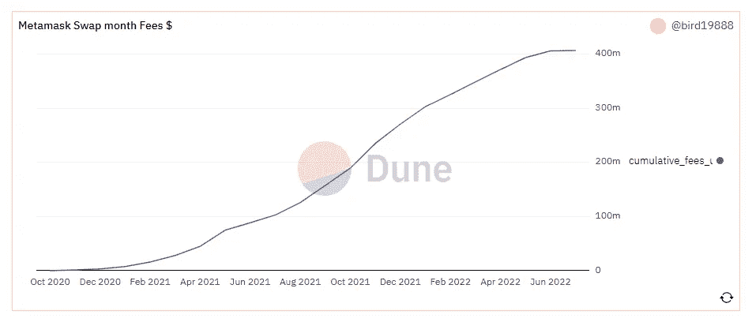
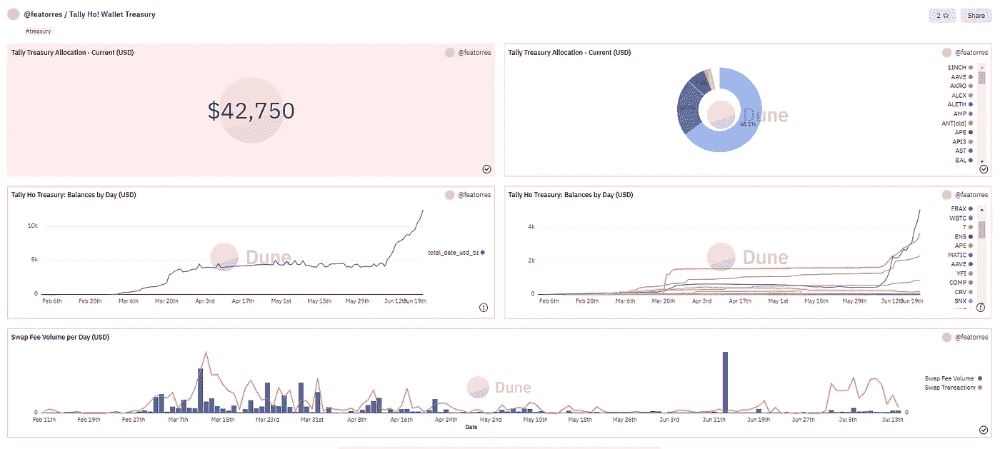

# TallyHo 钱包 Web3 的下一步

> 原文：<https://medium.com/coinmonks/tallyho-wallet-the-next-step-in-web3-b687cec91fa4?source=collection_archive---------11----------------------->

加入加密行业的第一步通常是通过比特币基地这样的交易所，让人们购买他们的第一个 BTC(或其他蓝筹加密货币)。第二步通常是建立一个元掩码钱包，并将您的加密发送到该钱包。在不到 3 年的时间里，Metamask 已经有了[“比 2020 年增长了 38 倍”，](https://earthweb.com/metamask-statistics/)现在每月拥有超过 2100 万活跃用户。

随着加密空间爆炸的速度如此之快，也难怪这个空间从那时起发展得如此之快——liquid staking，layer 2's，元宇宙——也许最重要的是在过去几年中，web3 的崛起。

尽管它有很多优点，但 Metamask 缺少的一个真正的东西是真正的所有权。正如我将在后面详细介绍的那样，Metamask 有一个分层的专有许可证，它限制了其代码的使用方式，最重要的是，就像任何 web2 公司一样，它的利润和治理集中于所有者，而不是用户本身。这就是 Tally Ho 的用武之地——第一个“属于每个人的 web3 钱包”

# 钱包游戏的下一步进化

Tally Ho 将 Metamask 的类似功能与真正的 DAO 的优势和 web3 的基本原则结合起来。事实上，*因为* Metamask 本质上是私有的，这激发了 Tally Ho 的人们去建造一些不是:

Tally Ho 团队想要创造一些与 web3 一致的东西，他们基本上决定从头开始构建一些完整的东西——他们这样做还不到一年。如果你看一下他们与 Metamask 的时间表，就很容易明白为什么 Tally Ho 会出现:

与 Metamask 不同，Tally Ho 的源代码是完全开源的，拥有 [GPLv3 许可证](https://blog.tally.cash/all-rights-reversed-tally-is-now-open-source/)，每个人都可以使用，其所有费用(如来自交换的费用)都直接返回到 Tally Ho DAO——这就是为什么他们声明这是一个“社区拥有和运营”的钱包客观地看，ConsenSys(Metamask 的母公司)报告称，meta mask 仅在 2021 年就实现了 2 亿多美元的收入[——其中没有一部分回到了用户手中，现在有望在 2022 年实现更高的收入:](https://entrepreneur-360.com/how-does-metamask-make-money-25307)

[https://dune.com/bird19888/metamask-feee](https://dune.com/bird19888/metamask-feee)

现在，这是一种让脸书或谷歌叫绝的收入模式——两者都是基于 web2 的“免费”服务，从用户身上攫取利润。相反，Tally Ho 希望做的是让用户/DAO 成为获利者，并帮助管理公司的方向。只是澄清一下，虽然 Tally Ho 回避了利润归社区的事实，但实际上利润归了 DAO，而不是个人用户的钱包。

> 交易新手？试试[加密交易机器人](/coinmonks/crypto-trading-bot-c2ffce8acb2a)或者[复制交易](/coinmonks/top-10-crypto-copy-trading-platforms-for-beginners-d0c37c7d698c)

## 刀是如何工作的？

像许多其他 Dao 一样，Tally Ho 在一个[总督 Bravo](https://blog.tally.xyz/understanding-governor-bravo-69b06f1875da) 框架下运作，拥有选举产生的代表职位(任何人都可以申请的职位[)作为治理提案决策的代表。如果你很好奇，你可以在这里找到他们所有与治理相关的讨论。](https://gov.tally.cash/t/tally-ho-delegate-applications/18)

从 [DAO 的结构提案](https://gov.tally.cash/t/tally-ho-dao-structure-proposal/455)中可以看出，DAO 有多项管理职责，包括 DAO 的财务、掉期费用和与预算相关的运营计划。如果你想知道关于掉期费用或财政部本身的信息，它们都可以在 Dune Analytics 上公开获得:

从上图可以看出，与 Metamask 相比，Tally 还有很长的路要走。(这个[社区版钱包](https://tally.cash/download)本身才刚满半年！)然而，考虑到他们还年轻，显然他们已经有了一个良好的开端。如果你浏览他们的治理论坛，很明显他们非常注重倾听用户的意见，自诞生以来，他们已经通过 [Open Zeppelin](https://tally.cash/OpenZeppelin_Audit_Report.pdf) 、[最小权限](https://leastauthority.com/blog/audit-of-tally-browser-extension-wallet-key-handling-for-ylvis-llc/)和 [Code Arena](https://code4rena.com/reports/2021-10-tally/) 完成了 3 次审计。如果这种对 web3 的整合是成功的，我认为它没有理由不能逐渐接管 Metamask 的市场份额，并成为每个接受 web3 意识形态的人的首选钱包。说到 Tally Ho 的成长，这就引出了我的下一部分:

# Tally Ho 的路线图

也许我从用户那里听到的关于 discord 的最大的批评是错误。为了满足 12 月的最后期限，Tally Ho 团队在 12 月推出了他们的产品，尽管为了满足社区的需求进行了足够彻底的 bug 测试。话虽如此，但很明显，该团队正在继续努力工作——不仅是为了完善钱包，而且还致力于新功能的集成，例如与[多边形](https://tally-ho.upvoty.com/b/tally-ho-roadmap/polygon-support/)、 [NFT 支持](https://tally-ho.upvoty.com/b/tally-ho-roadmap/nft-support-view-only/)的集成，以及进一步向下的[与第 2 层的连接。](https://tally-ho.upvoty.com/b/tally-ho-roadmap/arbitrum-support/)在真正的 DAO/web3 方式中，您可以在这里投票支持他们路线图上任何即将到来的提案[。(谈到未来的活动，他们还表示将在某个时候空投他们的](https://tally-ho.upvoty.com/?__force) [$DOGGO token](https://gov.tally.cash/t/update-wen-doggo/526/6) ，预计将在社区范围内分发超过 100 亿枚 token。)

# 结论

Tally Ho 是成品吗？绝对不行。但是我想说的是，只要没有像你我这样的用户提供的全方位罗盘的指引，Tally Ho *就无法完成。换句话说，没有用户的干预，web3 无法达到其最完整或最好的状态，否则我们将永远停留在 web2 中。考虑到这一点，Tally Ho 是那些雄心勃勃的产品之一，它们不仅允许用户保留对加密货币的控制权，还允许用户保留对钱包和钱包平台本身的所有权。*

有兴趣了解更多关于 Tally Ho 的信息吗？我建议加入他们的 [discord](https://blog.tally.cash/tally-wallet-plans-first-gitcoin-aqueduct-to-automate-public-goods-funding-ecosystem-building/) ，因为他们的 mod 非常开放地回答问题，并接受关于未来集成什么的反馈——这确实是一个进入仍处于早期阶段的 web3 项目的机会。至少，我会说至少花几分钟读一读他们的[博客](https://blog.tally.cash/why-im-all-in-on-an-imperfect-web3-future/)，因为对他们正在建设的东西的兴奋有一种感染，以及从根本上为什么 web3 值得投资。

再次感谢你花时间阅读这篇文章，如果你还没有，一定要在 twitter 上关注我，获取我所有的最新更新:[https://twitter.com/CryptosWith](https://twitter.com/CryptosWith)

免责声明:本文中的任何内容都不是财务建议。请自行研究和/或联系财务顾问，找出最适合你的投资。

> 加入 Coinmonks [电报频道](https://t.me/coincodecap)和 [Youtube 频道](https://www.youtube.com/c/coinmonks/videos)了解加密交易和投资

# 另外，阅读

*   [麻雀交换评论](https://coincodecap.com/sparrow-exchange-review) | [纳什交换评论](https://coincodecap.com/nash-exchange-review)
*   [美国最佳加密交易机器人](https://coincodecap.com/crypto-trading-bots-in-the-us) | [经常性回顾](https://coincodecap.com/changelly-review)
*   [在印度利用加密套利赚取被动收入](https://coincodecap.com/crypto-arbitrage-in-india)
*   [Godex.io 审核](/coinmonks/godex-io-review-7366086519fb) | [邀请审核](/coinmonks/invity-review-70f3030c0502) | [BitForex 审核](https://coincodecap.com/bitforex-review)
*   [5 款最佳免费加密货币制图工具](https://coincodecap.com/crypto-charting-tools)