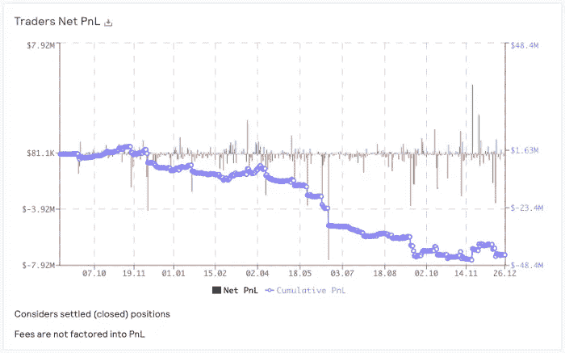

# 驯服 GMX:GLP 波动

> 原文：<https://medium.com/coinmonks/taming-gmx-glp-volatility-8f0019bdc819?source=collection_archive---------4----------------------->

> 我们如何摆脱波动性，并从业内最大的连锁运营商 GMX 那里获得回报。

# GMX 和 GLP 介绍

GMX 是当今该领域最大的在线分散式交易所之一。迄今为止，它们的交易量超过 700 亿美元，每天持续产生数亿美元的交易量。他们的保证金交易尤其允许交易者使用高达 50 倍的杠杆，这是他们持续疯狂成功的核心。

> 从顶级交易者那里复制交易机器人。免费试用。

GMX 的交易者对一个叫做 GLP 的流动性池进行交易。这是一个资产池，目前由、ETH、UNI 和 LINK 以及各种 stablecoins(、、戴和)组成。当交易者使用杠杆交易时，他们从 GLP 借钱来交易。如果他们赢了，他们拿走奖金，如果他们输了，他们支付 GLP 池。自 2021 年 8 月推出 GMX 以来，交易者通常会输给该池，导致 GLP 升值。这可以通过查看 GMX 统计页面上“PnL 交易者网”的历史表现来看出，这也与研究交易者盈利能力的学术研究相吻合。

Source : [https://stats.gmx.io/](https://stats.gmx.io/)

GLP 还从掉期交易中赚取了一部分费用，即交易员借入资金进行交易时产生的贷款费用，以及清算费用。该平台产生的费用的 70%流向 GLP 持有者，30%流向 GMX 赌注者。

由于这些有利的环境，GLP 一直是长期投资者存放资金的热门地点。GLP 是为数不多的在熊市中持续增长的服务之一。

Source : [https://defillama.com/protocol/gmx?denomination=ETH](https://defillama.com/protocol/gmx?denomination=ETH)

虽然 GLP 持有相当一部分稳定的股票，但它也包括 BTC、瑞士联邦理工学院、联合大学和林克大学，其中一些股票的价格下跌了 80%以上。这些资产的波动促使 GLP(绿线)的价格在过去一年普遍下跌。令人欣慰的是，这被平台产生的大量费用令人印象深刻地抵消了，最终在我们结束动荡的一年时看起来相对平稳(蓝线)。

Source : [https://stats.gmx.io/](https://stats.gmx.io/)

# 三角洲中立的 GLP

在 Flynt，我们认为我们可以通过做空波动资产(如 BTC、瑞士联邦理工学院、UNI 和 LINK)来中和 GLP 的方向性部分，从而改善 GLP。所以我们继续对策略进行回溯测试。

GLP 头寸在公共场所持有，而空头头寸在币安持有，以获得最佳的进场和出场价格。

## 绩效结果

我们测试了许多不同的再平衡策略，并将使用 C 设置运行实时策略。平均年回报率为 18.96%，最大提取率为-3.5%。虽然我们计划每周开放提款，因为最长的损失期持续了 51 天，但我们建议订户以更长的时间框架(+3 个月)来实施这一策略。

与 GLP+费斯策略相比,“设置 C”似乎很好地抑制了波动。

该战略将于 2022 年 12 月 28 日上线。

***在***[***flynt . finance***](http://flynt.finance/)***报名，获取 crypto 中最佳收益率机会。***

> *在 twitter 上关注我*[*@ 0x tinker*](https://twitter.com/0xTinkerer) *在 twitter 上关注 Flynt Finance 进行自动加密管理*[*@ Flynt Finance*](https://twitter.com/flyntfinance)

免责声明:主要结果来自后验测试，即基于历史数据的模拟。然而，我们确实试图尽可能保守地对其建模。这一战略在其运作过程中可能会发生环境变化，以进一步降低波动性和提高盈利能力。这篇文章不是财务建议，请记住过去的表现并不能保证未来的结果。

> *加入 Coinmonks* [*电报频道*](https://t.me/coincodecap) *和* [*Youtube 频道*](https://www.youtube.com/c/coinmonks/videos) *了解加密交易和投资*

# 另外，阅读

*   [Bookmap 评论](https://coincodecap.com/bookmap-review-2021-best-trading-software) | [美国 5 大最佳加密交易所](https://coincodecap.com/crypto-exchange-usa)
*   [密码交易机器人](/coinmonks/crypto-trading-bot-c2ffce8acb2a) | [硬币门评论](https://coincodecap.com/coingate-review)
*   最佳加密[硬件钱包](/coinmonks/hardware-wallets-dfa1211730c6) | [Bitbns 评论](/coinmonks/bitbns-review-38256a07e161)
*   [新加坡十大最佳加密交易所](https://coincodecap.com/crypto-exchange-in-singapore) | [购买 AXS](https://coincodecap.com/buy-axs-token)