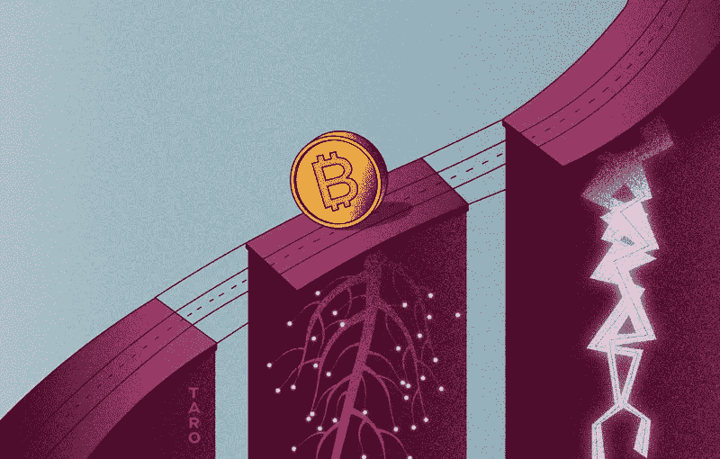
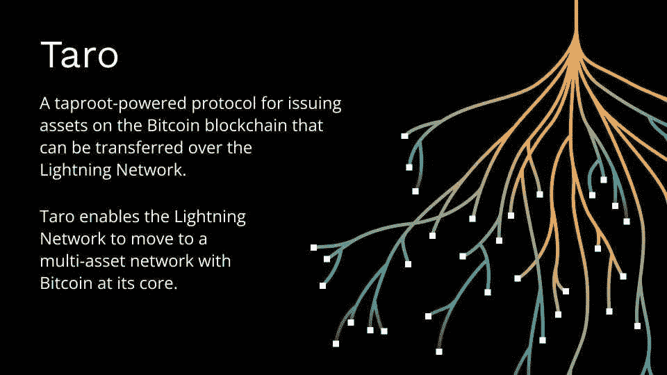
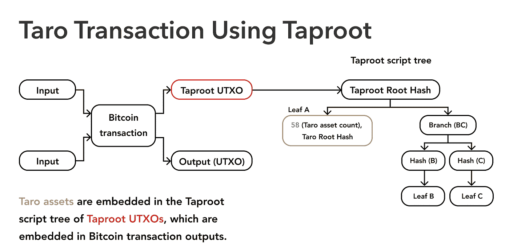
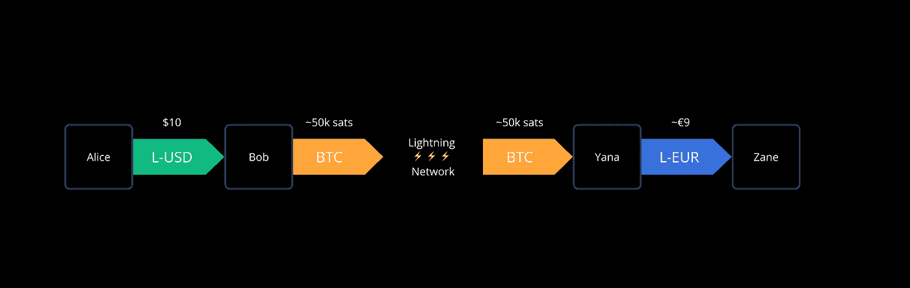

# Taro 协议支持在比特币上创建数字资产

> 原文：<https://medium.com/coinmonks/taro-protocol-enables-creation-of-digital-assets-on-bitcoin-d9225d2df632?source=collection_archive---------4----------------------->

medium.com- mintdice

# 介绍

比特币的一项新发展，即 Taro，允许在区块链发行数字资产，这些资产可以通过闪电网络进行即时、大量、低费用的交易。这些资产可以是稳定的硬币、法定货币和不可替代的代币。

这是一个重要的里程碑和游戏规则的改变者，因为这使用户能够使用比特币区块链上的任何类型的资产，以低廉的价格转移它们，并且全天候不受审查，同时网络确保完全去中心化和用户控制的隐私达到最高程度的安全。

比特币的区块链具有易于审计的供应和全球网络，任何人都可以在任何时间使用，自 2013 年以来一直 100%正常运行。

下面我们来看看 Taro 协议使用什么技术来解决这些期望的属性。

# 芋头是什么？

*docs.lightning.engineering*

2022 年 4 月初，闪电实验室公布了 Taro，这是一项针对比特币和闪电网络的新协议提案，旨在扩大网络的用例。该公司发布了一套比特币改进提案草案(BIP)，并正在寻求社区对拟议设计的评论和反馈。

Taro(直根资产表示覆盖)是一种协议，允许用户在比特币的区块链上发行数字资产。这些数字资产可以是可替代的货币，如稳定币，也可以是不可替代的、独一无二的代币，如 NFT 或收藏品。目前，由于最低的交易费用、速度和可扩展性，这种资产通常存储在其他区块链上，但 Taro 有潜力改变这种情况。

# 芋头是怎么工作的？

Taro 寻求在比特币上发行资产和收藏品，这是协议形式的不可替代资产，以及在闪电网络上转移它们(比特币的扩展解决方案)。

Taro 利用 2021 年上线的比特币最新重大升级 Taproot，以私人和安全的方式发行资产，而不会膨胀比特币区块链。Taro 不需要单独的区块链，也不依赖于直接在主链上添加数据。

Taro 利用新的 Taproot 脚本行为，允许开发人员在现有的输出中嵌入任意的资产元数据。

*River Financial*

Taro 通过直根脚本树的“叶子”将资产添加到比特币中，因为树中的每片叶子都是独立的，可以选择性地显示，从而允许结构化的承诺。所提出的协议可以通过在主根脚本树中包括关于这些资产的信息(称为元数据)来作为构建在比特币之上的层，从而允许 Taro 资产交易看起来像常规的比特币交易(因为只有主根输出在 chain 上显示)，同时仍然能够证明跨交易图的资产移动。

在主根输出中包括(提交到)特定元数据的散列的链上比特币交易创建 Taro 资产。Taro 将资产分配给发行者的私钥，然后将交易发布到网络上。然后，新生成的未用完的事务输出(UTXO)充当资产的起源点和唯一标识。

区块链上的一个事务可以代表数百万个事务，因为一个散列可以代表无限量的数据。芋头资产转让也是如此。与任何其他比特币交易一样，Taro 资产可以在交易中通过比特币网络进行转移，通过 Lightning 集成，该技术将享受二层网络的即时转移，以便廉价有效地发送和接收资产。

# 芋头有什么特别之处？

支付网络在历史上一直在与自举问题作斗争。当一项新资产成立时，必须建立一个全新的支付网络来满足该资产的支付需求。Taro 允许一种支付路由范例，在这种范例中，闪电网络可以管理任何资产的渠道，同时还可以找到资产之间的路由。

Taro 本质上是让比特币和比特币的闪电网(Lightning Network)成为多资产网络，让用户在保持首选货币稳定的同时，享受即时、全球、最终的低费用结算。用户将能够开放在边缘插入的 Taro 通道，并与构成今天闪电网络的现有比特币通道互操作。

必须指出的是，Taro 不是第一个试图在比特币基础上创建不同资产的项目，但它是第一个利用比特币 Taproot 升级的项目，以便使实施更加高效和可扩展。RGB 协议是另一个试图实现类似目标的项目。

# 芋头上有稳定的斑点

pixabay

Taro 最近发布的 alpha 版本将实现点对点比特币和闪电原生 stablecoins 的创建。它将使钱包开发者能够通过允许用户在同一个钱包中拥有以菲亚特计价的余额和以 BTC 计价的余额，从本质上向闪电网络添加稳定的硬币资产。这将使用户能够以比特币闪电的方式获得稳定的硬币或法币。

## 美元比特币化

此次发行是向世界储备货币美元比特币化迈出的第一步，通过在比特币区块链上发行稳定的币美元资产，允许用户在闪电网络上进行全球、即时结算、低费用、点对点的数字美元交易，而无需金融中介。

Taro 将让世界各地的支付应用程序和新银行，如 Strike、Paxful、Bitnob、Bottlepay 和 Ibex，为他们的用户提供闪电原生的美元稳定账户。这将满足全球发展中市场客户的需求，他们希望获得安全、不受审查的数字美元。这对拉丁美洲和西非的用户尤其有利，因为这将扩大他们社区的金融服务。

## 用户设置汇率

docs.lightning.engineering

通过与 Taro 整合，Bob 和 Yana 将其 Lightning 节点转变为“边缘节点”,现在只需支付少量费用，就可以处理美元对 BTC 或欧元对美元或欧元对欧元的即时转换。在此之前，只有集中的交易所才能为用户提供这种体验。

Taro 协议本身为集成商提供了处理汇率的选择权。渠道中执行掉期交易的每个对等方负责确定自己的汇率。他们可能会使用来自流动性交易所的参考汇率，或者自己决定汇率。重要的是要注意，当接收付款时，接收方自己生成发票，从而确保接收方收到以其期望的资产计价的适当金额。

Taro 协议没有规定或设定费率，只是提供了一个进入技术壁垒低的功能市场的机制，以及允许自动、原子和即时交易的工具。

# 芋头的 NFTs

pixabay

在 Taro 之前，在比特币上创造不可替代的代币(NFT)是不可能的。NFT 是记录在区块链中的独一无二的数字资产，用于验证真实性和所有权，所有者可以转让或出售。任何人都可以创建它们，不需要任何编码技能。

尽管 NFTs 最常见的用例是数字艺术，但是 NFTs 可以是任何数字文件，包括音频、视频和其他类型的文件。例如，具有链上数据的 NFT 形式的令牌化身份可能是在区块链上注册并配置为不可交易的驾照、学位或护照的数字版本。

收藏品或任何其他类型的具有价值或重要性的不可替代资产将具有唯一的标识符，该标识符在比特币链级别上建立对该资产的主张，使得不可能伪造所有权。

# Taro 什么时候全面实施？

9 月 28 日，闪电实验室发布了 Taro 开源软件的第一个版本，该软件可以在比特币网络上创建、发送和接收资产。

随着 Taro daemon 的 alpha 发布，开发者现在可以在 testnet 上发布令牌，这是一个为开放测试设计的替代比特币区块链。它允许开发者用 testnet 硬币而不是实际的 BTC 来测试应用程序。只有在彻底的测试和错误修复之后，项目才能在 mainnet 上运行。

闪电实验室表示，闪电网络集成是 Taro 即时转移和接收资产的关键功能，将在未来的开发阶段启用。Taproot 频道必须首先合并到该公司的照明实施(LND)，这是目前正在开发中。

该公司表示，在未来几个月内，Taro 守护程序将添加更多增强功能，包括“宇宙功能”，这将允许用户和资产发行人提供关于资产来源、供应发行的证据，并更容易地与 Taro 资产数据进行交互。

# 摘要

Taro 打算利用比特币最新的软分叉升级，将资产与现实世界的应用程序(如美元 stablecoins)集成到点对点数字货币堆栈中。如果成功并被全球用户广泛采用，Taro 将分散全球外汇市场，比特币将使“跨境”支付过时。

此外，通过利用比特币和闪电作为其轨道，Taro 可以建立一个可互操作的资产生态系统，可以组合不同的用例，而不会影响可能不关心这些资产的各方。如果 Taro 协议被广泛采用，它将通过提高向矿商支付的费用，增强比特币的网络效应，并增加闪电网络上 BTC 的流动性。

最终目标是让比特币成为受开放协议支持的底层全球货币网络，Taro 只是一个开始。

*免责声明:本文包含的信息仅用于教育目的，并不构成 Wheatstones 的任何形式的建议或推荐，用户在做出(或避免做出)任何投资决定时也不打算依赖这些信息。*

> 交易新手？试试[密码交易机器人](/coinmonks/crypto-trading-bot-c2ffce8acb2a)或者[复制交易](/coinmonks/top-10-crypto-copy-trading-platforms-for-beginners-d0c37c7d698c)