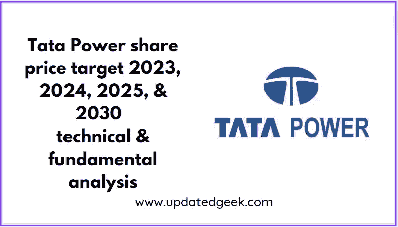
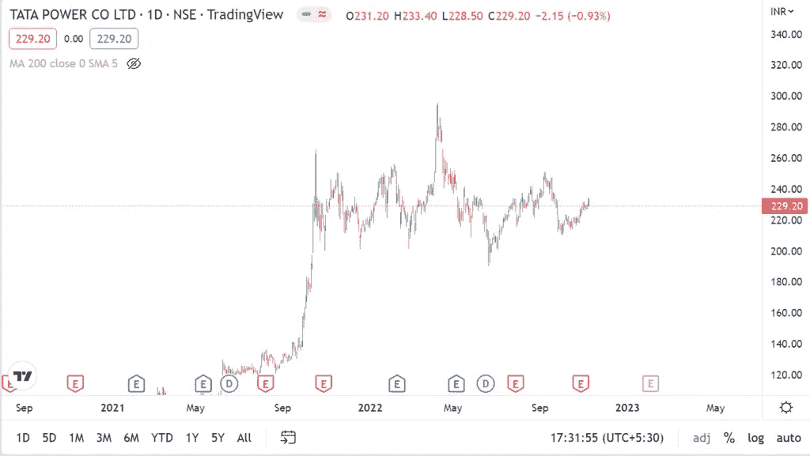
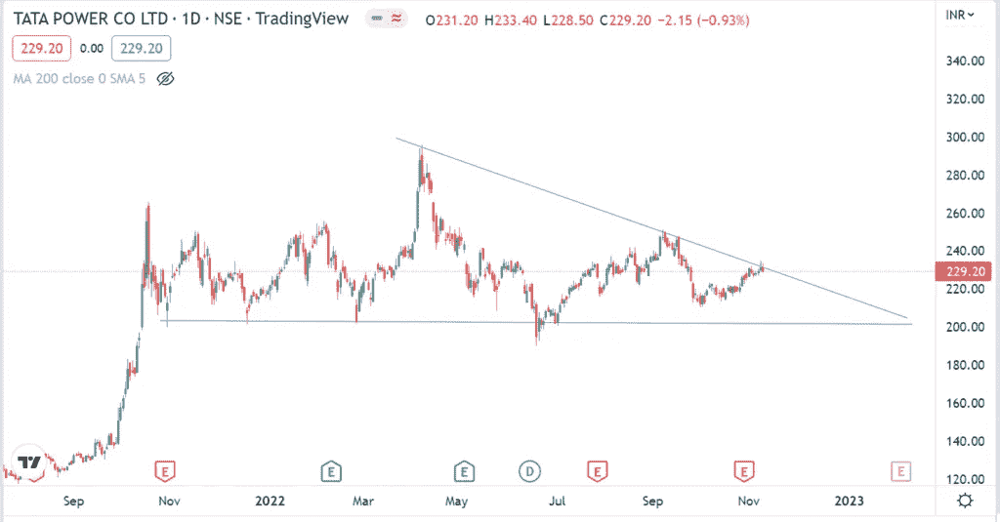
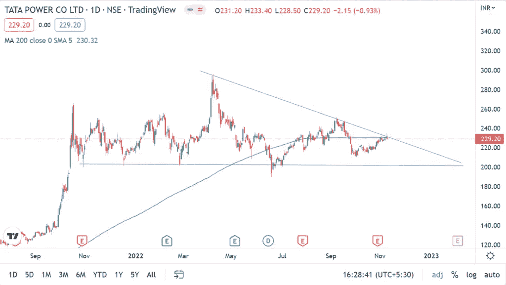
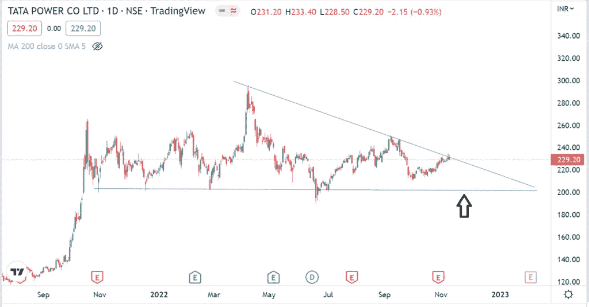

# 塔塔电力 2023 年、2024 年、2025 年和 2030 年的股价目标|技术分析和基本面分析

> 原文：<https://medium.com/coinmonks/tata-power-share-price-target-2023-2024-2025-and-2030-technical-analysis-and-fundamental-54c724a79203?source=collection_archive---------0----------------------->

# 塔塔动力是什么？

Tata Power share price target 2023, 2024, 2025, and 2030

塔塔电力公司是印度最大的发电公司，装机容量超过 10，000 兆瓦。该公司位于印度马哈拉施特拉邦的孟买。

该公司由 Dorabji Tata 于 1919 年 9 月创立。塔塔电力是印度最大的综合电力公司，在 IIM·乌代普尔 2017 年负责任商业排名中排名第三。该公司成为第一家发运超过 1 吉瓦太阳能组件的印度公司。

# 塔塔电力公司最新收益

塔塔电力 2022 年的最新收益为 4257.6 亿卢比。营业收入为 819.1 亿卢比，净收入为 215.6 亿卢比。塔塔电力的总资产为 112，884 亿卢比，总股本为 22，441 亿卢比。

[点击此处](https://link.upstox.com/DQT7YCUH7irWFzFM6)在印度最好的经纪人处开立 demat 账户

[要在印度最好的经纪人处开立加密钱包账户，请点击此处](https://wazirx.com/invite/jkwe73z9)

> 交易新手？在[最佳加密交易](/coinmonks/crypto-exchange-dd2f9d6f3769)上尝试[加密交易机器人](/coinmonks/crypto-trading-bot-c2ffce8acb2a)或[复制交易](/coinmonks/top-10-crypto-copy-trading-platforms-for-beginners-d0c37c7d698c)

# 塔塔电力技术分析

Tata Power share price chart

当前**塔塔电力股价**为 229.20 卢比。价格在 2022 年 4 月触及其最高值 295 卢比。

Tata Power share price pattern

价格从 2022 年 4 月开始连续形成三角形形态。在过去的 13 个月中，价格已经五次触及水平线。目前，价格有望突破并向上移动。

Tata Power share price 200 moving average

考虑到 200 移动平均线，当前**塔塔电力股价**是进入交易的正确点，因为移动平均线触及当前价格栏。

激进的买家可以在当前价格进入交易，保守的买家可以等待价格接近水平线。

# 塔塔电力基本面分析

塔塔电力公司的市值超过 70，000 亿卢比。另一个支撑因素是市盈率在 15 以上。塔塔电力的销售增长在 15%左右，利润增长超过 850%。

**也读作**

*   [Bajaj 金融 2023 年、2025 年、2030 年和 2035 年的股价目标](https://updatedgeek.com/bajaj-finance-share-price-and-target/)
*   [Bajaj Finserv 股价和 2023 年、2025 年、2030 年、2035 年和 2040 年目标](https://updatedgeek.com/bajaj-finserv-share-price-and-target/)
*   [电力金融公司 2023 年、2025 年、2030 年、2035 年、2040 年的股价目标](https://updatedgeek.com/power-finance-corporation-share-price-target/)
*   [马纳普拉姆金融有限公司 2023 年、2025 年、2030 年、2035 年、2040 年的股价目标](https://updatedgeek.com/manappuram-finance-limited-share-price-target/)

# 塔塔电力分红

该公司宣布 2022 年 6 月 1.75 卢比的股息，2021 年 6 月 1.55 卢比，2020 年 7 月 1.55 卢比，2019 年 6 月 1.30 卢比，2018 年 7 月 1.30 卢比，2017 年 8 月 1.30 卢比，2016 年 9 月 1.30 卢比，2015 年 7 月 1.30 卢比，2014 年 7 月 1.25 卢比，2013 年 7 月 1.15 卢比，

这表明，塔塔电力公司自成立以来一直定期向股东分红。

# 塔塔电力股价目标

**塔塔电力股价目标【2023 年在 290 到 360 卢比之间，2024 年在 400 到 470 卢比之间，2025 年在 510 到 550 卢比之间，2030 年在 1200 到 1420 卢比之间。**

# 塔塔电力股份的未来

塔塔电力公司的未来预期是基于增长，因为即将到来的技术基于电动汽车。随着电动汽车销量的增加，对清洁能源和充电站的需求也将增加。考虑到未来的增长，塔塔电力一直在努力改善其基础设施。该公司还计划与私营和政府部门的公司建立伙伴关系。

**也读作**

*   [IRCTC 2023 年、2024 年、2025 年和 2030 年的股价目标](https://updatedgeek.com/irctc-share-price-target/)
*   [LIC 股价目标 2023 年、2024 年、2025 年和 2030 年](https://updatedgeek.com/lic-share-price-target/)
*   [HDFC 有限公司 2025 年、2030 年、2035 年股价目标](https://updatedgeek.com/hdfc-ltd-share-price-target/)
*   [2023 年、2025 年、2030 年、2035 年 Muthoot Finance 股价目标](https://updatedgeek.com/muthoot-finance-share-price-target/)

# 塔塔电力股份的风险

竞争是风险因素之一，因为随着需求的增长，许多公司已经开始进入电力领域。

塔塔电力的另一个主要风险因素是巨额投资，该公司也为此获得了巨额贷款。

# 塔塔电力是值得购买的好股票吗？

是的，塔塔电力是一只值得购买的好股票。有几个原因支持以目前的价格购买塔塔电力的股票。首先是对电动汽车日益增长的需求。其次是持续的红利申报。

# 塔塔电力的竞争对手

塔塔电力公司的主要竞争对手是

*   信赖力量
*   阿达尼力量
*   电网公司
*   NTPC

**免责声明**:如果你想投资股市，在做出购买决定之前，你应该咨询你的理财顾问。你应该评估风险，研究公司细节。

# 常见问题

**1。塔塔能源的目标是什么？**

**塔塔电力股价目标【2023 年在 290 到 360 卢比之间，2024 年在 400 到 470 卢比之间，2025 年在 510 到 550 卢比之间，2030 年在 1200 到 1420 卢比之间。**

**2。塔塔动力股份的未来如何？**

从长远来看，塔塔电力股份对投资者来说前景光明。

**3。现在可以买塔塔动力股份吗？**

是的，你现在可以购买塔塔电力股份。

**4。塔塔电力 2025 年的股价目标是多少？**

**塔塔电力 2025 年的股价目标**在 510 卢比至 550 卢比之间

**相关搜索**:

*   [为什么美元兑印度卢比汇率上升？](https://updatedgeek.com/why-dollar-rate-is-increasing/)
*   [你应该知道的 10 条理财经验](https://updatedgeek.com/10-money-lessons/)
*   共有基金优于股票的 5 个理由
*   [印度采用电动汽车如何帮助中国赚钱？](https://updatedgeek.com/india-electric-vehicle-adoption-helping-china/)
*   [2022 年投资实物黄金或数字黄金前需要考虑的事情](https://updatedgeek.com/things-to-consider-before-investing-in-physical-gold-or-digital-gold-in-2022/)
*   你应该买天然钻石还是实验室培育的钻石？
*   [为什么信用卡比现金或借记卡更好](https://updatedgeek.com/why-credit-cards-better-than-cash-or-debit-cards/)