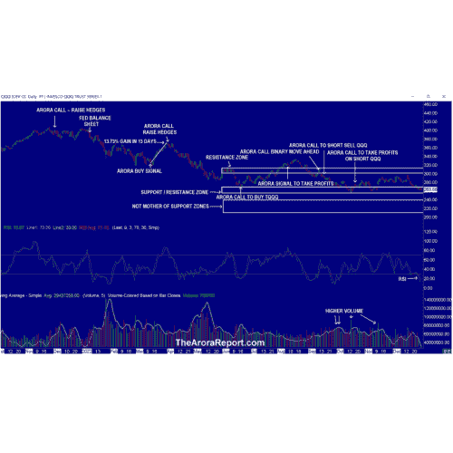

# 税收损失销售即将结束—2023 年定位即将开始“阿罗拉报告股票市场新闻”

> 原文：<https://medium.com/coinmonks/tax-loss-selling-about-to-end-positioning-for-2023-about-to-begin-the-arora-report-stock-516e00d36f0e?source=collection_archive---------76----------------------->

娜塔莎·阿罗拉博士

*要获得优势，这是你今天需要知道的。*

## 税收损失销售

请[点击此处](https://thearorareport.com/chart-analysis-stock-market-tech-stocks-support-zone-qqq-mc-12282022)查看纳斯达克 100 指数 ETF (QQQ)图表。

请注意以下几点:

*   图表显示，QQQ 已经跌入支撑/阻力区。
*   图表显示，今年 10 月的低点已经不远了。
*   图表显示 RSI 非常超卖。
*   图表显示，在最近的抛售中，成交量并不高。
*   综上所述，从传统的技术分析角度来看，股市有望反弹。然而，投资者需要记住，传统的技术分析不再像过去那样有效。出于这个原因，投资者需要看看综合分析，如 ZYX 资产配置模型。ZYX 资产配置模型是一个随着市场条件而变化的适应性模型。请点击[此处](https://thearorareport.com/unique-zyx-asset-allocation-3/)查看适应性是如何实现的。
*   季节性是积极的。
*   多头仍然希望圣诞老人集会包括 2022 年的最后五个交易日和 2023 年的前两个交易日。
*   科技股、陌陌股和 meme 股出现了严重的税收流失抛售。
*   **对于很多机构来说，今天是税损抛售的最后一天**。
*   随着税收损失抛售的结束，这应该会减轻市场的一些抛售压力。然而，许多对冲基金即将开始为新的一年进行短期交易。目前尚不清楚这种定位的网将走向何方。
*   投资者需要知道图表上显示的 10 月低点下方可能会有很多止损点。
*   如果市场接近图表上显示的 10 月低点，追踪和摧毁算法将接管并试图取消止损。有关下一级的信息，请收听题为“华尔街的秘密:搜寻和摧毁算法”的播客
*   如果 10 月低点被剔除，这将是传统技术分析中的卖出信号，并将导致技术型投资者卖出；这些投资者目前正在买入。以技术为导向的投资者从买入到卖出的这种转变可能会导致大幅下跌。
*   作为一个可操作的项目，请注意下面的“保护带和现在要做什么”部分。

> 交易新手？在[最佳密码交易所](/coinmonks/crypto-exchange-dd2f9d6f3769)上尝试[密码交易机器人](/coinmonks/crypto-trading-bot-c2ffce8acb2a)或[复制交易](/coinmonks/top-10-crypto-copy-trading-platforms-for-beginners-d0c37c7d698c)

## 股票中的 Momo 人群和精明资金

陌陌人群是🔒([查看锁定内容，请免费试用 30 天](https://thearorareport.com/sub))股票早盘。明智的投资是🔒在早期贸易中。

## 金色的

陌陌人群是🔒早期贸易中的黄金。明智的投资是🔒在早期贸易中。

长期来看，请看黄金和白银评级。

## 油

陌陌人群是🔒早期贸易中的石油。明智的投资是🔒在早期贸易中。

长期而言，请参见机油评级。

## 比特币

由于加密领域的两项发展，比特币正面临压力。

*   专注于密码的货币交易所北海巨妖将结束在日本的业务。
*   受欢迎的加密软件 Solana 因担心鲸鱼即将出售而暴跌。

积极的一面是，在 11 月 1 日至 12 月 21 日期间，MSTR 以约 4280 万美元的现金购买了 2395 个比特币。一些投资者将此视为信心的标志。然而，谨慎的投资者需要记住，最近，MSTR 一直是错误的，坐拥巨额亏损，购买相对较少。

## 推销

我们非常非常短期的早期股市指标是🔒。这个指标有很好的跟踪记录，在长期投资者中很受欢迎，以保持与市场一致，在短期交易者中也很受欢迎，以独立进行快速交易。

利率在下降，债券在上涨。

美元略微疲软。

不建议大部分投资者交易期货。提供这些信息的目的是给出上市前活动的指示，通常在市场开放时指导活动。

黄金期货价格为 1818 美元，白银期货价格为 24.27 美元，石油期货价格为 78.90 美元。

标准普尔 500 期货的阻力位是 3950、4000 和 4200:支撑位是 3770、3630 和 3600。

DJIA 期货上涨 40 点。

## 保护带和现在该做什么

对投资者来说，重要的是向前看，而不是看后视镜。

考虑继续持有好的、非常长期的现有头寸。基于个人风险偏好，考虑持有🔒现金或国库券或分配给短期战术交易；和中短期对冲🔒和短期对冲🔒。这是一个很好的保护自己的方法，同时也能参与到上涨中。

你可以通过在对冲中增加现金来确定你的保护范围。高保护级别适用于那些年龄较大或保守的人。低保护带适合那些年轻或好斗的人。如果不对冲，总现金水平应高于上述水平，但明显低于现金加对冲。

值得提醒的是，如果你没有足够的现金，你就不能利用即将到来的新机会。调整对冲水平时，考虑调整股票持仓的部分止损量(非 ETF)；考虑在剩余数量上使用更宽的止损点，并为高贝塔股票留出更多空间。贝塔系数高的股票比市场波动更大。

要免费试用 30 天付费服务以获得更多机会，请[点击此处](https://thearorareport.com/sub)。

这篇文章刚刚发表在 [ZYX 购买变化警报](http://thearorareport.com/sub)。

市场可以为知识渊博的投资者创造大量财富。现在，在 ARORA 报告的帮助下，你也可以非常成功地实现你的目标。您从我们的付费服务中收到的内容不到 2%。…要获得剩余的 98%，包括许多有吸引力的投资机会，请免费试用付费服务。

[请点击此处，享受 30 天免费试用。](http://thearorareport.com/sub)

*原载于 2022 年 12 月 28 日 https://blog.thearorareport.com***。**

> **加入 Coinmonks* [*电报频道*](https://t.me/coincodecap) *和* [*Youtube 频道*](https://www.youtube.com/c/coinmonks/videos) *了解加密交易和投资**

# *另外，阅读*

*   *[Bookmap 评论](https://coincodecap.com/bookmap-review-2021-best-trading-software) | [美国 5 大最佳加密交易所](https://coincodecap.com/crypto-exchange-usa)*
*   *[加密交易机器人](/coinmonks/crypto-trading-bot-c2ffce8acb2a) | [造币评论](https://coincodecap.com/coingate-review)*
*   *最佳加密[硬件钱包](/coinmonks/hardware-wallets-dfa1211730c6) | [Bitbns 评论](/coinmonks/bitbns-review-38256a07e161)*
*   *[新加坡十大最佳密码交易所](https://coincodecap.com/crypto-exchange-in-singapore) | [收购 AXS](https://coincodecap.com/buy-axs-token)*
*   *[红狗赌场评论](https://coincodecap.com/red-dog-casino-review) | [Swyftx 评论](https://coincodecap.com/swyftx-review)*