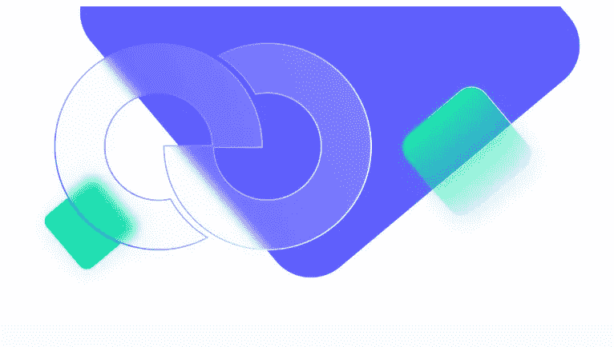
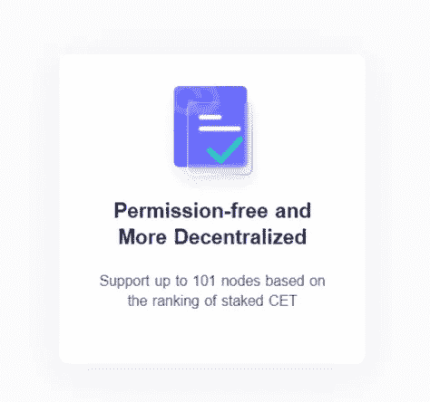

# CSC 的分类学

> 原文：<https://medium.com/coinmonks/taxonomy-of-csc-5a9f797dfc45?source=collection_archive---------36----------------------->

## 了解 CoinEx 智能链

根据几个标准，区块链系统分为公共和私人区块链。公共区块链为来自各种组织和背景的人提供了一个加入、交易和挖掘的开放平台，而私有区块链则用于促进一组个人之间的私有数据共享和交换…

# 文职人员委员会

CoinEx 智能链——CSC 是一个基于 CPoS 共识协议的无权限完全去中心化的公共区块链。CSC 支持高性能交易和较低的交易费用，因此它非常高效，可以为开发人员提供高效、低成本的链上环境来运行分散式智能合约应用程序(DApps)和存储数字资产。

## 什么是分类学

分类学是关于事物的系统分类；这里，我们处理区块链的分类，即，在处理区块链网络的分布式账本时，基于节点的权利对区块链进行分类。

## 访问和控制问题

这种分类法是关于分布式分类帐结构的，它导致授权和控制策略治理。在 CSC 网络中，有一组规则来管理用户、系统和节点，以跟踪与安全相关的活动。这些规则允许或限制用户访问区块链的资源，包括数据。这些规则要解决的基本问题如下:

*   谁能看账本？
*   谁能在账本上写字？
*   谁来监督共识以及账本的完整性？

网络的完整性策略将区块链定义为公共无许可和许可。为了充分理解区块链的分类，我们需要更深入，首先理解它是什么类型的区块链。

# 区块链技术的分类

区块链的基本类型有公立和私立区块链。公共和私有区块链在各方面不同，即谁可以成为对等网络的成员，谁或谁都可以执行共识协议并写入共享账本。

## 公共区块链

**公有区块链**完全分布式开放。任何人都可以加入同伴网络，成为其中的一员。一个人可以简单地下载网络协议，安装在他的系统中；当他上网时，他就成为会员，而不需要暴露他的身份。没有唯一的所有权，但通常会激励其成员，以便更多的成员加入网络。共识过程对所有人开放，每个人都有资格参与。

## 私有区块链

一个人可以通过网络发起者的邀请成为成员，或者应该满足发起者设定的规则才有资格加入网络。因此，这个私有 BC 被称为许可 BC，它是一个封闭类型的网络。企业启动网络，邀请或批准成员。成员的身份是已知的。这是一种分布式网络，但权力是集中的。共识机制集中在一只手里，因此块创建的所有权是单一的。私有 BC 使用该设置进行访问控制。据说公共 BC 更快、隐私丰富、可信、可管理、可扩展且合法。

## 混合或联盟区块链

**混合 BC** 是一种既有公有又有私有的区块链。在这种意义上，它是一个分布式框架，但只对选定的成员组公开。这些成员团体组成了联盟。与私有 BC 的情况不同，一致性发生在预先选择的组的选定服务器上。预选成员的身份只知道。这些团体的成员是未知的。因此，这种混合 BC 是部分集中和部分分散的。但这是一个许可的公共 BC。

# 成为 CSC 网络的一部分

CSC 运行 CPoS 共识机制，允许令牌持有者投票选举验证者，这使得网络更加分散，有利于社区管理。CPO 的特点如下:

1.  块由有限数量的验证器生成。

2.验证器依次在 PoA 中生成块。换句话说，它们共享相同的生成块的概率。

3.验证器的集合由链上治理在没有任何许可的情况下基于标记的令牌来选择和消除。

4.任何人都可以向他或她信任的节点委派令牌。

## 验证器

欢迎大家通过跑马圈地申请辅助节点成为验证者。基于整体的标桩排名，区块链将在每 200 个块中选择前 101 个节点作为验证器。验证器有义务生成块并验证链上信息。作为回报，验证者将根据他们的赌注比例获得批量佣金和一定数量的批量生产奖励。

## 访问 CSC

[电报](https://t.me/CoinEx_Announcement) | [推特](https://twitter.com/coinexcom) | [脸书](https://www.facebook.com/TheCoinEx) | [网站](https://www.coinex.org/) | [GITHUB](https://github.com/coinexcom/coinex_exchange_api/wiki) | [下载 APP](https://www.coinex.com/#toapp) | [YOUTUBE](https://www.youtube.com/channel/UCMAuqO8ZqfBwgL51-fY5n4g/)

> 交易新手？尝试[加密交易机器人](/coinmonks/crypto-trading-bot-c2ffce8acb2a)或[复制交易](/coinmonks/top-10-crypto-copy-trading-platforms-for-beginners-d0c37c7d698c)