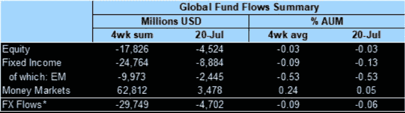
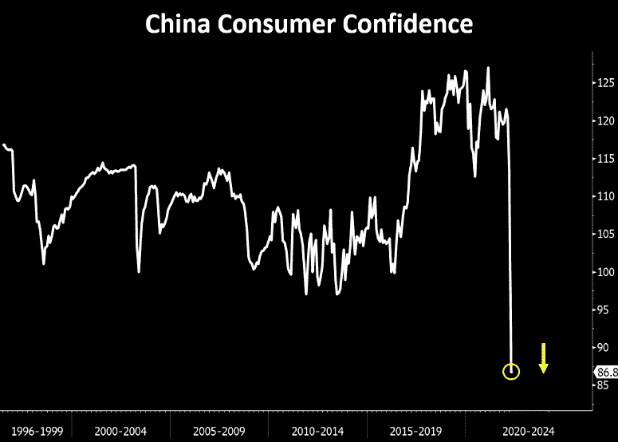

# 经济衰退中股票何时见底？科技股崩盘挤压，中国信心崩溃

> 原文：<https://medium.com/coinmonks/tech-crash-squeezes-when-do-stocks-bottom-in-a-recession-china-confidence-collapse-f280151ddea5?source=collection_archive---------27----------------------->

嘿，我是基兰！市场又将迎来新的一周，以下是需要注意的关键事件，以及来自投资银行的最有趣的宏观研究。我希望能在本周的[贸易节目](http://www.traderseed.io/)中与你交谈，一如既往，如果你有任何问题，请在下面给我留言。

# 每周观察列表

本周，周三的美联储会议占据了中心位置，市场预期中国将再次大幅加息。FOMC 的声明和美联储主席鲍威尔的新闻发布会可能会使市场紧张不安，因为市场试图判断经济衰退的可能性，以及如果经济衰退出现，美联储将如何致力于抑制通胀。

同样在本周，我们将看到世界上大多数大公司公布收益。周二，微软和 Alphabet 将在盘后发布报告。周三，我们将看到脸书的数字，周四，亚马逊和苹果。这里的上涨或下跌的惊喜当然会移动主要的股票指数。

# 宏观视角

**外流..**尽管卖空交易仍在持续，但在截至 7 月 20 日的一周，流入全球股票基金的全球资金仍为负(前一周为负 50 亿美元，前一周为负 30 亿美元)。流入全球固定收益基金的资金在几周的正流入后降至负水平(负 90 亿美元对正 10 亿美元)。

网络技术公司的崩溃经历了 3 次 30%的挤压。在科技股大抛售期间，纳斯达克熊市遭遇挤压。这很好地提醒了挤压潜力。

对冲基金的收入持续下降。他们并不认同市场的最新上涨。全球高频流量继续显示出下降趋势，而净流量也仍然略呈负值。

**经济衰退中股票何时见底？美国似乎有可能进入衰退。平均而言，股市通常会在衰退结束前 4 个月跌入低谷**

**港口拥堵达到峰值..**港口拥堵统计随着集装箱运输周期达到峰值。供应链的好消息。

**中国不信任案。这才叫撞车。如果中国会有一些食品供应问题，这将是革命性的危机信心水平(所有政府离混乱只有 3 顿饭的距离…)**

**中国地产..**是世界上最大的资产类别。目前估计总价值为 62 万亿美元。如果这个市场崩溃，潜在的溢出效应将是巨大的。一个需要监控的重要区域。

我希望你觉得这很有趣，很有用。请务必每周关注我，了解市场动态。如果您有任何问题、意见或反馈，请在下面的评论中告诉我。

祝你一周愉快！
基兰

> 交易新手？试试[加密交易机器人](/coinmonks/crypto-trading-bot-c2ffce8acb2a)或者[复制交易](/coinmonks/top-10-crypto-copy-trading-platforms-for-beginners-d0c37c7d698c)