# 技术引发的加密市场周期——“加密现在死了吗？”

> 原文：<https://medium.com/coinmonks/tech-induced-crypto-market-cycles-9ee00bbe28b2?source=collection_archive---------6----------------------->

**从技术角度看加密繁荣-萧条周期的简史**

## **-目录-**

**那么，现在一切都结束了吗？**

**周期是如何形成的:** ——Gartner 炒作周期:“技术引发炒作”
——Jean-Paul Rodrigue 的四个阶段:“聪明的钱先动”

**以前周期的技术树** -2008–2013 纪元
-2014–2017 纪元
-2018–2021 纪元

**正在构建的新技术** -计算基础设施的改进
-分散式数字身份
-高级令牌组学

**未被察觉的大规模采用趋势**
-用户和开发者的数量

**结论:循环往复**

**链接**

**免责声明**

# 那么，现在一切都结束了吗？

随着 2021 年的历史性牛市成为过去，加密市场正在经历今年最动荡的时期。宏观上，我们已经看到战争导致制裁，通货膨胀上升到几十年来从未见过的水平，开始加息，市场正在谈论可能的衰退甚至即将到来的萧条。在密码市场，当最大的算法稳定币项目失败并拖累整个市场时，NFT 狂热引发的零星牛市最终崩溃了。卢纳和 UST 总共蒸发了 600 亿美元的财富。这场动荡已导致三箭资本(Three Arrows Capital)和 Celsius 等一些最大的加密公司破产，导致了整个市场的蔓延。目前看来，这对于加密市场来说是毁灭性的。有人说这个密码一直以来都是一个集合密码。

那么，现在一切都结束了吗？妄下结论，我们坚信不是。贪婪和恐惧的人性永远不会改变，密码行业总是有自己的炒作和萧条周期，通过这个周期实现了关键的技术突破。然后，它导致了下一个周期，推动行业向大规模采用迈进了一步。当你回顾历史时，这种模式变得更加清晰。现在，这是一个回顾和思考创新技术如何通过循环被采用的好时机。

# **循环是如何形成的:**

## **Gartner 炒作周期:“技术引发炒作”**

有着大胆承诺的新技术通常会成熟，并在一个又一个周期中被采用。Gartner Hype Cycles 提供了技术和应用程序的成熟度和采用情况的图形表示，以及它们与解决实际业务问题和开拓新机会的潜在关联。Gartner Hype Cycle 方法让您了解一项技术或应用程序将如何随着时间的推移而发展。

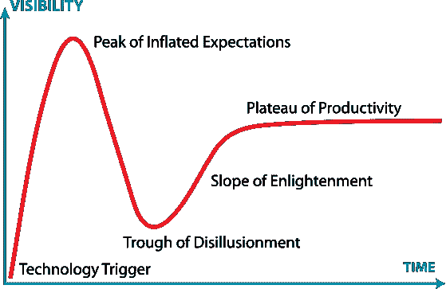

[[Gartner Hype Cycle]](https://www.gartner.com/en/documents/3887767)

> 创新触发:一项潜在的技术突破拉开了序幕。早期的概念验证故事和媒体兴趣引发了大量的宣传。通常没有可用的产品存在，商业可行性未经证实。
> 
> **过高期望的顶峰**:早期的宣传产生了许多成功的故事——通常伴随着大量的失败。一些公司采取行动；许多人没有。
> 
> **幻灭的低谷**:随着实验和实施的失败，人们的兴趣减弱。这项技术的生产者要么出局，要么失败。只有当幸存的供应商改进他们的产品，使早期采用者满意时，投资才会继续。
> 
> 更多关于技术如何使企业受益的例子开始具体化，并变得更广为人知。技术提供商推出第二代和第三代产品。更多的企业资助试点；保守的公司保持谨慎。
> 
> 生产力的平稳期:主流采用开始起飞。评估供应商生存能力的标准更加明确。该技术广泛的市场适用性和相关性显然正在得到回报。

## **Jean-Paul Rodrigue 的四个阶段:“聪明的钱先动”**

除了炒作周期的技术方面，不同的资金投资者在每个阶段也扮演着不同的角色。让-保罗·罗德里格斯的著名图表描绘了泡沫形成的四个不同阶段。

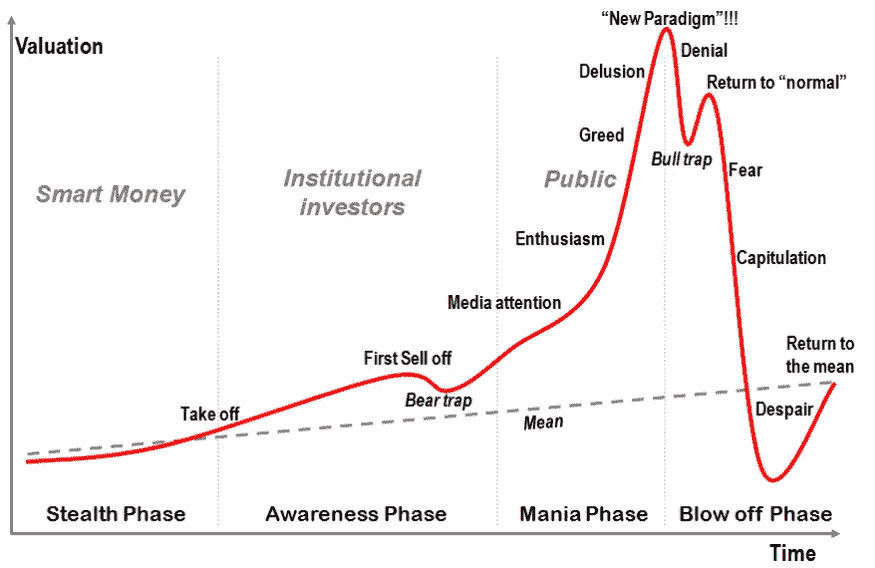

[[Jean-Paul Rodrigue Four Phases of a Bubble]](https://transportgeography.org/contents/chapter3/transportation-and-economic-development/bubble-stages/)

> **潜行**:那些理解新基本面的人意识到未来大幅升值的机会正在出现，但风险很高，因为他们的假设迄今尚未得到证实。因此,“精明的资金”通常会悄悄地、谨慎地投资于这一资产类别。
> 
> 意识:许多投资者开始注意到这一势头，带来额外的资金，推高价格。随着少数投资者兑现他们的第一笔利润，可能会出现一个短暂的抛售阶段。精明的投资者借此机会巩固其现有地位。在这一阶段的后期，媒体开始注意到，那些进入的人变得越来越“不老练”。
> 
> 狂热:每个人都注意到价格在上涨，公众都投身于这个“千载难逢的投资机会”这个阶段不是关于逻辑，而是关于心理学。大量资金涌入，创造了更大的预期，并将价格推至极高水平。在这场新的狂热中，精明的投资者和许多机构投资者都没有注意到，他们正悄悄地撤出并出售自己的资产。每个人都试图加入，新进入者对市场、市场动态和基本面完全没有了解。利用一切可能的金融手段，尤其是杠杆和债务，哄抬价格。在某一点上，关于全新的基本面的声明暗示着“永久的高平台”已经达到，以证明未来价格上涨的合理性；泡沫即将破灭。
> 
> **爆发**:顿悟的时刻(一个触发器)到来了，每个人几乎同时意识到情况已经改变。价格暴跌的速度比泡沫膨胀的速度快得多。许多过度杠杆化的资产所有者破产，引发了新一轮抛售。甚至有可能估值低于长期均值，这意味着一个重大的买入机会。然而，公众在这一点上认为这是“最糟糕的投资”。这是精明的投资者开始低价收购资产的时候了。

# **前几个周期的科技树**

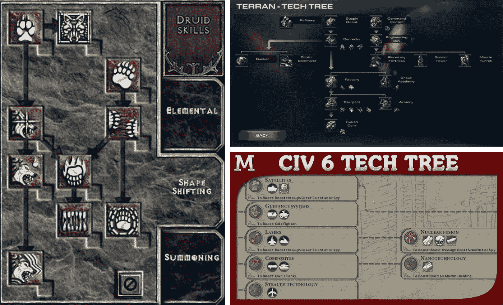

[We are all familiar with how one tech leads to another] (clockwise from the left: Diablo 2, Starcraft 2, Civilization 6)

自从 2008 年比特币白皮书发布以来，Crypto/Web3 技术已经经历了几个周期。然而，与永远不会回来的时尚潮流不同，密码行业总是以更大的周期回来，因为它从每个炒作和泡沫破裂的周期中构建了关键的构件。从每一个周期开始，关键的技术突破都得以实现，并伴随着技术进步，引领着下一个炒作周期的发展。下面是一个简短的历史，一个科技树，如果你愿意，每个以前的周期和技术突破。

> 交易新手？尝试[加密交易机器人](/coinmonks/crypto-trading-bot-c2ffce8acb2a)或[复制交易](/coinmonks/top-10-crypto-copy-trading-platforms-for-beginners-d0c37c7d698c)

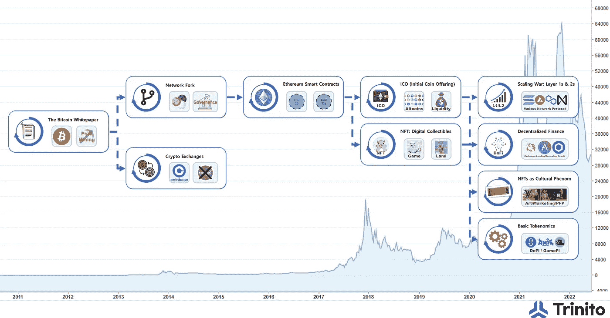

[30,000ft View on the Crypto Tech History] (click and expand the picture)

# -**2008–2013 纪元:**

**比特币白皮书、网络分叉、加密交换**

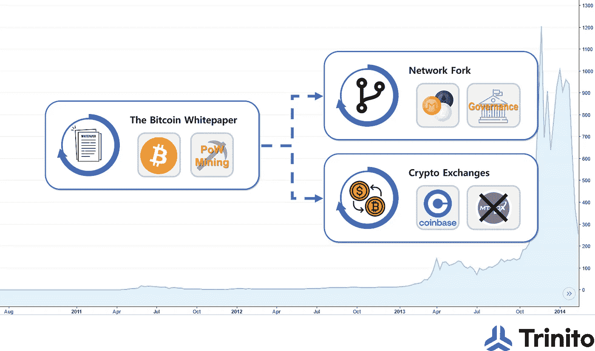

[2008–2013 Era: Bitcoin Whitepaper, Network Fork, Early Crypto Exchanges]

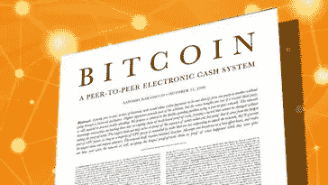

**比特币白皮书**可以说是 2008 年诞生整个密码行业的第一个技术突破。它为世界上第一个可用的加密资产比特币奠定了蓝图，比特币仍然是所有加密资产中最大和最古老的。比特币的关键组成部分之一是其共识机制，即工作证明，它利用电力和计算能力来保护网络。电力矿商已经成长为一个属于他们自己的行业，由遍布地缘政治区域的[而不仅仅是几家上市公司](https://compassmining.io/education/crypto-mining-companies-ranked-market-cap/)组成。

**比特币出现后，许多类型的网络分叉**纷纷效仿。源代码是公开的，网络对任何人都是免费的。很快，人们用比特币之外的不同参数和假设进行实验，开始了自己的替代比特币网络。莱特币是早期的替代币之一，是比特币的源代码分支。按市值计算，莱特币至今仍价值 10 亿美元。分叉为成千上万的替代硬币打开了大门，并为人们提供了引导讨论如何运行网络的方法，这是一种链外治理的形式。

第一个密码交易所在这个时代形成。其中一些名人是 2010 年成立的 Mt. Gox，2011 年 8 月成立的 Bitstamp，2012 年 6 月成立的比特币基地，以及 2012 年 12 月成立的 BitFinex。一些早期的交易所，如 Mt. Gox，没有存在很长时间，最终崩溃了，但其他一些交易所，如比特币基地，仍然是该行业的基石，不仅经受住了时间的考验，还铺平了道路，以接纳数亿用户，并充当与监管机构和政府合规的联络人。

# -**2013–2017 纪元:**

**以太坊智能合约，** **ICOs** ， **NFTs 原语**

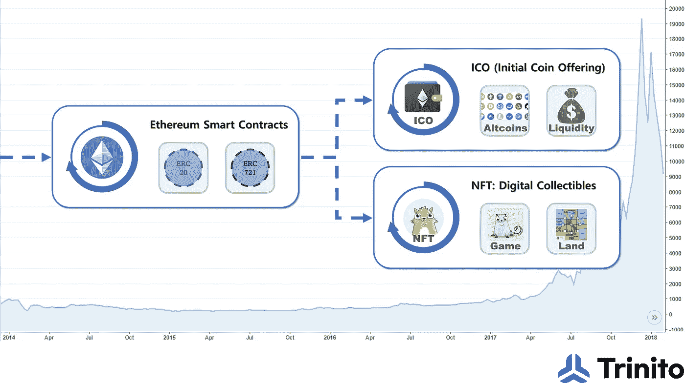

[2013–2017 Era: Ethereum Smart Contracts, ICOs, NFTs Primitives]

以太坊是基于比特币和区块链技术可以从金钱之外的其他应用开发中受益的想法而设计的。2013 年底，Vitalik Buterin 在一份白皮书中首次提出以太坊的概念，以太坊在 2014 年 7 月至 8 月期间通过比特币支付首次硬币发行。2016 年发生的 1600 万美元的 ICO 和 1.5 亿美元的“The DAO”资金被标记为迄今为止历史上最大的一些资金。凭借更具表现力的编码语言和协议设计，以太坊网络使创建和运行分散的应用程序和具有自己令牌的智能合约成为可能。以太币最流行的两种形式是 ERC-20 和 ERC-721。这些新发明为成千上万的新协议和应用铺平了道路，这些协议和应用包括最初的硬币发行、分散金融和不可替代的代币等等。

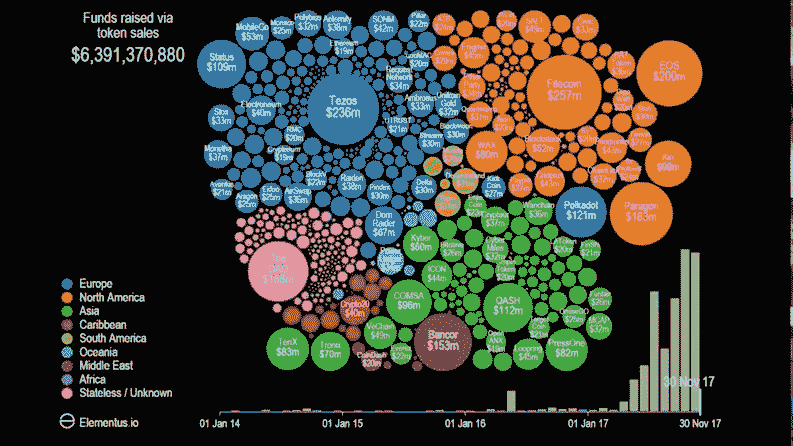

Visualizing the ICO Explosion in 2017 [https://www.visualcapitalist.com/video-ico-explosion-one-animated-timeline/](https://www.visualcapitalist.com/video-ico-explosion-one-animated-timeline/)

以太坊的 ERC 20 格式为**成千上万的初始硬币发行(“ICO”)提供了融资手段。** ICO 是一种进入资本市场的新方式，为数以万计有新想法的企业家筹集资金，帮助他们开发自己的区块链技术潜力。[在 2017-18 年的 ICO 热潮中，3250 个项目估计筹集了 214 亿美元](https://cointelegraph.com/news/ico-market-2018-vs-2017-trends-capitalization-localization-industries-success-rate)。这个时代的很多 ICO 项目，并没有像其他早期投资一样，把承诺具体化。然而，ICO 在当时充当了牛市的催化剂，并为加密经济提供了自己的新项目融资手段(以不同的名称，如 IDO、IEO、Launchpads 等)。)

[Kevin McCoy, “Quantum” (image courtesy of Sotheby’s)]

[Cryptokitties]

以太坊的 ERC-721 格式在 2013-2017 年时代启用了不可替代的令牌(“NFT”)原语。每个代币单元都是唯一的 NFT 格式适用于数字收藏品。NFT 最早的一些创意自然是以数字艺术和游戏项目的形式出现的。艺术家凯文·麦考伊的《量子》于 2014 年出版。在 2013-2017 年的大部分时间里，NFTs 仍然是数字艺术和商品产权的概念证明，但从未引起更广泛的市场关注。直到 2017 年 11 月 CryptoKitties 发布后，NFTs 才开始流行起来。虽然短暂，但 CryptoKitties 的成功为创造 CryptoKitties 的工作室 Axiom Zen 赢得了知名投资者的资金。像美国消费者新闻与商业频道和福克斯新闻频道这样的主要新闻站报道了在狂热爱好者中交易的数字收藏品。这样的发展为下一个周期激励了一代艺术家和企业家。

# -**2017–2021 纪元:**

**L1 & L2 网络，DeFi，NFT 作为文化现象，基本记号经济学**

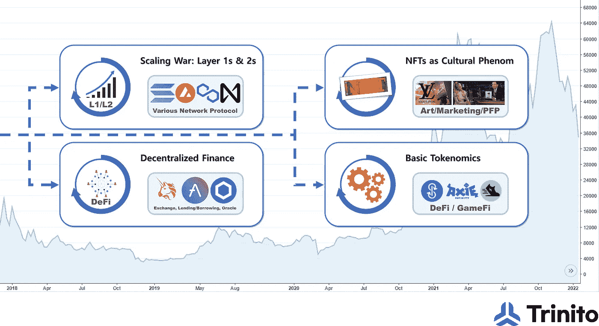

[2017–2021 Era: L1 & L2 Networks, DeFi, NFT as Cultural Phenom, Basic Tokenomics]

**各种 L1 和 L2 网络**专注于可扩展性和低交易费用，如 Solana、Avalanche、Polygon、Near，以及 2017-21 时代推出的许多其他网络。鉴于以太坊的速度和容量有限，而区块链交易的市场需求巨大，这些其他网络吸引了市场和开发商的极大关注。这些网络为零售 dApps 提供了快速和廉价的区块空间，并通过赠款、生态系统基金和其他支持支持新的重要项目和研究。

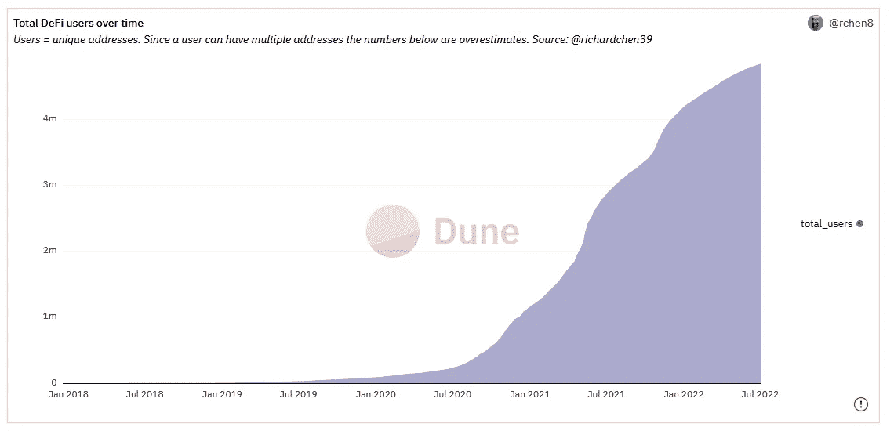

[[Growth of DeFi Users]](https://dune.com/rchen8/defi-users-over-time)

**分散金融，或 DeFi** ，是一种金融形式，它使用区块链技术、智能合同和分散应用程序(dApps)在区块链网络上提供金融服务，如贷款、交易和投资，而无需任何中介。2020 年夏天，一家借贷平台 Compound 推出了$COMP token 来奖励其用户。通过向用户发放令牌来提高激励，在 2020 年夏季 DeFi 期间，复合和众多 DeFi 项目吸引了大量新资本和用户到他们的平台。DeFi 是高度可编程的、防篡改的、可组合的、透明的、无权限的和自我管理的。DeFi 是真正加密应用的一项突破性成就，有着在加密之外不可能实现的巨大前景。

[[Adidas’ Bored Ape Yacht Club Collaboration]](https://twitter.com/adidasoriginals/status/1466446117642584068)

在这个时代，NFTs 获得了文化意义。 [不可替代是指只有一个独特的项目，没有其他类似的项目。](https://www.rollingstone.com/culture-council/articles/nfts-redefining-cultural-value-1173699/)在 NFTs 之前，数字一词实际上是独特或专有的反义词。例如，音乐和电影行业已经与数字盗版斗争了很长时间。NFTs 第一次在数字领域实现了唯一性(或不可替代性)。无怪乎文化、艺术和时尚产业最先意识到 NFT 在 2021 年的潜力。这些行业天生就将排他性和独特性理解为创造价值的一种方式。平面设计师皮普尔在佳士得以 6900 万美元的价格拍卖了他的画作。Jay-Z 和贾斯汀比伯把他们的社交媒体资料改成了著名的 PFP(资料图片)NFTs。路易威登和耐克是众多推出自己的 NFT 营销策略的公司之一。有些人可能还没有听说过 crypto，但现在每个人都知道什么是 NFT。

将 Tokenomics 作为增长黑客的 Web3 零售应用:长期以来，缺乏实际使用一直是批评者的观点。然而，随着许多构建模块的到位，我们终于在游戏和生活方式类别中看到了拥有数百万用户的**加密零售应用**。Axie Infinity 拥有数百万来自东南亚的游戏玩家，已经成为“即玩即赚”( P2E)游戏类别的领导者。StepN 已经成为移动赚钱(M2E)生活方式类别的领导者，并且注册了数百万用户。新的 P2E 或 M2E 概念建立在加密基础设施之上，如更快的区块链、可替换令牌&NFT 和之前提出的基本令牌组学。这些 dApps 证明了加密不仅与金融有关，也是互联网革命的延续，因此有了 Web3 的概念。

# - **2022 年及以后:**

什么样的潜在科技触发物正在被制造？尽管在十多年的时间里，密码行业已经从零到一取得了长足的进步，但仍有很大的发展空间来释放其全部潜力。因此，在前沿有新的研究和实验，使加密不仅更容易获得，而且是前所未有的。

**计算基础设施的改进(扩展性和互操作性):**分散计算固有的高成本一直是日常用户使用基础设施的瓶颈，就像他们使用 YouTube 或 Instagram 等智能手机应用程序一样。使用加密又慢又贵，各种竞争网络分散了流动性和用户基础。到目前为止，有这么多有前途的项目致力于解决区块链的可伸缩性和互操作性。零知识证明、等离子体、分片和侧链是正在积极研究的一些流行的扩展方法。模块化架构、web 组装、桥和零层技术都是提高不同区块链之间互操作性的突出努力。随着计算基础设施的改善，许多企业家将发现以前无法实现的商业模式成为可能。

**分散式数字身份** 集中式数字身份存在许多问题，比如网络攻击。今天，加密以所有可转移的资产为中心，如代币和 NFT，但仍然缺乏对形成个人身份的社会关系进行编码的方法。DeFi 主要是转移或抵押资产。GameFi 和 Web3 应用因过度金融化而受到批评。 [E. Glen Weyl 等人](https://papers.ssrn.com/sol3/papers.cfm?abstract_id=4105763)通过令牌(灵魂绑定令牌或“SBT”)明确了去中心化身份的想法。分散的数字身份可能有潜力通过声誉打开抵押不足的贷款市场，阻碍和补偿协调的战略行为，创造具有可分解、共享权利和许可的新市场。这可能是另一个零比一的时刻，就像 DeFi 或 NFT 一样，将激励并给市场带来兴奋。

代币激励制度对 dapp 的早期成功至关重要，但这些 dapp 的代币经济学经常被批评为不可持续。加密行业对前期简单的象征性经济学更加谨慎，并在寻找更可持续、更和谐的激励体系。令牌是数字所有权的同义词，数字所有权是加密的核心价值主张，令牌组学将永远处于加密网络和应用的中心。它的潜力还有很多需要探索，毫无疑问，密码领域的下一件大事将是令牌组学的新剧本，这将促进它的发展和稳定。

# **未被察觉的大规模采用趋势**

在 crypto 中，并不是所有东西都在不规则的循环中运动。尽管这些年来价格和投资者情绪起伏不定，但密码行业的一些指标只指向向上和向右的方向。下面仅举几个例子。

**用户数量**

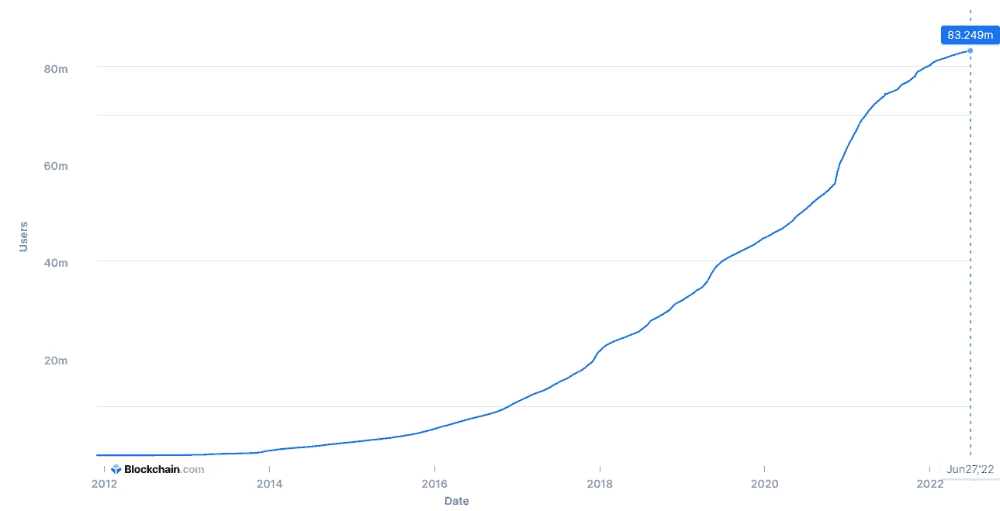

[[Blockchain.com’s Number of Wallets]](https://www.blockchain.com/charts/my-wallet-n-users)

秘密人口的数量呈持续上升趋势。上图显示了 Blockchain.com 以钱包衡量的用户数量呈平滑上升趋势。[Crypto.com 报告](https://blog.crypto.com/global-crypto-owners-near-300-million-predicted-to-hit-1-billion-by-the-end-of-2022/)称，到 2021 年 12 月，全球密码拥有者将达到 2.95 亿，比 2021 年初增长 178%。假设 15 至 64 岁的世界人口为 52 亿(80 亿的 65%)，全球加密采用率约为 5%，这使该行业处于早期采用阶段，主流采用差距不会太远。

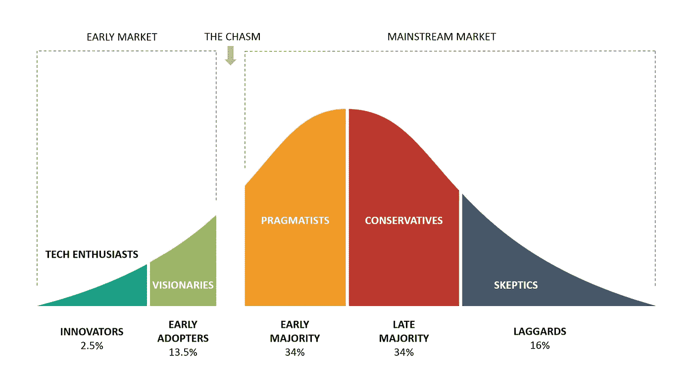

[Crypto Worldwide Adoption in the Early Adopters Stage] (Picture: Think Insights)

**开发者数量**

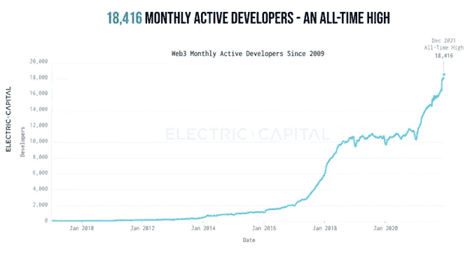

[Monthly Active Developers (Electric Capital)]

开发人员参与度是技术采用的早期领先指标。 [Electric Capital 报道](https://raw.githubusercontent.com/electric-capital/developer-reports/master/dev_report_2021.pdf)在 2021 年底，每月提交开源加密和 Web3 项目代码的活跃开发人员达到历史最高水平，超过 18，000 人。超过 34，000 名新开发人员在 2021 年提交了代码，这是历史上最高的。熊市的前景是，在 2017 年和 2018 年上一次牛市期间加入的开发人员在接下来的几年熊市中基本上都留了下来，尽管网络价值从峰值下跌了 83%。

# **结论:通过每个周期进行**

我们已经看到商业周期反复经历繁荣和萧条。当新的创新技术被开发和采用时，周期的波峰和波谷变得更加突出。毫无疑问，加密技术是一项创新技术，它鼓舞了如此多的人，开启了如此多的可能性。因此，在过去的几年中，crypto 出现了夸大的牛市和熊市。

在 Trinito，我们认为牛市和熊市周期的发展模式将在未来几年内持续存在。人性的贪婪和恐惧永远不会改变。熊市期间，关键的基石正在被构建。技术突破和重要的实验将由那些有着坚定信念的企业家和研究人员实现，以在下一轮牛市中获得回报。回顾在熊市期间开发的技术催化剂，这些催化剂引发了上一轮牛市中的下一轮牛市，这恰恰显示了加密中的这种模式。我们相信在熊市中建立起来的东西将为下一轮牛市奠定基础，我们将找到一切可能的方法来支持他们生存和成功。

由 Trinito 投资主管 SungPil Huh 撰写，Trinito 联合创始人 Eric Yoo 供稿。

#加密货币#比特币#以太坊# DeFi # NFT # SBT # dApps #牛市#熊市# marketcycle #技术

**链接**

[https://99bitcoins.com/bitcoin/historical-price/](https://99bitcoins.com/bitcoin/historical-price/)

[https://thenewstack.io/web3-developer-ecosystem/](https://thenewstack.io/web3-developer-ecosystem/)

[https://TechCrunch . com/2022/05/05/crypto-gaming-is-growing-but-can-it-reach-people-out-of-the-web 3-world/](https://techcrunch.com/2022/05/05/crypto-gaming-is-growing-but-can-it-reach-people-outside-of-the-web3-world/)

[https://consensys.net/reports/web3-report-q3-2021/](https://consensys.net/reports/web3-report-q3-2021/)

https://dune.com/rchen8/defi-users-over-time

[https://www . Forbes . com/sites/jeffkauflin/2018/10/29/where-did-the-money-go-inside-the-big-crypto-icos-of-2017/？sh=45188bd6261b](https://www.forbes.com/sites/jeffkauflin/2018/10/29/where-did-the-money-go-inside-the-big-crypto-icos-of-2017/?sh=45188bd6261b)

[https://blog . portion . io/the-history-of-nfts-how-they-get-started/](https://blog.portion.io/the-history-of-nfts-how-they-got-started/)

**免责声明**

这不是投资建议，仅供参考。您不应将任何此类信息或其他材料理解为法律、税务、投资、财务或其他建议。