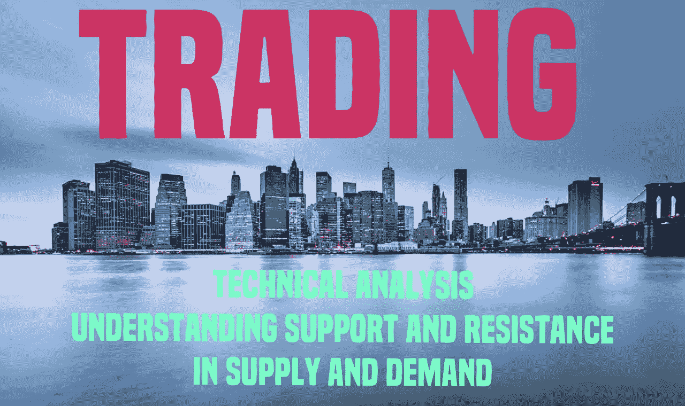

# 技术分析

> 原文：<https://medium.com/coinmonks/technical-analysis-7c29511edbf3?source=collection_archive---------45----------------------->

## **了解供需中的支持和阻力**

## **什么是技术分析？**

技术分析是对过去价格模式的研究，以确定市场趋势并预测未来价格。它基于这样一种信念，即市场是有效的，价格是趋势性的。技术分析师使用图表来识别模式，这些模式可以暗示…