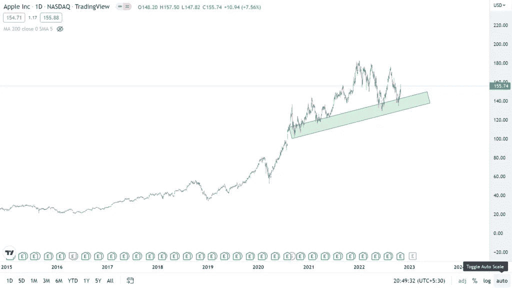
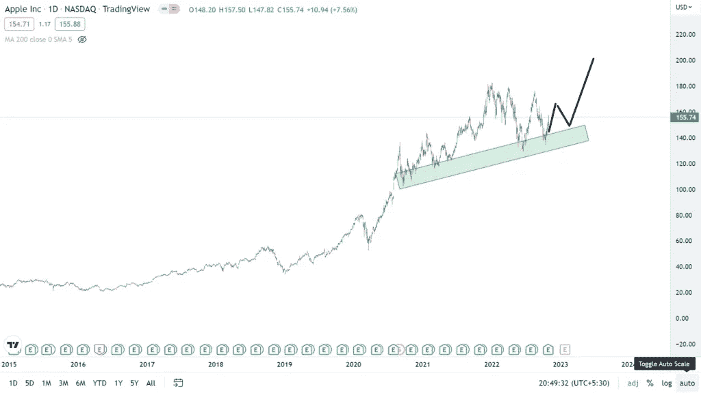
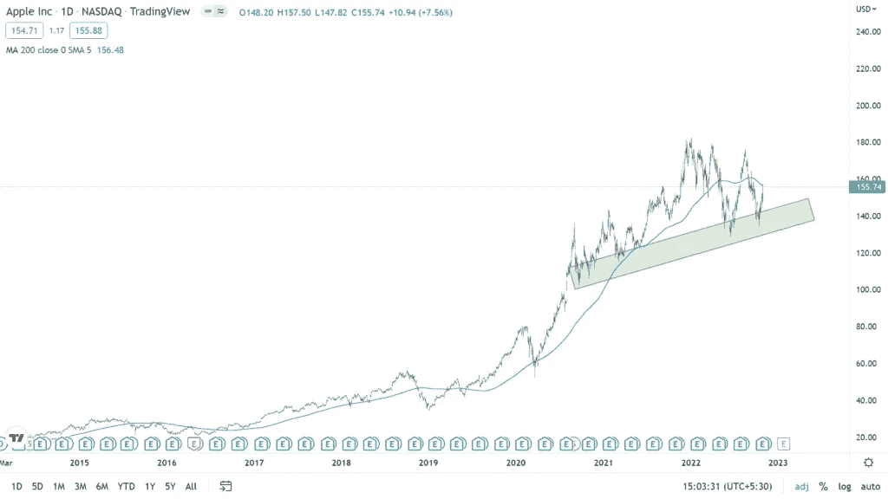

# (技术分析)苹果公司 2023 年至 2030 年的股价目标

> 原文：<https://medium.com/coinmonks/technical-analysis-apple-inc-share-price-target-2023-to-2030-2ea43811a1c3?source=collection_archive---------15----------------------->

# 苹果公司公司详情

Apple logo

苹果公司是一家总部位于美国的跨国科技公司，经营消费电子产品、在线服务以及软件。公司总部位于美国加利福尼亚州库比蒂诺。从营收来看，苹果是最大的科技公司。考虑到其市值，苹果是世界上最大的公司。它与微软、Alphabet、Meta 和亚马逊一起被评为美国五大信息技术公司。苹果手表由史蒂夫·乔布斯、史蒂夫·沃兹尼亚克和罗纳德·韦恩于 1976 年创立。苹果公司的一些受欢迎的产品是 iPhone，iPad，Apple Watch，Mac，AppleTV，AirPods，HomePod 迷你等。比较受欢迎的服务有 AppStore、iTunes Store、Apple TV+、Apple Music、Apple Fitness 等。

> 从顶级交易者那里复制交易机器人。免费试用。

# 苹果公司股价技术分析

当前**苹果公司的股价**是 155.74 美元。该股在 2022 年 1 月触及 181 美元的最高价。

Apple Inc share price zone

**苹果公司的股票**不断地在长方形的区域上制作上下图案。自 2020 年 8 月以来，它已经九次触及该区域。

Apple Inc share price up trend

该股可能会回撤并触及 145 美元，然后向上移动。由于市场正在复苏，价格有望突破 190 美元。

Apple Inc share price 200 moving average

考虑到 200 均线，价格正好触及均线趋势线。这表明购买股票，因为从这一点来看，价格预计将显示逐步上升的趋势。

苹果公司的股票投资也以股息的形式给予了固定的投资回报。该公司于 2022 年 11 月宣布股息为 0.23 美元，2022 年 8 月 0.23 美元，2022 年 5 月 0.23 美元，2022 年 2 月 0.22 美元，2021 年 11 月 0.22 美元，2021 年 8 月 0.22 美元，2021 年 5 月 0.22 美元，2021 年 2 月 0.205 美元，2020 年 11 月 0.205 美元，2020 年 8 月 0.82 美元，5 月 0.82 美元

苹果公司的股票在未来有增长的潜力，投资者可以期待未来一二十年的高回报。

还看 [HDFC 股价目标链接](https://updatedgeek.com/hdfc-ltd-share-price-and-target/)

# 目标价格

2022 年底的目标价格是 162 美元，2023 年是 208 美元，2024 年是 230 美元，2025 年是 272 美元，2026 年是 303 美元，2027 年是 326 美元，2028 年是 383 美元，2029 年是 401 美元，2030 年是 419 美元。

**苹果公司股份**代表近几年稳定的增长率。要知道最佳进场点，建议根据图表形态跟随技术分析信号。这个信号代表强烈的买入。

由于过去几年的收入增长，苹果公司的份额有着强大的基础。由于云计算、电动汽车生产和在线广告的市场前景看好，预计这一趋势将持续下去。

[要在印度最好的经纪人那里开立 demat 账户，请点击此处](https://link.upstox.com/DQT7YCUH7irWFzFM6)

# 常见问题

**1。5 年后苹果会是什么价位？**

苹果公司预计在未来 5 年内将达到 326 美元

**2。10 年后苹果会值多少钱？**

10 年后的预期价格将是 450 美元

**3。苹果股票的 12 个月目标价是多少？**

苹果股票的 12 个月目标价是 211 美元

**4。苹果股票能达到 1000 美元吗？**

是的，苹果公司的股票预计到 2042 年会达到 1000 美元

**5。苹果是买入持有的情况吗？**

是的，目前苹果处于买入并持有的状态。

**6。苹果股票未来还会增长吗？**

这支股票的长期回报预测是积极的，但不能保证投资利润。价格将代表涨跌。

**免责声明**:如果你想投资股市，在做出购买决定之前，你应该咨询你的理财顾问。你应该评估风险，研究公司细节。

**相关搜索**

为什么信用卡或借记卡会有有效期？

为什么美元对印度卢比的汇率在上升？

[2022 年最佳赚钱调查网站](https://updatedgeek.com/best-money-making-survey-site-in-2022/)

**关注更多更新**

*在 LinkedIn* 上关注[*Raveen Chawla*](https://www.linkedin.com/in/raveen-chawla-02b3017b)

**相关搜索，点击* [*文章*](https://updatedgeek.com/) *，点击* [*网络故事*](https://updatedgeek.com/web-story-sitemap.xml)*

> *加入 Coinmonks [电报频道](https://t.me/coincodecap)和 [Youtube 频道](https://www.youtube.com/c/coinmonks/videos)了解加密交易和投资*

# *另外，阅读*

*   *[加密货币储蓄账户](/coinmonks/cryptocurrency-savings-accounts-be3bc0feffbf) | [YoBit 审核](/coinmonks/yobit-review-175464162c62)*
*   *[Botsfolio vs nap bots vs Mudrex](/coinmonks/botsfolio-vs-napbots-vs-mudrex-c81344970c02)|[gate . io 交流回顾](/coinmonks/gate-io-exchange-review-61bf87b7078f)*
*   *[CoinFLEX 评论](https://coincodecap.com/coinflex-review) | [AEX 交易所评论](https://coincodecap.com/aex-exchange-review) | [UPbit 评论](https://coincodecap.com/upbit-review)*
*   *[AscendEx 保证金交易](https://coincodecap.com/ascendex-margin-trading) | [Bitfinex 赌注](https://coincodecap.com/bitfinex-staking) | [bitFlyer 点评](https://coincodecap.com/bitflyer-review)*
*   *[Bitget 回顾](https://coincodecap.com/bitget-review)|[Gemini vs block fi](https://coincodecap.com/gemini-vs-blockfi)cmd |[OKEx 期货交易](https://coincodecap.com/okex-futures-trading)*