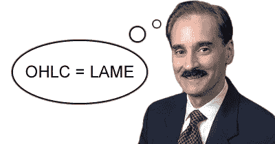
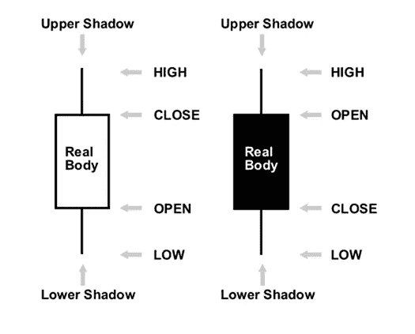
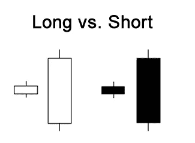
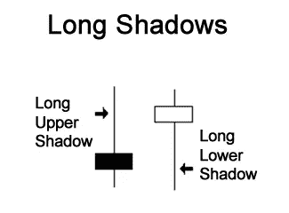

# 什么是日式烛台？

> 原文：<https://medium.com/coinmonks/technical-analysis-for-beginners-what-is-a-japanese-candlestick-3b03372c5ba4?source=collection_archive---------10----------------------->

Image from [Babytips](https://www.babypips.com/learn/forex/sexy-bodies-and-strange-shadows)

日本人发展了他们传统的技术分析来交易大米，并对此保密。

西方人史蒂夫·尼森从他的日本经纪人朋友那里得知这一被称为日本烛台的“秘密”技术后，“发现”了这一技术。

在他对烛台的研究和学习之后，史蒂夫开始写关于它们的文章，日本的绝密技术在 20 世纪 90 年代慢慢流行起来。

也许没有史蒂夫·尼森，烛台图表今天可能仍然是一个秘密。

你可以在这里阅读更多关于日本烛台[的历史。](/coinmonks/history-of-japanese-candlesticks-a812b5ceac2a)

为了便于理解，我将在本文中使用图像来解释日本烛台。

**日本烛台讲解**

日本烛台是由特定时间段的开盘价、最高价、最低价和收盘价制成的。

Image from [Babytips](https://www.babypips.com/learn/forex/sexy-bodies-and-strange-shadows)

*   在特定的时间框架内，当收盘价高于开盘价时，蜡烛线是看涨的(向上移动)。
*   即使大部分交易平台用白色，看涨的烛台不是白色就是绿色。但是烛台是什么颜色并不重要；它包含的信息决定了它的定义。
*   在选定的时间范围内，当收盘价低于开盘价时，蜡烛线是看跌的(向下移动)。
*   黑色或红色的烛台代表熊烛台。不过，这不是规则。可以用不同的颜色来区分*。*
*   烛台的真正主体是它的填充部分。
*   阴影是身体上下延伸的细线。
*   高点在上影线的顶端。
*   低点在下影线的底部。

**烛台尺寸:**

烛台有不同的主体尺寸；

Image from [Babytips](https://www.babypips.com/learn/forex/sexy-bodies-and-strange-shadows)

*   一根长蜡烛线，收盘价高于开盘价，表明买家在时间框架内影响市场。
*   长身体的烛台是支配买卖压力的标志。
*   一根长蜡烛线，开盘价高于收盘价，表明市场在选定的时间范围内有买入或卖出的压力。
*   矮身烛台意味着买卖减少了。

**烛台阴影(灯芯)**

交易时段的上下阴影为解读市场情绪提供了至关重要的信息。

*   该时段的最高点是上影线。
*   该时段的最低点是下影线。
*   带长影的蜡烛图显示交易活动持续到开盘价和收盘价之后。

Image from [Babytips](https://www.babypips.com/learn/forex/sexy-bodies-and-strange-shadows)

*   带有短阴影的日本烛台表示交易发生在开盘价和收盘价之间。
*   上阴影长、下阴影短的烛台表示买家提高了出价，给出了有竞争力的报价。出于某种原因，卖家进入市场，推动价格下跌，以开盘价收盘。
*   下影线很长、上影线很短的日本烛台，暗示着卖家正在控制降价。出于某种原因，买家重新进入市场，以提高价格，并在临近开盘时收盘。

> 交易新手？试试[加密交易机器人](/coinmonks/crypto-trading-bot-c2ffce8acb2a)或者[复制交易](/coinmonks/top-10-crypto-copy-trading-platforms-for-beginners-d0c37c7d698c)

**结论:**

我知道你觉得这篇文章很有帮助。如果是这样，请鼓掌 50 次以示感谢，并关注我的更多帖子。

非常感谢。

> 加入 Coinmonks [电报频道](https://t.me/coincodecap)和 [Youtube 频道](https://www.youtube.com/c/coinmonks/videos)了解加密交易和投资

# 另外，阅读

*   [加拿大最佳加密交易机器人](https://coincodecap.com/5-best-crypto-trading-bots-in-canada) | [库币评论](https://coincodecap.com/kucoin-review)
*   [火币加密交易信号](https://coincodecap.com/huobi-crypto-trading-signals) | [HitBTC 审查](/coinmonks/hitbtc-review-c5143c5d53c2)
*   [TraderWagon 回顾](https://coincodecap.com/traderwagon-review) | [北海巨妖 vs 双子座 vs BitYard](https://coincodecap.com/kraken-vs-gemini-vs-bityard)
*   [如何在 FTX 交易所交易期货](https://coincodecap.com/ftx-futures-trading)
*   [OKEx vs KuCoin](https://coincodecap.com/okex-kucoin) | [摄氏替代品](https://coincodecap.com/celsius-alternatives) | [如何购买 VeChain](https://coincodecap.com/buy-vechain)