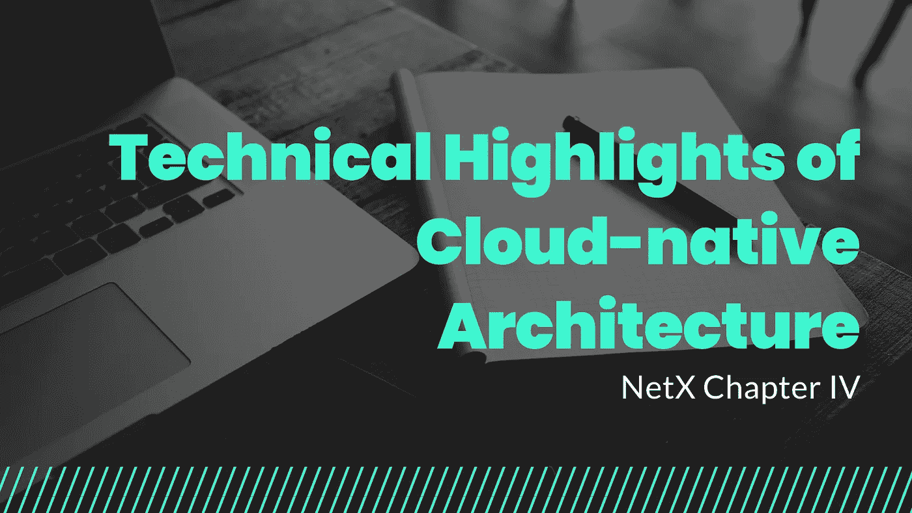

# 云原生架构的技术亮点

> 原文：<https://medium.com/coinmonks/technical-highlights-of-cloud-native-architecture-fd4785215a59?source=collection_archive---------15----------------------->

*TL；博士*

*云原生，拥有巨大的优势，宣告了现有 IT 革命的趋势。一旦不跟风，IT 企业的洗牌在所难免。*

IT 行业的结构性改革既带来了巨大的机遇，也带来了艰难的洗牌。过去的 30 到 40 年见证了重大的 IT 改革，如 20 世纪 70 年代和 80 年代从大型机到小型机的转变，20 世纪 90 年代 C/S 架构的流行，以及 21 世纪初互联网的兴起。IBM、思科、惠普、甲骨文、EMC、SAP 等 IT 巨头逐渐形成。

所有这些改革都有一个共同的特点:对于任何逆潮流而动的软件或硬件企业来说，无论其垄断地位多么根深蒂固，重组都是注定的。

2006 年，亚马逊通过互联网将基于分布式操作系统的强大计算能力分配给数百万普通用户。这种在线计算服务被称为云计算。云计算通过互联网提供所需的基础设施(硬件/服务器)、存储、数据库和应用服务。简而言之，强大的计算能力聚集了分布式操作系统，并像我们对水和电所做的那样分配给家庭。每个人都有权有效利用这种必需品。打开水龙头，水就来了；当你打开开关时，电就出现了。

这种趋势催生了许多百亿美元的明星企业，如 VMware、ServiceNow、Salesforce、Shopify 和无数独角兽公司。现在这个新的历史转折点，云原生还会创造什么？单纯依靠云原生的数字化转型会成为未来变革的关键要素吗？请记住这些，让我们打开 NetX 新世界的大门——一个跨越整个互联网的去中心化链原生生态系统。

不同的人和组织对云原生有不同的理解。Pivotal 是许多前沿技术的创造者，也是 Matt Stine 的所有者，他对 cloud-native 的定义是这样的。“Cloud native 是一种构建和运行应用程序的方法，可以充分利用云计算模式的优势。”

我认为云原生是与云原生应用相关的设计、开发、部署、操作和维护流程、技术堆栈和文化理念的集合概念。它倡导以下概念:

*   **隔离:**封装在容器中的应用加快了代码和组件的重用，简化了操作。
*   **无锁:**开源软件栈支持在任何公有云或私有云上部署，或者以组合方式部署。
*   **无限扩展:**针对扩展到数万个自我修复、多租户节点的现代分布式系统环境进行了优化。
*   **灵活性和可维护性:**应用程序被划分为具有明确依赖关系的微服务。
*   **提高效率和资源利用率:**微服务调度的动态管理和编排流程降低了维护和运营相关成本。
*   **应用灵活性:**应用于处理单个容器甚至数据中心的故障，以及不同层次的需求。

这些概念生成了一套完整的系统，云原生应用程序在这些系统上运行。这些应用程序专为云模型而设计。由专门的小型团队快速构建和部署到可轻松扩展的平台，实现硬件解耦，使组织更加敏捷、灵活，并可跨云移动。与传统架构应用相比，它们表现出以下特征:

*   **可预测:**符合框架或“契约”的十二因素应用程序，旨在通过可预测的行为最大化弹性。高度自动化、容器驱动的基础设施改进了软件的编写方式。
*   **操作系统抽象:**开发人员在平台上操作，并从底层基础设施依赖关系中进行抽象。使得基础设施迁移和应用程序扩展变得简单和安全。
*   **合适的容量:**根据应用程序的持续需求，在部署期间动态分配和重新分配资源。优化了应用程序生命周期管理，最大限度地减少了停机时间，并增强了扩展能力。
*   **协作:**云原生支持 DevOps，即人员、流程和工具的组合。开发和运营职能部门之间的密切协作减少了内部冲突，并将编程的应用程序代码快速顺利地投入生产。
*   **连续交付:**一旦 IT 团队准备就绪，单个软件将被更新并准备发布。快速发布的软件组织喜欢紧凑的反馈循环，并且更有效地响应客户需求。随着收入的增加，公司变得更有竞争力。
*   **独立:**微服务架构将应用分解成小型的、松散耦合的独立运行的服务。这些服务映射到较小的独立开发团队，并使频繁的独立更新、扩展和故障转移/重启成为可能，而不会影响其他服务。
*   **自动化可扩展性:**随着大规模基础设施的自动化，避免了人为错误导致的停机。自动化为易于管理的应用程序的构建和操作注入了简单性，因为相同的规则集适用于各种规模的部署。
*   **快速恢复:**container runtime and orchestrator 在 VM 之上提供动态、高密度的虚拟化覆盖，非常适合托管微服务。流程编排动态管理虚拟机群集中容器的放置，以便在发生故障时提供弹性扩展和恢复/重启。

# 📚必读

[NetX 系列 1.1](/triaslab/rethinking-the-it-industry-d101384e801) | [NetX 系列 1.2](/coinmonks/a-letter-from-satoshi-nakamoto-345a45d012bb) | [NetX 系列 1.3](/coinmonks/out-of-control-the-post-it-evolution-dd64e05ff5bc) | [NetX 系列 2.1](/coinmonks/life-emerges-9ebf26304cd4) | [NetX 系列 2.2](/coinmonks/life-is-out-of-control-9f8e5b7b4b99) | [NetX 系列 2.3](/coinmonks/the-kite-flies-up-and-i-become-the-kite-40678b9dabda) | [NetX 系列 3.1](/coinmonks/the-container-in-the-it-field-21250e3e8b5) | [NetX 系列 3.2](/coinmonks/microservice-architecture-for-new-technologies-d0e37cfccdfa) | [NetX 系列 3.3](/coinmonks/from-service-mesh-to-serverless-570ebd69c884)

***NetX，面向可信可靠的智能自治系统的数字生活的链原生互联网(***[***Trias***](https://www.trias.one/)***)***

****|***[***Ethanim***](https://www.ethanim.network/)***|***[***Tusima***](https://www.tusima.network/#/)***| behemotumius | leviam | Divina****

> *交易新手？试试[加密交易机器人](/coinmonks/crypto-trading-bot-c2ffce8acb2a)或者[复制交易](/coinmonks/top-10-crypto-copy-trading-platforms-for-beginners-d0c37c7d698c)*