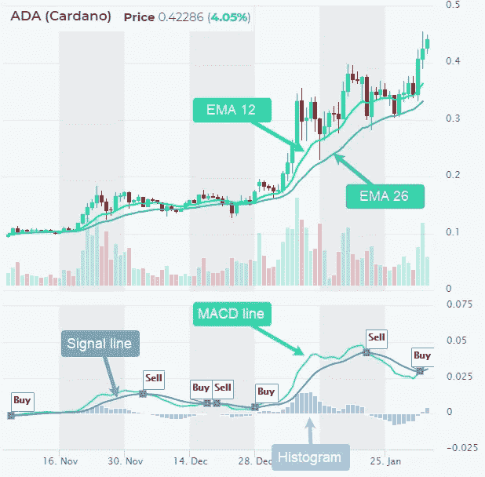
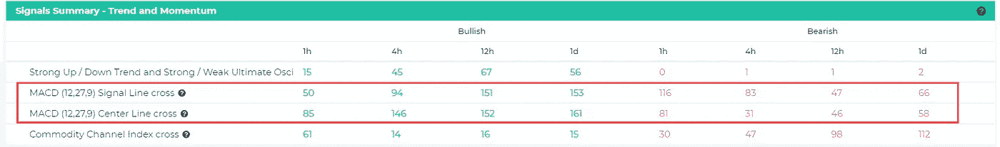
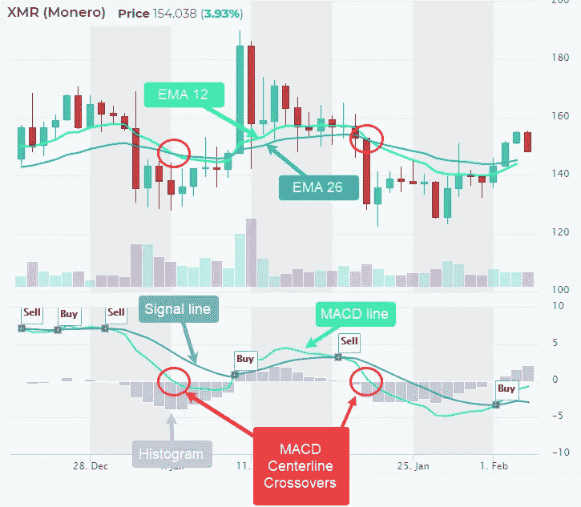
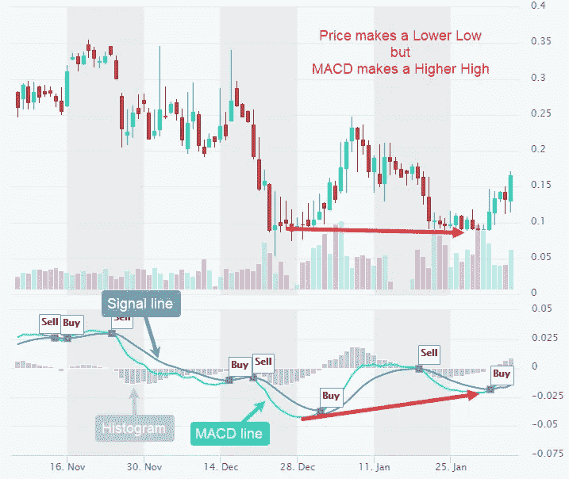
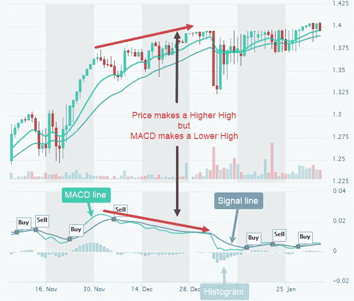
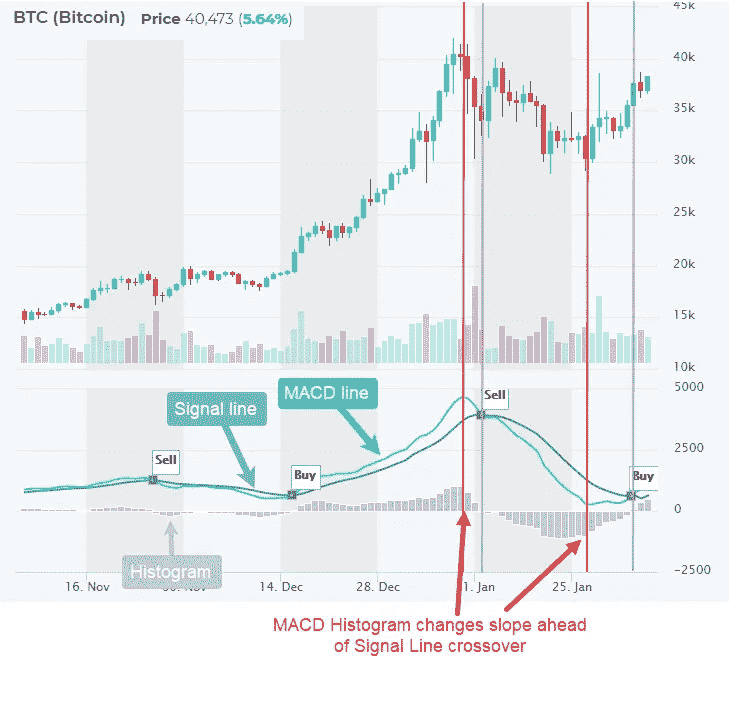

# 解释了加密中的技术指标

> 原文：<https://medium.com/coinmonks/technical-indicator-in-crypto-explained-df89ea4a0e8d?source=collection_archive---------27----------------------->

# MACD 线和 MACD 信号线

**移动平均线收敛/发散指标(MACD)是一种简单有效的动量指标。这可能是最广泛使用的加密交易指标。**

MACD 把两个趋势跟踪指标，移动平均线(12 天和 26 天)，通过从较短的移动平均线中减去较长的移动平均线，变成了动量振荡器。**因此，MACD 提供了两个世界的最佳选择:趋势跟踪和势头。**

MACD 在零线上下波动，因为均线收敛，交叉和发散。

它使用收盘价计算 12 日和 26 日均线之间的差异。MACD 线的 9 日均线和指标一起被绘制成信号线，用来识别转弯。还有，MACD 线和信号线的区别叫做直方图。

Source: altFINS

# 如何交易 MACD 指标？为了产生信号，密码交易员可以寻找:

[**1)信号线交叉——最常用的**](https://altfins.com/knowledge-base/macd-line-and-macd-signal-line/#link1)

[**2)中线交叉-最少使用(延迟)**](https://altfins.com/knowledge-base/macd-line-and-macd-signal-line/#link2)

[**3)分歧——有利于发现潜在的逆转**](https://altfins.com/knowledge-base/macd-line-and-macd-signal-line/#link3)

[**4)MACD 直方图的斜率——最早的信号，最被低估——一定要用！！**](https://altfins.com/knowledge-base/macd-line-and-macd-signal-line/#link4)

# 1)信号线交叉是最常用的 MACD 交易信号。

信号线是 MACD 线的 9 日均线。作为指标的移动平均线，它跟随 MACD，更容易发现 MACD 转弯。

当 MACD 上涨并穿过信号线时，就是多头交叉。当 MACD 向下穿过信号线时，就发生了熊市交叉。

在上面的 ADA 图中，注意当 MACD 线穿过信号线时，我们的系统显示买入，反之则显示卖出。

交易员可以在 altFINS.com[信号摘要](https://platform.altfins.com/summary)页面轻松找到看涨或看跌 MACD 信号线交叉的加密货币:

# 2) MACD 中心线交叉口-最少使用的信号(迟来的)。

MACD 持续高于零表明趋势上升，低于零表明趋势下降。当 MACD 高于零时，出现潜在的买入信号，当它低于零时，出现潜在的卖出信号。

MACD 中心线(0)交叉发生在均线 12 和均线 26 交叉的时候。所以当快速均线(均线 12)穿过慢速均线(均线 26)时，这是买入信号，反之亦然。均线交叉是常用的趋势指标，但不是好的动能指标。因此，MACD 中心线交叉信号通常滞后于 MACD 信号线交叉信号，因此不太优选。

Source: altFINS

# 3) MACD 背离——有利于发现潜在的反转。

趋势交易者也观察 MACD 趋势和价格趋势之间的背离，这是当前趋势即将反转和结束的迹象。

当加密货币价格创下更低的低点(下降趋势)但 MACD 创下更高的低点时，就会出现看涨 MACD 背离。这表明价格的下跌趋势正在失去动力，因为每一次下跌都会减轻抛售压力，这可能意味着反转。

Source: altFINS

当加密货币价格创下更高的高点(上升趋势)但 MACD 创下更低的高点时，就会出现**看跌 MACD 背离**。这表明，虽然价格仍处于上升趋势，但上升势头已经减弱。

Source: altFINS

**发现 MACD 背离是很费时间的，因为这需要一张一张地目测图表。altFINS 让交易者可以在一个网格中查看多达 24 个硬币图表，从而使这项任务变得更加容易。只需进入**[**Screener**](https://platform.altfins.com/screener)**，选择图表选项卡，将每页项目更改为 6、12 或 24。**

# 4)MACD 直方图的斜率——最早的信号，最容易被低估。

正如我们在第(1)条中提到的，信号线交叉是加密交易者最常用的 [MACD。**我们能否预测并领先于 MACD 信号线交叉？**](https://tradesanta.com/blog/how-to-use-moving-averages-in-trading?utm_source=altfins&utm_medium=link&utm_campaign=macd)

是的，虽然不是 100%的时间。

**这里有一个** [**视频教程**](https://youtu.be/9BeFcXNfbZI) **讲述如何察觉这种早期的势头变化。**

交易者可以使用 MACD 直方图来预测这些信号。回想一下，当 MACD 线穿过一条信号线时，就发生了信号线交叉(见下面比特币图表中的“买入”和“卖出”标志)。MACD 线和信号线之间的差异由 MACD 直方图记录。从本质上来说，MACD 直方图是一个指标的指标，它是领先一步的信号线交叉！

当 MACD 直方图的斜率改变时，交易者应该注意。**当 MACD 直方图见顶并开始下降时(蓝色条)，这是交易者的潜在卖出信号**，它会比“卖出”信号线交叉更早发生(见下面的比特币图表)。当 **MACD 柱跌入谷底并开始上升时(蓝色柱)，这是一个潜在的买入信号。**

在下面的比特币图表中，注意斜率的**变化(红色垂直线)如何比 MACD 信号线交叉(灰色垂直线)给交易者更早的交易信号。**

时间上的微小差异可能会产生巨大的利润差异！

Source: altFINS

# MACD (12，27，9)信号线交叉

**MACD 信号线是 MACD 指标的 9 日均线，用来识别转弯。**信号线交叉是最常见的 MACD 信号。当 MACD 上涨并穿过信号线时，就是多头交叉。当 MACD 向下穿过信号线时，就发生了熊市交叉。

**MACD 是一个趋势跟踪和动量指标**，通过从一个较短的移动平均线(12 日均线)减去一个较长的移动平均线(26 日均线)来计算。MACD 在零线上下波动，因为均线收敛，交叉和发散。MACD 线的 9 日均线和指标一起被绘制成信号线，用来识别转弯。交易者可以寻找信号线交叉，中线交叉和发散来产生信号。当 MACD 移动到零(中线)以上或信号线以上时，出现潜在的买入信号，当它穿过零以下或信号线以下时，出现潜在的卖出信号。

# MACD (12，27，9)中线交叉

中线交叉— **MACD 持续高于零表示上涨趋势，低于零表示下跌趋势。当 MACD 移动到零以上时，出现潜在的买入信号，当它穿越零以下时，出现潜在的卖出信号。**

**MACD 是一个趋势跟踪和动量指标**，通过从较短的移动平均线(12 日均线)减去较长的移动平均线(26 日均线)来计算。MACD 在零线上下波动，因为均线收敛，交叉和发散。MACD 线的 9 日均线和指标一起被绘制成信号线，用来识别转弯。交易者可以寻找信号线交叉，中线交叉和发散来产生信号。当 MACD 移动到零(中线)以上或信号线以上时，出现潜在的买入信号，当它穿过零以下或信号线以下时，出现潜在的卖出信号。

> 交易新手？试试[加密交易机器人](/coinmonks/crypto-trading-bot-c2ffce8acb2a)或者[复制交易](/coinmonks/top-10-crypto-copy-trading-platforms-for-beginners-d0c37c7d698c)