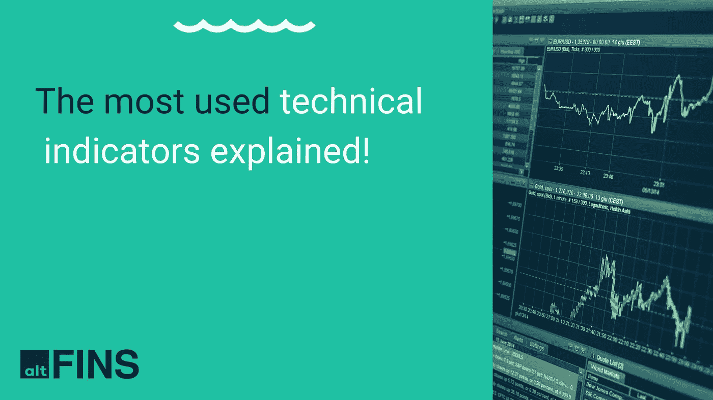

# 解释的技术指标

> 原文：<https://medium.com/coinmonks/technical-indicators-explained-baef56a115b3?source=collection_archive---------17----------------------->

Source: altFINS.com

# 卷

**成交量** —在选定时间段内交易的硬币数量。

**成交量($)** —在选定时间段内交易的硬币的价值。

**异常成交量峰值** —如果新成交量是前 10 个区间平均值的两倍。

# SMA 与 EMA

移动平均线(MA)有助于识别价格趋势和潜在的支撑位和阻力位。两种主要的移动平均线是简单移动平均线和指数移动平均线

简单移动平均线的计算方法是取(5，10…)个周期的收盘价的平均值。

指数移动平均线(EMA)对最近的价格有更大的权重，因此比 SMAs 有更少的滞后；它对价格变化的反应会更快。

日均线比均线变化慢，因此更适合时间框架长的交易者。均线反映价格变化更快，因此对短线交易者更好。同样重要的是用于计算 SMAs 和 EMAs 的时间框架——长期交易者应该使用更长的时间框架(60+周期),中期交易者应该使用 20-60 周期，而短期交易者应该使用 5-20 周期。

趋势指示:当价格在均线以上时，趋势是向上的，反之亦然。

支撑和阻力位。MAs，尤其是 SMAs，也可以作为支撑位和阻力位。在强劲的上涨(下跌)趋势中，价格往往会从支撑线和阻力线反弹。当价格突破支撑线和阻力线时，它可以表明盘整或反转。

均线交叉也用于确定价格趋势。当一个较短的均线在较长的均线上方交叉时(即 10 天均线交叉 20 天均线)，这是一个看涨指标(“黄金交叉”)，反之亦然(“死亡交叉”)。

# RSI 背离

相对强度指数(RSI)是一个动量指标，衡量最近价格变化的幅度，以分析超买或超卖的情况。

RSI 值的范围从 0 到 100。

相对强度指数(RSI)使用以下公式计算:RSI = 100–100/(1+RS)其中 RS =指定时间范围内上升期的平均收益/指定时间范围内下降期的平均损失

当 RSI 高于 70 时，资产价格被认为是超买(由于修正)，当它低于 30 时，被认为是超卖(由于反弹)。一些交易者使用更极端的水平(80/20)来减少错误的读数。

在强劲的上升趋势中，RSI 通常会达到 70 或更高，持续一段时间，而下降趋势会在 30 或以下停留很长时间。虽然一般的超买和超卖水平可能是准确的，但它们可能不会为趋势交易者提供最及时的信号。

在 altFINS [知识库上阅读如何交易 RSI。](https://altfins.com/knowledge-base/trading-rsi-and-rsi-divergence/)

# **随机(14，3，3) (STOCH)**

随机振子是一种范围受限的动量振子。随机指标旨在显示在用户定义的时间段内，与高/低范围相比的收盘位置。

随机振荡指标用于:(1)识别超买和超卖水平，(2)发现背离，(3)识别多头和空头的设置或信号。

STOCH 是一个范围振荡器，由两条在 0 和 100 之间移动的线组成。第一行(称为%K)显示与用户定义的周期的高/低范围相关的当前收盘价。第二条线(称为%D)是%K 线的简单移动平均线。现在，与大多数指标一样，随机指标中使用的所有周期都可以由用户定义。也就是说，最常见的选择是 14 周期的%K 和 3 周期的%D。

基本的理解是，随机指标用收盘价来决定动量。当价格收于回望期高/低区间的上半部分时，随机振荡指标(%K)上升，也表明动量或买/卖压力增加。当价格收在周期高/低区间的下半部分时，%K 下跌，表明动能减弱或买入/卖出压力。

和任何区间指标一样，超买/超卖是随机振荡指标产生的主要信号。超卖的默认阈值是 20，超买的默认阈值是 80。

当使用随机指标来确定超买/超卖水平时，最好沿着趋势交易。原因是超买并不总是意味着看跌，就像超卖并不总是意味着看涨一样。很多时候，超买(超卖)的情况可能是一个加强趋势的迹象，而不一定是即将发生的反转。

随机振荡指标通常用 3 天简单移动平均线作为触发线。当随机振荡指标在触发线上方交叉时，是看涨均线交叉，当它在下方交叉时，是看跌均线交叉。

# MACD 线和 MACD 信号线

**移动平均线收敛/发散指标(MACD)是一种简单有效的动量指标。这可能是最广泛使用的加密交易指标。**

MACD 把两个趋势跟踪指标，移动平均线(12 天和 26 天)，通过从较短的移动平均线中减去较长的移动平均线，变成了动量振荡器。**因此，MACD 提供了两个世界的最佳选择:趋势跟踪和势头。**

MACD 在零线上下波动，因为均线收敛，交叉和发散。

它使用收盘价计算 12 日和 26 日均线之间的差异。MACD 线的 9 日均线和指标一起被绘制成信号线，用来识别转弯。还有，MACD 线和信号线的区别叫做直方图。

在 altFINS [知识库](https://altfins.com/knowledge-base/macd-line-and-macd-signal-line/)上阅读如何交易 MACD 指标！

# 威廉姆斯%R

是衡量超买和超卖水平的动量指标，类似于随机振荡器。威廉姆斯%R 用于建立市场的进场点和出场点。它将一枚硬币的收盘价与一段时间内的高低区间进行比较，通常是 14 天。

威廉姆斯%R 是一个受欢迎的指标，因为它能够预示未来至少一到两个时期的市场反转。交易者不仅用它来预测市场反转，还用它来确定超买和超卖的市场条件。

威廉姆斯从 0 到-100 振荡(0 到-20 表示超买，80 到-100 表示超卖)。

在 altFINS [知识库上了解什么是 Williams 百分比范围(14)。](https://altfins.com/knowledge-base/williams-r/)

在 [altFINS 平台上找到所有重要的技术指标！](https://platform.altfins.com/summary)

> 交易新手？尝试[加密交易机器人](/coinmonks/crypto-trading-bot-c2ffce8acb2a)或[复制交易](/coinmonks/top-10-crypto-copy-trading-platforms-for-beginners-d0c37c7d698c)