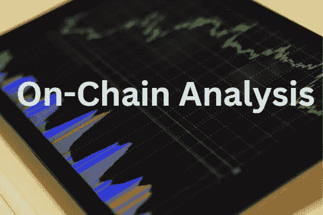
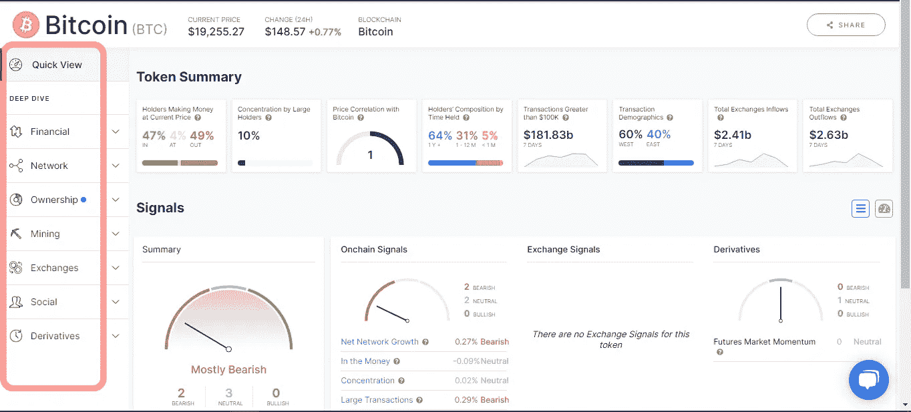
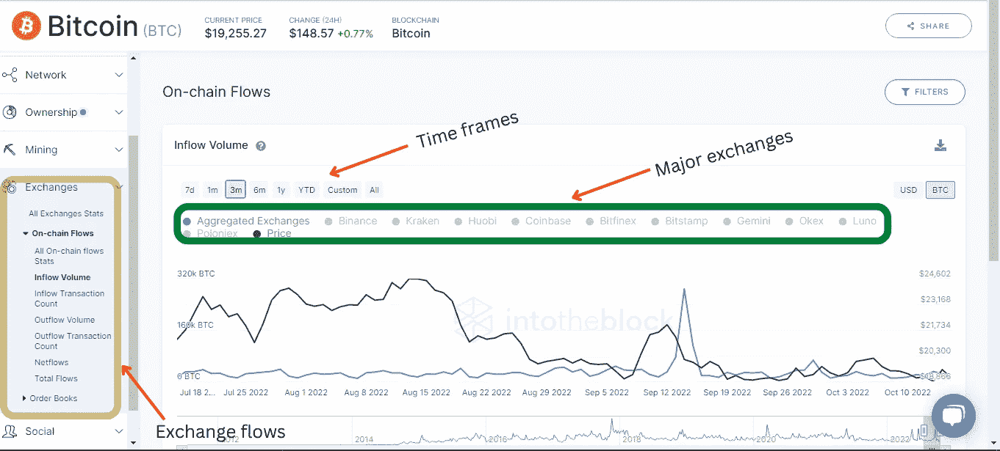
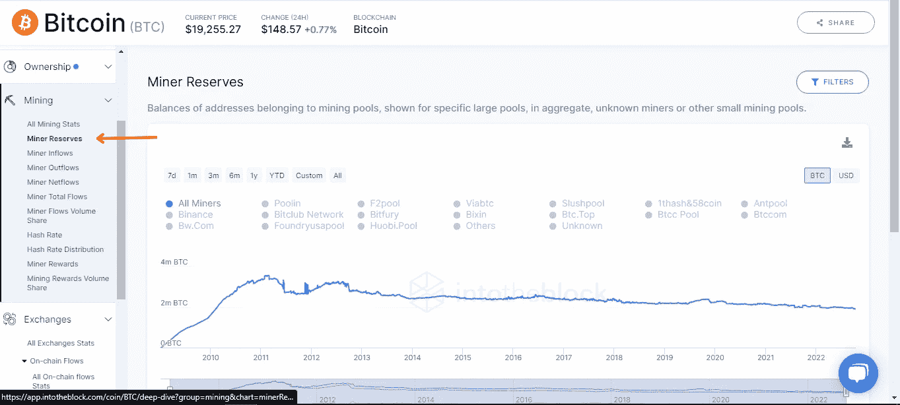
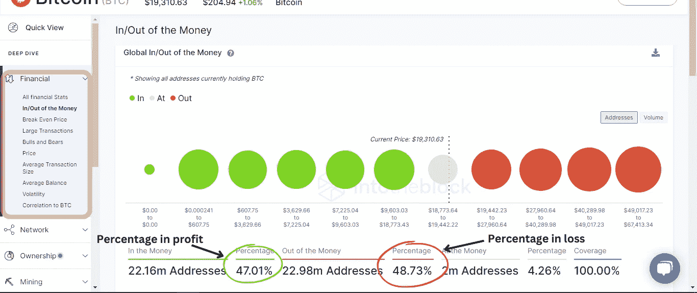

# 技术与链上分析。

> 原文：<https://medium.com/coinmonks/technical-vs-on-chain-analysis-73958f1d30f5?source=collection_archive---------17----------------------->

在阅读大量新闻文章和研究价格图表后，你可以预测市场走向，但仍然没有得到你想要的结果。如果我说，这是因为你在分析中缺少了一个工具呢？让我们来了解一下！

> 从顶级交易者那里复制交易机器人。免费试用。

**什么是链上分析**

区块链是一种开放式分类账，将每笔交易记录作为存储数据保存。使用指标来理解这些数据，并使用它来做出明智的决策和预测，这就是所谓的“链上分析”

链上分析是简单的分析和预测市场使用的数据从区块链分类帐。

**技术分析 vs 链上分析**

技术分析主要由交易员用于现货买卖条目，它涉及使用指标、图表和蜡烛图分析加密货币的历史价格，以确定当前的交易环境并预测潜在的价格变动。技术分析的问题包括

*   大多数指标是滞后的:一些指标对已经过去的事情而不是即将到来的事情给出延迟的反馈。
*   错误的移动:当一个钱包买入或卖出大量资产时，它仍然在图表上显示为看涨或看跌，实际上可能是抛售。
*   清洗交易将显示在图表上:一些交易者可以重复购买和出售相同的资产，以增加交易量，这将记录在图表上，使交易者认为资产正在获得动力。

链上分析的指标提供了图表中发生的事情的总体情况和背后的原因，包括:

*   矿工们正在采取什么行动。
*   鲸鱼和散户的输赢百分比。
*   实时交易的数量。

所有这些都提供了区分加密货币的投机价值和原始效用价值所需的缺失背景。

我不是说我不使用技术分析，但链上分析只是有助于消除噪音，给你真正的数据来分析和预测。

**进行链上分析的平台**

有很多平台可以进行链上分析。下面是我用过的一些，它们有一个非常简单的界面。

*   [玻璃节点](https://studio.glassnode.com/)(价格)
*   [脱屑](https://defillama.com/)(价格)
*   南森(价格)
*   [进块](https://app.intotheblock.com/)(自由)
*   [Cryptoquant](https://cryptoquant.com/sign-up?my-friend=dNeWfRUdA) (价格)

**链上分析的简单指标**

随着区块链的大量活动的进行，大量的链上指标和度量标准已经存在，但我将重点介绍我使用的几个，以便您可以及时掌握它们。

**交易所流量**:交易所流量指标只是跟踪资金进出交易所的情况。而且大多数时候，流入量的激增意味着持有者会将他们的密码送到交易所抛售。资金外流意味着投资者将他们的资产或利润抽回钱包进行安全保管。

要访问指示器，请遵循以下步骤:

*   我将使用平台[进入模块](https://app.intotheblock.com/)，因为它是完全免费的。
*   注册后，点击任何加密货币进入指标。在这个例子中，我将使用 BTC。

*   从左侧面板中，选择交换，并从下拉菜单中选择流入或流出量。它向您展示了从主要的集中交易中进行选择的选项，并指定您喜欢的时间范围。

**矿商储备:**特定加密货币的矿商投资了大量设备和能源，并不时出售其余额，这可能会影响市场，任何技术分析都无法预测这一点。此指标显示属于特定大型采矿池的地址余额。怎么能免费访问呢？程序同上。

*   它显示了主要的挖掘池和聚合表单，您可以使用它们在不同的时间范围内进行分析。

该指示器识别地址购买令牌的平均价格(成本),并将其与当前价格进行比较。如果当前价格高于成本，那么这个地址就是“在赚钱”如果当前价格低于成本，则该特定地址“不赚钱”。当大多数地址亏钱(亏损)时，抛售压力会很大，因为这些地址中的许多只是想减少他们的损失，甚至达到盈亏平衡。当大多数地址都赚钱(盈利)时，抛售压力会小一些，因为他们想保住自己的头寸。

**链上分析的局限性**

*   没有足够的数据:链上分析是新的，一些加密货币还没有足够的数据。
*   众多指标:随着区块链的发展，有许多指标，它们都可能讲述不同的故事。这取决于交易者或投资者建立策略和决定。

一般来说，链上分析在几周或几个月的更长时间框架内是有效的，并且它只是关于区块链上的人类活动。

请在下面留下您的评论，如果您有任何问题，请联系我。

 [## Ismail Abdul raheem | Twitter | Linktree

### 链接树。让你的链接做得更多。

linktr.ee](https://linktr.ee/ismailtunde) 

> 加入 Coinmonks [电报频道](https://t.me/coincodecap)和 [Youtube 频道](https://www.youtube.com/c/coinmonks/videos)了解加密交易和投资

# 另外，阅读

*   [Bitsgap 审核](/coinmonks/bitsgap-review-a-crypto-trading-bot-that-makes-easy-money-a5d88a336df2) | [Quadency 审核](/coinmonks/quadency-review-a-crypto-trading-automation-platform-3068eaa374e1) | [Bitbns 审核](/coinmonks/bitbns-review-38256a07e161)
*   [加密复制交易平台](/coinmonks/top-10-crypto-copy-trading-platforms-for-beginners-d0c37c7d698c) | [Coinmama 审核](/coinmonks/coinmama-review-ace5641bde6e)
*   [印度的加密交易所](/coinmonks/bitcoin-exchange-in-india-7f1fe79715c9) | [比特币储蓄账户](/coinmonks/bitcoin-savings-account-e65b13f92451)
*   [OKEx vs KuCoin](https://coincodecap.com/okex-kucoin) | [摄氏替代品](https://coincodecap.com/celsius-alternatives) | [如何购买 VeChain](https://coincodecap.com/buy-vechain)
*   [币安期货交易](https://coincodecap.com/binance-futures-trading)|[3 commas vs Mudrex vs eToro](https://coincodecap.com/mudrex-3commas-etoro)