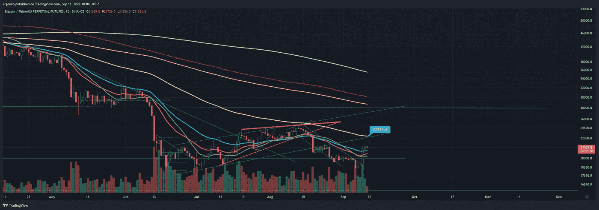
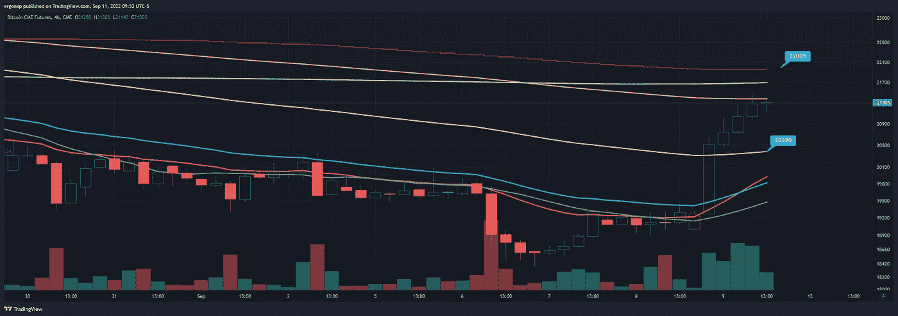
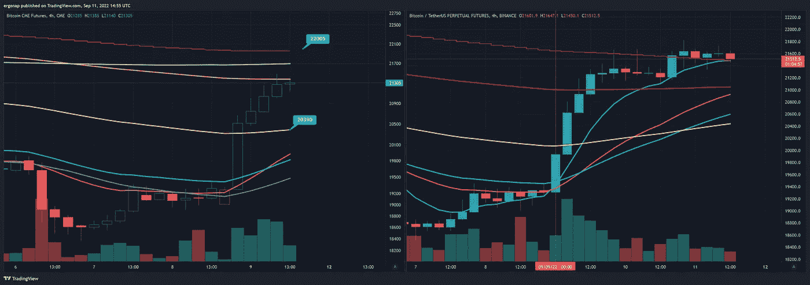
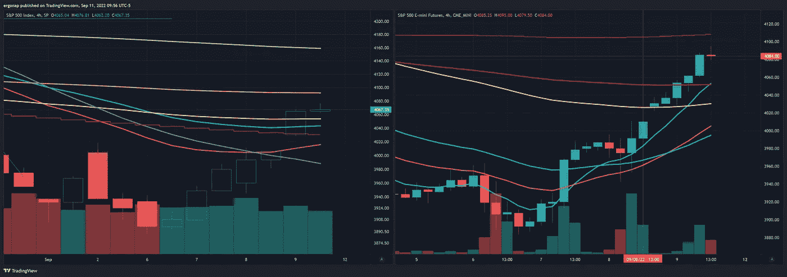
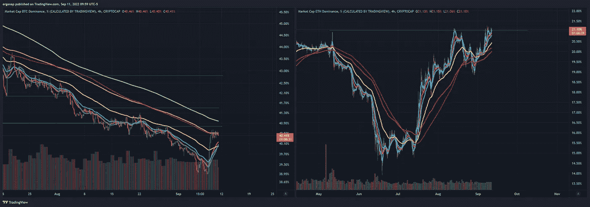
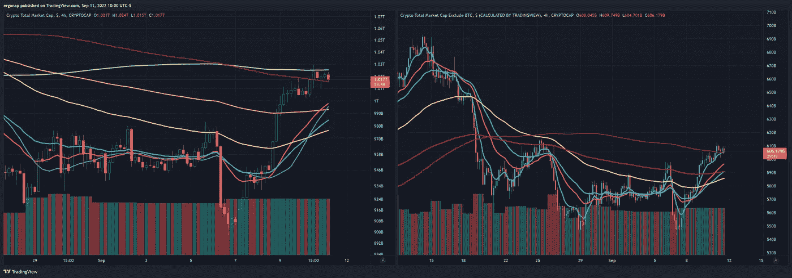
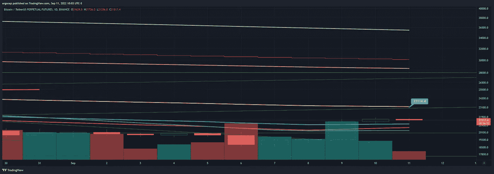
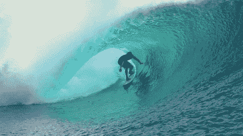

# 技术上看多，但能持续多久？🤷

> 原文：<https://medium.com/coinmonks/technically-bullish-but-for-how-long-c5313804e47d?source=collection_archive---------17----------------------->

## #加密货币市场/#比特币分析 9/11

所以，我想我们现在是乐观的。我再强调一下:* **暂时是** *。至少对短期牛市来说，4H 交叉是显著的逆风。跟着市场走。

宏观事物:乌克兰已经把 F 挤出了俄罗斯，可能已经扭转了战局。因此，所有这些宏观情景都将很快发挥作用，无论是看涨还是看跌——有人将采取行动。

This is Russia literally running from Ukraine. Remember all the people telling you Russia is strong and gargling that propaganda juuuuuuuust maybe have been wrong. They’re also the people that tell you government is bad, be your own bank with crypto, etc.

鲍威尔在 9 月 8 日发表讲话，基本上是说我们将解决通货膨胀+监管加密问题，因此这本身就告诉你这不是一个看涨的市场时间。

首先是每日宏观提醒:BTC 在 7 月 21 日至 8 月 18 日的整个时间框架内都在这条线上，之前在 FOMC 8 月 17 日之后艰难修正。下一个#FOMC 是 9 月 21 日，所以 10 天。BTC 下面的蓝线:

[https://www.tradingview.com/x/KvJxhwCm/](https://www.tradingview.com/x/KvJxhwCm/)

提醒:https://www.federalreserve.gov/newsevents/calendar.htm FOMC 日历:(搜索 FOMC)。

穿越 4h 89 均线通常是极其显著的，对于*CME*(更显著)我们就是这么做的。200 毫安的开销现在是下一个可能的逆转，除了…

[https://www.tradingview.com/x/Ugi7JDwj/](https://www.tradingview.com/x/Ugi7JDwj/)

我们也有这样的情况，CME 和$BTC 价格之间有明显的差距，现在价格变得有点大。我们将在几个小时内(大约 5 小时)看到我们走哪条路。

[https://www.tradingview.com/x/2KIvruAA/](https://www.tradingview.com/x/2KIvruAA/)

我们能防止差距并向下修正吗？我们能向上弥补差距吗？现在零售看起来准备好了一个短暂的挤压，ES/ SPX(股票市场)也有同样的缺口，我们等着看接下来的 5 个小时会发生什么。

[https://www.tradingview.com/x/xXyL8w2d/](https://www.tradingview.com/x/xXyL8w2d/)

那么 BTC。d 看起来它正在积极地转向。我们可能会上下来回摇晃，可能会持续出血一段时间。与此同时，Eth 已经达到了一些重要的顶部，人们将不得不付出。

[https://www.tradingview.com/x/5nZanRCT/](https://www.tradingview.com/x/5nZanRCT/)

市场可能会上涨，以诱捕交易者。

[https://www.tradingview.com/x/aRYGoTED/](https://www.tradingview.com/x/aRYGoTED/)

因此，如果我们作为转折点上涨，23k 是目前值得关注的价格，但也可能是陷阱。那是海峡的底部。

[https://www.tradingview.com/x/0FeciCbb/](https://www.tradingview.com/x/0FeciCbb/)

其他人期待 16k，我也是。但从短期来看，无论我们走哪条路，我都会跟着走，除了像疯子一样给 ESX 刷单之外，我不会在任何一个方向做任何事情，因为我喜欢这种波动性和摇摆不定的股票。

老实说，股票看起来不错。密码？现在不行，还不确定。在修正之前，Crypto 最后一次在 34 均线上上涨了 10%,这使我们在#FOMC 会议之前达到了 23k。

随波逐流，但**不要忘记 9/21 FOMC** 。

> 交易新手？尝试[加密交易机器人](/coinmonks/crypto-trading-bot-c2ffce8acb2a)或[复制交易](/coinmonks/top-10-crypto-copy-trading-platforms-for-beginners-d0c37c7d698c)