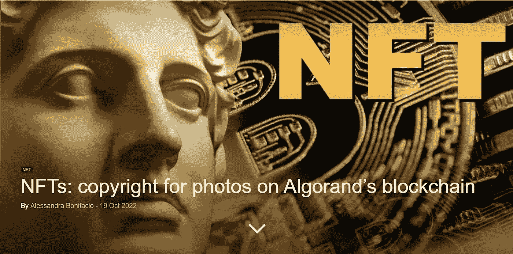

# Telegram 和 Web3，去中心化的新前沿

> 原文：<https://medium.com/coinmonks/telegram-and-web3-the-new-frontier-of-decentralization-e1acf41046da?source=collection_archive---------45----------------------->

本周最大的新闻是 Telegram 的 Web 3 生态系统的可能创建…

 [## 电报用户名拍卖市场“几乎”准备启动

### 流行的消息应用 Telegram 开发了一个新的市场，不涉及不可伪造的令牌(NFT)。的…

cointelegraph.com](https://cointelegraph.com/news/telegram-username-auction-marketplace-almost-ready-to-launch) 

这是我希望看到的，因为有了 Telegram，我们可以为真正分散的项目提供强大的推动力。他们从用户名拍卖开始，但这可能会导致网站域名、NFT 和 TON 令牌的新用例，以开发和创建 Telegram 生态系统。

[https://en . crypto nomist . ch/2022/10/20/ledger-wants-beyond-crypto wallet/](https://en.cryptonomist.ch/2022/10/20/ledger-wants-beyond-cryptowallets/)

伊莱杰进入足球空间，向金球奖得主赠送印有特别 NFT 的金色伊莱杰。他们已经开始用信用卡支付了。接下来会有什么？

[https://en . crypto nomist . ch/2022/10/19/nfts-copyright-photos-algorands-区块链/](https://en.cryptonomist.ch/2022/10/19/nfts-copyright-photos-algorands-blockchain/)

在使用阿尔格兰德区块链的音乐版权后，照片和图片也开始在阿尔格兰德区块链上得到认证。这个区块链的下一个大步骤，在去中心化和可伸缩性方面一直很有希望？

 [## 俏皮新闻:十大加密朋克钱包休眠，房子在 OpenSea 上出售等等

### 不可伪造的令牌(NFT)侦探挖出了一个 2017 年的旧钱包，它为 0.02 ETH 铸造了 141 个密码朋克，这是…

cointelegraph.com](https://cointelegraph.com/news/nifty-news-top-10-cryptopunks-wallet-lays-dormant-house-sells-on-opensea-and-more) 

一个来自 2017 年的休眠 NFT 钱包与 141 个加密朋克被发现铸造了现在昂贵得离谱的 NFT，每个可能 7 美元。

> 交易新手？试试[密码交易机器人](/coinmonks/crypto-trading-bot-c2ffce8acb2a)或[复制交易](/coinmonks/top-10-crypto-copy-trading-platforms-for-beginners-d0c37c7d698c)