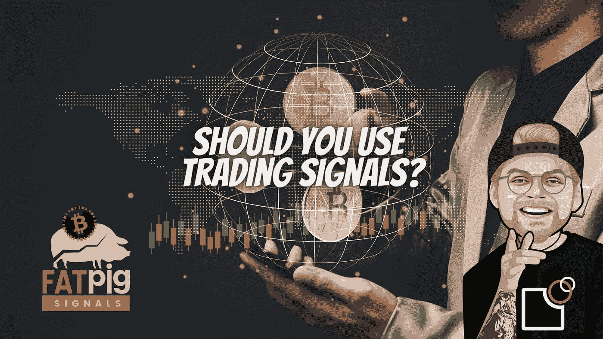

# 电报加密信号——来自交易团队的交易信号有多有用？

> 原文：<https://medium.com/coinmonks/telegram-crypto-signals-how-useful-are-trading-signals-from-trading-groups-8517d9dabe85?source=collection_archive---------12----------------------->

最近几个月，电报上的信号组变得越来越受欢迎。相应的通道共享有趣的交易信号，投资者似乎可以毫不费力地利用这些信号获利。但是这些电报通道背后是什么呢？