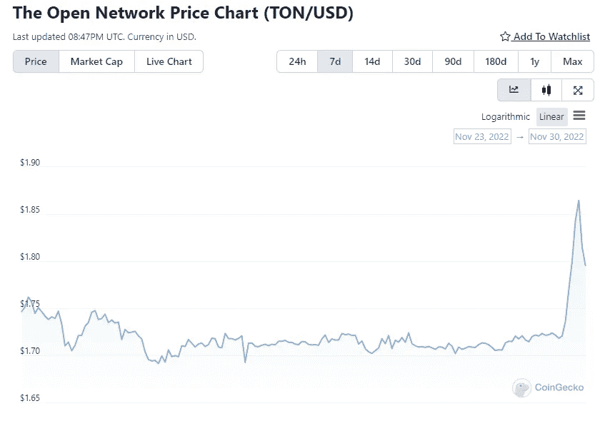

# Telegram 正在建立一个分散的加密货币交易所和非托管钱包

> 原文：<https://medium.com/coinmonks/telegram-is-building-a-decentralized-cryptocurrency-exchange-and-non-custodial-wallets-877b489bc7a?source=collection_archive---------25----------------------->

Telegram 首席执行官帕维尔·杜罗夫宣布，这款即时通讯应用正朝着加密方向迈出决定性的一步。特别是，他在这一领域的提议应该会导致非托管钱包和去中心化加密货币交易所的推出。杜罗夫的声明被委托给 Twitter，似乎没有留下过多的疑问。

The tweet of Pavel Durov

对于这一具有挑战性的步骤，提出的原因之一是，区块链行业无情地集中在少数人手里，这些人毫不犹豫地滥用自己的优势地位。这一提法显然是针对最近 FTX 破产所象征的灾难性事件。

The tweet of Pavel Durov

根据 Durov 的说法，回归加密货币原始精神的最佳方式恰恰是在非托管钱包(即用户自己拥有的钱包)的去中心化和传播中找到。Telegram 将在不久的将来提供的解决方案，如 Fragment，这是一个完全分散的拍卖平台，基于[开放网络(TON)](https://ton.org/) 的区块链。这一参考立即在密码市场上产生了结果，在这个市场上，TON token 目前正在迅猛增长，这也是由一个事实驱动的，即[关于其可能通过电报集成的谣言](https://cointelegraph.com/news/ton-telegram-integration-highlights-synergy-of-blockchain-community)已经流传了一段时间。杜罗夫几小时前发布的另一条[推文](https://twitter.com/durov/status/1598002696661127168?s=20&t=41mToVkezbY5Mosi5Hszhw)证实了这些传言。

The Open Network Price Chart (TON/USD) of the last 7 days

几天前，TON 的投资者宣布成立一个 1 . 26 亿美元的基金，旨在支持受 FTX 崩溃影响的项目。该基金与币安推出的基金非常相似，以应对一个行业的新困难，该行业目前无法走出漫长的加密冬天。

***免责声明*** *:我不知道所使用的图片有任何第三方权利。如有任何资料来源，我保证予以引用，如有要求，我将调整立场。*

***免责声明*** *:交易加密货币具有很高的风险，可能不适合所有投资者。在决定交易加密货币之前，你应该仔细考虑你的投资目标和你的经验水平。自己做研究。此处表达的所有观点归各自作者所有，不应被视为任何形式的财务建议。*

*关于作者*

[*CRYPTO_ALBERT*](https://twitter.com/albertovischio?t=C3Xj9pTm9Q7EZqwjrGHQdA&s=09)

*主编* [*新币帖*](https://www.newcoinpost.com/) *。我帮助人们更好地理解加密货币领域及其目的。*

> 交易新手？试试[加密交易机器人](/coinmonks/crypto-trading-bot-c2ffce8acb2a)或者[复制交易](/coinmonks/top-10-crypto-copy-trading-platforms-for-beginners-d0c37c7d698c)