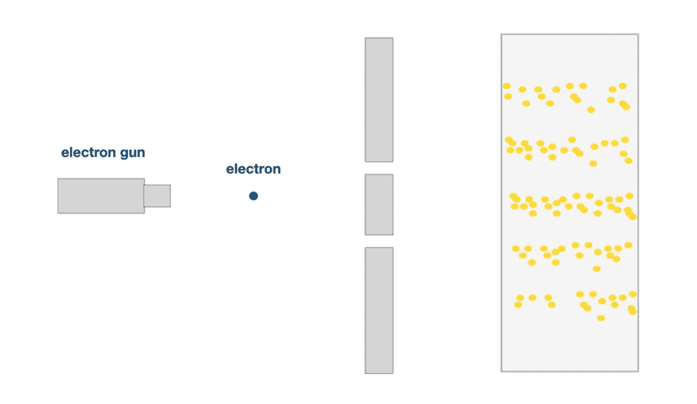
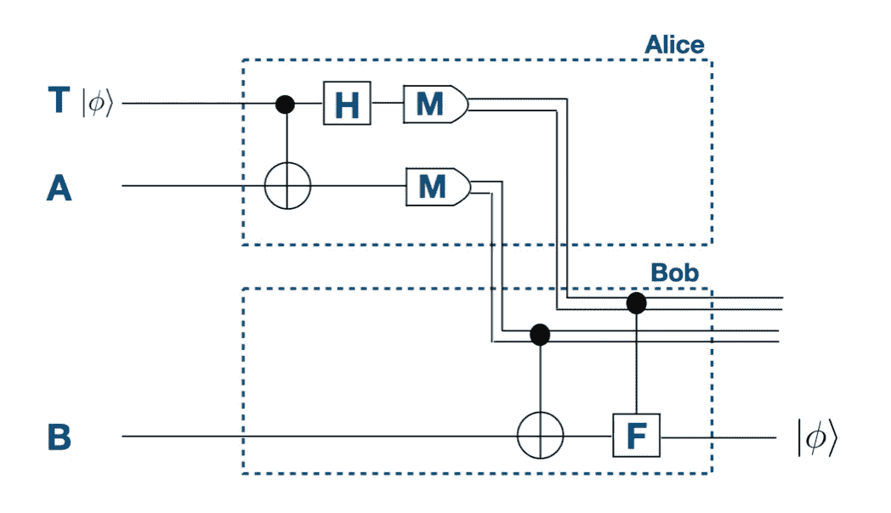
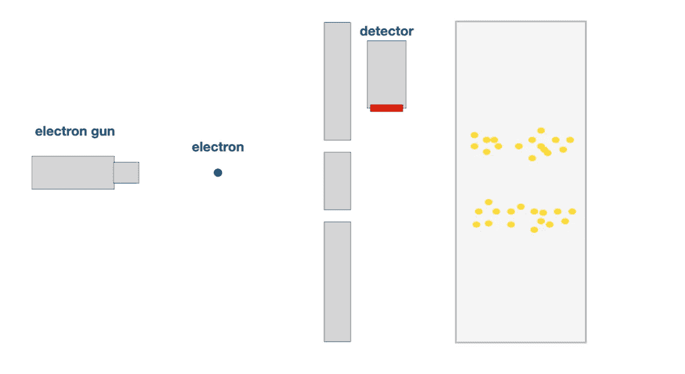

# 心灵传输——为什么它对未来的通信很重要

> 原文：<https://medium.com/coinmonks/teleportation-why-it-is-important-for-the-future-of-communication-e04ac4f942de?source=collection_archive---------23----------------------->

## 我们从科幻电影中知道的心灵运输可能仍然是一个不可能实现的目标。但是技术本身已经是真实的，并且是量子信息研究的一大部分。虽然它可能只在小范围内起作用，但它将很快改变我们在网络中分享信息和交流的方式。

它总是从一小步开始。就像在 1900 年，当马克斯·普朗克提出黑体辐射问题可以解决时，如果人们将能量视为离散的东西而不是连续的东西。他称之为量子化能量。这个简单的假设导致了一个科学领域的发展，这个领域被证明是一种看待现实的怪异方式。至少是微观现实。因为它与我们日常生活中所习惯的物理现象相矛盾。量子物理是一种解释和预测微观粒子行为的奇怪的物理模型。微观粒子可以做非常奇怪的事情。最著名的例子一定是双缝实验。这个实验表明，量子粒子可以同时处于两种物理状态，并同时通过两个狭缝。这最终在狭缝后面的屏幕上产生了干涉图案，这使得物理学家认为微观粒子的行为像波一样。把一个粒子想象成一种波很奇怪，不是吗？

> 量子粒子可以同时处于许多物理状态。

For this experiment one uses an electron gun. Each electron passes — just like a wave — through both slits simultaneously. This creates the interference pattern on the screen behind.

# 纠缠

量子物理定律的另一个相当奇特的结果是所谓的纠缠。就在今年，诺贝尔奖颁给了研究人员，他们的工作主要基于纠缠的本质。你可以在我的文章[“2022 年诺贝尔物理学奖”](https://medium.datadriveninvestor.com/the-physics-nobel-prize-2022-93c6d8d5d24a)中读到。

> 一个纠缠粒子所发生的事情会瞬间触发另一个纠缠粒子的动作。

两个粒子可以纠缠在一起。我们可以故意让它们处于纠缠状态。这意味着这两个粒子现在是相互联系的。以一种非常特殊的方式联系在一起。一个粒子的变化会影响另一个粒子的变化。疯狂的是，这种影响是瞬间发生的。这意味着如果粒子 A 发生了什么，那么粒子 B 会立即“感觉到”并做出反应；爱因斯坦并不喜欢这一点，也不能接受这是一个物理事实。但这是为什么呢？

要回答这个问题，我们应该先认识一下爱丽丝和鲍勃。这两个人喜欢参与量子和密码实验。爱丽丝有一个电子，鲍勃有一个电子。它们使它们的电子纠缠在一起，这意味着它们现在处于这种特殊的连接状态。现在爱丽丝带着她的电子去火星探险。与此同时，她和鲍勃都没有与量子位互动。当她到达火星时，她给鲍勃发了一条信息，告诉他对量子位做些什么。信息从火星传到地球需要 3 分钟，因为光速只有每秒 30 万公里。鲍勃收到信息的第二秒钟，他与他的电子相互作用。爱丽丝的电子毫不迟疑地做出了反应。就好像它们之间的信息以超过光速的速度传递。这种信息传输与爱因斯坦的相对论相矛盾，相对论认为没有什么能比光速更快。这让他觉得量子理论有些不太对劲。但事实证明，纠缠确实存在，它甚至在量子计算领域发挥了重要作用。但更重要的是:它在瞬移中的作用很大。

# 心灵运输

那么心灵运输实际上是如何工作的呢？
当我们用量子物理学的术语来讲隐形传态的时候，是指我们把一个粒子的量子态所包含的信息从一个地方转移到另一个地方。
因为这听起来相当复杂，我们再次让 Alice 和 Bob 参与实验。

> 传送的基础是纠缠。

假设爱丽丝有一个电子，她想把它传送给鲍勃。但这并不是说电子会瞬间穿越空间，到达鲍勃等待的地方。爱丽丝正在获取构成她的 电子的 ***的所有信息，并将这些信息发送给鲍勃。这包括电荷、质量和自旋等参数。鲍勃需要一个中性电子作为白纸，这样他就可以把爱丽丝的电子信息“打印”在纸上。为了实现这个目的，鲍勃的电子需要和爱丽丝的电子纠缠在一起。***

鲍勃通过所谓的**经典频道**接收来自爱丽丝的信息。经典信道是量子物理学家用来描述我们现在使用的所有普通信息交流方式的术语。这包括你能想象到的任何东西，比如电话线、无线电传输或一张纸上的一系列 1 和 0。一个**量子通道**将是一种传输量子信息的方式。例如，这些信道被用于超密集编码，这是另一种奇特的量子算法。但是让我们回到爱丽丝和鲍勃。

所以爱丽丝把她电子的所有信息通过无线电波发送给鲍勃。他接收到 1 和 0 的序列，并将信息印在他的空白电子上。通过这种方式，他重现了爱丽丝在另一边的电子。让我们看看这将如何应用于人类——只是为了好玩和纯理论。

The quantum circuit diagram for visualizing the process of teleporting the quantum information from Alice to Bob.

所以为了让一个人被传送，这个人身体里的每一个粒子都必须与 ***传送通道*** 另一边的一个同类型粒子纠缠在一起。那么每一个粒子的量子状态都必须精确地编码成一系列的 1 和 0。这是一个很大的数据量。然后，大量的数据必须传输到另一端，不能丢失一个比特。在那里，信息将被解码并印在纠缠的伙伴粒子上。因此，如果爱丽丝把自己传送到鲍勃呆的地方，她首先需要把她身体里的每一个粒子与鲍勃所在位置的粒子纠缠在一起，这些粒子必须正是她存在的粒子。这个信息在 Bob 那边创造了另一个 Alice。你现在可能会问自己的问题是:最初的爱丽丝怎么了？她还在吗？

# 不可克隆定理

我认为这一节的标题已经回答了我们在上一节末尾问自己的问题。但是让我们找出原因，好吗？为了做到这一点，我们必须再看一看本文开头提到的双缝实验。在那里，我们看到了电子是如何处于量子状态，并且可以同时通过两个狭缝。但是如果我们想看看它是如何同时穿过两个狭缝的呢？
我们可以在有两条缝的墙后面安装一个探测器。探测器会记录下电子通过了哪个狭缝。但是一旦探测器被激活，电子的行为就不再像波。它不想被观察到。 ***观测破坏量子态。*** 电子只通过其中一个狭缝，最终不会出现干涉图样。

> 观测破坏量子态。

回到传送协议。如果我们从粒子中提取信息，我们必须以某种方式测量信息。这样我们就破坏了量子态。因此，不可能在原始粒子保持不变的情况下创造出一个精确的粒子复制品。这就是所谓的**不克隆定理**。

> 不破坏原来的量子态，就无法复制它。

把这个应用到爱丽丝的传送过程中，我们会注意到，只要她的信息被传送，她就不会以物理形态存在。她只是纯粹的信息。只有当信息被完全印在等待的空白粒子上时，她才再次以物理形式存在。有点吓人，不是吗？我觉得这令人毛骨悚然。
但无论如何。
这与通信技术有什么关系？

# 通信的未来

量子定律最大的应用之一将是量子计算机。据说，只要有足够的量子位来处理信息，它们就会变得比当今任何经典计算机都更强大。
现在想象一个量子计算机网络，以及它们能做什么。很神奇吧？
由于量子计算机处理量子信息，在量子计算机的网络中，这种量子信息需要在网络节点之间交换。但是由于不可克隆定理，量子信息不能像在经典网络中那样传输。这就是心灵运输进入游戏的地方。在量子计算机网络中——如果你愿意，可以称之为量子互联网——量子信息通过传送过程在节点之间传输。

那么这些有什么用呢？我们为什么需要量子互联网，它与通信有什么关系？

疯狂的是，在这样一个量子网络中，我们可以建立一个不可能被窃听的通信通道。为什么？
因为观测对量子态的影响。
如果你窃听两点之间传输的信息，你测量了量子态，你不可避免地改变了信息。这就是信息保持安全和窃听者被注意和定位的方式。

因此，你可以看到量子隐形传态——尽管这听起来像是一个疯狂的科幻小说概念——确实是一件真实的事情，只是不是我们一开始想象的那样。最令人惊讶的是:它将被用来建立一种更安全的信息交换方式。

谢谢你陪我到最后。我希望你喜欢阅读这篇文章，你可以学到一些新的东西。如果你喜欢你所读的，请鼓掌，并在下面给我留言！:)

> 交易新手？尝试[加密交易机器人](/coinmonks/crypto-trading-bot-c2ffce8acb2a)或[复制交易](/coinmonks/top-10-crypto-copy-trading-platforms-for-beginners-d0c37c7d698c)