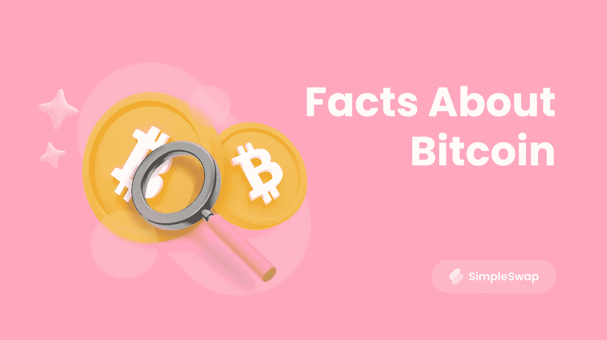

# 说点我不知道的比特币

> 原文：<https://medium.com/coinmonks/tell-me-something-i-dont-know-about-bitcoin-5fcc2941994e?source=collection_archive---------32----------------------->

Facts about Bitcoin

中本聪发布比特币白皮书已经有 14 年了。现在有许多关于 BTC 的有趣故事。我们在这篇文章中列举了一些有趣的事实。让我们更好地了解 BTC！

# 事实一。BTC 创始人的大秘密

如果你谷歌“比特币的创始人是谁？”，你会马上找到答案——中本聪。但是如果你问“谁是中本聪？”，那么你的搜索结果中就会出现很多不同的充满谜团和假设的调查。事实是我们对这个人(甚至一群人)一无所知。我们只知道在 2008 年，隐藏在中本聪名下的人开发了一种独特的区块链技术，创造了世界上第一种叫做比特币的数字货币。而在 2010 年 12 月 12 日，他神秘失踪了:Satoshi 离开了网络，再也没有出现在网上。流行的[假设](https://cryptoslate.com/was-the-cia-behind-bitcoin-creator-satoshi-nakamotos-disappearance/)是，在中央情报局对他感兴趣后，聪立即消失了，给他发了一封信，邀请他进行一次私人谈话。

没有人知道为什么世界上第一个“密码爸爸”消失了。有些人还在等他回来。例如，北海巨妖加密货币交易所的编辑皮特·里佐[在 2020 年发推文](https://twitter.com/pete_rizzo_/status/1337745288057008129):

> ✨10 几年前的今天，Satoshi 在#BitcoinTalk 论坛上发表了他的最后一篇文章。
> 
> 第二天，他注销了，再也没有回来。
> 
> pic.twitter.com/jnfgI1fXI6
> 
> —皮特·里佐(@皮特 _ 里佐 _)2020 年 12 月 12 日

# 事实二。第一笔交易是免费的

比特币网络的第一笔交易发生在 2009 年 1 月 12 日。中本聪转让了 50 BTC 给哈尔芬尼，而且没有佣金。芬尼因开发了用于比特币区块链网络的[工作证明](https://simpleswap.io/blog/proof-of-work-vs-proof-of-stake?utm_source=medium&utm_medium=portal&utm_campaign=smthaboutbtc)机制而闻名于世。

你可以在[这篇文章](https://simpleswap.io/blog/first-people-supporting-bitcoin?utm_source=publish0x&utm_medium=portal&utm_campaign=smthaboutbtc)中找到更多关于最早支持比特币的人的信息。

# 事实三。比特币的披萨

2010 年 5 月，美国发生了历史上最有趣的[披萨购买](https://newsbeezer.com/uaeeng/how-did-this-guy-buy-two-600-million-worth-of-pizza-mix/)。开发商拉兹洛·哈尼奇买了两个披萨，并为此支付了 1 万 BTC，外加 0.99 BTC 的佣金。购买时，加密货币的价值约为 25 美元，截至 2022 年 10 月 17 日，1 万 BTC 价值 1.95 亿美元。

比特币价格这些年的变化难道不令人着迷吗？你可以在这里了解 T2 从开始到现在的历史。

# 事实四。最大的佣金

现在我们已经习惯了[加密货币交易费](https://simpleswap.io/blog/what-is-a-cryptocurrency-transaction-fee?utm_source=medium&utm_medium=portal&utm_campaign=smthaboutbtc)，早些时候这是新事物，所以会出现错误。例如，在 2016 年，登记了一笔相当不寻常的交易。一名未知用户以 291 BTC(125，000 美元)的费用进行了一笔 0.0001 BTC 的交易。用户犯了一个错误，但荷兰矿池 BitClub 网络当天收到了一笔非常丰厚的奖金。

# 事实 5。第一个 BTC 百万富翁

第一个比特币百万富翁可能就是创始人本人——中本聪。根据[分析](https://www.investopedia.com/terms/s/satoshi-nakamoto.asp#toc-wealth)，Satoshi 拥有 100 万左右的比特币，占比特币总数的 5%。所以这个人手上有相当大的市场力量。然而，没有人知道他是否想在某个时候使用这种权力。

# 事实 6。特斯拉和比特币

2013 年 12 月，一辆特斯拉 Model S 以 91.4 BTC(购买时为 10.4 万美元)的价格[出售](https://money.cnn.com/2013/12/06/autos/tesla-bitcoin/index.html)给了一位不知名的汽车爱好者。2021 年 3 月，特斯拉增加了比特币作为支付选项，但 2 个月后这个决定被[取消](https://www.bbc.com/news/business-57096305)。创始人得出的结论是，环保的交通工具不能用不环保的加密货币来购买。你可以在这篇文章中找到可以用 crypto [支付的地方。](https://simpleswap.io/blog/what-can-be-bought-with-bitcoin-in-2022?utm_source=medium&utm_medium=portal&utm_campaign=smthaboutbtc)

# 事实 7。最后一个比特币

根据[研究](https://www.investopedia.com/tech/what-happens-bitcoin-after-21-million-mined/)的数据，截至 2022 年 8 月，共有 19184681 个比特币。BTC 总量的近 90%已经被开采。世界上只能有 2100 万枚硬币。看起来观察的时代很快就要结束了，但其实并没有那么简单。根据预测，开采过程变得越来越复杂，这意味着到达终点并不容易。

# 事实 8。不幸的加密投资者

[James Howells](https://www.bloomberg.com/opinion/articles/2021-12-09/don-t-throw-away-your-bitcoins) 被认为是最不成功的加密货币所有者。2013 年，一名年轻的英国男子将一个硬盘扔进了垃圾桶。一个 8000 BTC 的硬盘！加密货币的价格飙升，但豪厄尔斯无法回到过去改变他的所作所为。事实上，过去有许多人不相信加密，现在他们都对他们没有安全地存储他们的 BTC 感到非常失望。

# 事实 9。最高价格

2021 年 11 月，比特币的价格创下了[历史记录](https://www.statista.com/statistics/326707/bitcoin-price-index/#:~:text=Bitcoin%20BTC%2FUSD%20price%20history%20up%20until%20October%2020%2C%202022&text=Bitcoin%20(BTC)%20price%20again%20reached,65%2C000%20USD%20in%20November%202021.)，它是 67789 美元！有传言说价格会涨到 10 万美元，但相反它开始下跌。今天，在这个[隐秘的冬天](https://simpleswap.io/blog/crypto-winter?utm_source=publish0x&utm_medium=portal&utm_campaign=smthaboutbtc)里，很难相信 BTC 涨得这么高。让我们希望这枚硬币很快会再次繁荣起来。

# 事实 10。比特币的阴暗面

比特币历史上的第一次商业成功是在丝绸之路黑市，这是一个出售毒品、武器和其他非法商品的平台。数字货币的去中心化和匿名性解释了这种流行。甚至还有一部关于丝绸之路的[电影](https://www.imdb.com/title/tt7937254/)，如果你感兴趣的话。

# 事实 11。最成功的加密投资者

可能，世界上最快乐的加密投资者是克里斯托弗·科赫。回到 2009 年，当加密货币刚刚兴起时，这个年轻人花 22 美元购买了比特币。当时，比特币每枚价值 0.008 美元。想象一下比特币价格上涨时他的惊喜吧！有一天，科赫先生突然意识到他的 5000 个比特币价值 85 万美元。

# 结论

你已经知道以上所有的事实了吗？或者这些事实对你来说是一个惊喜？在评论中写下你会给这篇文章添加什么有趣的事实！

**购买或兑换硬币最简单的方法是使用** [**SimpleSwap 服务**](https://simpleswap.io/?utm_source=medium&utm_medium=portal&utm_campaign=smthaboutbtc) **。**

**干杯！**

最初发表在我们的 [Publish0x 博客](https://www.publish0x.com/simpleswap-blog/tell-me-something-i-don-t-know-about-bitcoin-xwyrvxq)上。

> 交易新手？尝试[加密交易机器人](/coinmonks/crypto-trading-bot-c2ffce8acb2a)或[复制交易](/coinmonks/top-10-crypto-copy-trading-platforms-for-beginners-d0c37c7d698c)