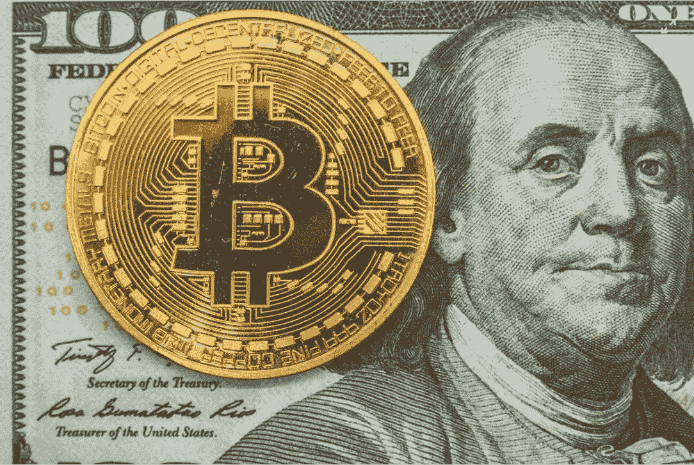

# 2023 年可能比比特币更有吸引力的十种加密货币

> 原文：<https://medium.com/coinmonks/ten-cryptocurrencies-that-could-be-more-attractive-than-bitcoin-in-2023-7c4788897c89?source=collection_archive---------2----------------------->

加密货币──今年 6 月初，加密货币市场经历了有史以来最大幅度的下跌。特别是被广泛认为是整个空间中估值最高的“加密货币的母亲币”比特币(BTC)，在 6 月 7 日至 6 月 14 日的短短 7 天内，其总价值损失了约 30%。随后，在大幅下跌后的第五天，即 6 月 18 日，它突破了 20，000 美元大关，跌至 17，592 美元。在不到两周的时间里，这一系列的折磨转化为大约 43%的价值损失。

此外，许多著名的加密货币硬币和代币实际上已经失去了价值，有些已经申请破产，包括 Terra Luna、Three Arrows Capital、Celsius 和 Voyager 等家喻户晓的名字。此外，顶级加密货币公司和交易所也出现了大规模裁员。因此，许多人认为这是一个信号，表明又一个“秘密冬天”将出现，并从已经遭受打击的市场中抹去另一大块价值。

然而，随着加密市场最近在 7 月下半月开始反弹，对 2023 年市场前景的乐观情绪再次增长。因此，让我们来探索一下明年可能超越 BTC 的十大加密货币项目和代币。

**值得关注的十大加密货币**

**以太坊**

目前，瑞士联邦理工学院已经超过了 BTC。自 7 月下半月以来，ETH 的涨幅高达 65%。目前，它的一个月涨幅为 55%。专家认为 ETH 是一种远远优于 BTC 的技术和区块链系统，随着人们期待已久的明年新形式以太坊 2.0 的推出，这两种顶级加密货币的前景非常光明。

**Teather (USDT) &美元硬币(USDC)**

加密货币中最著名的两种稳定币，USDT 币和 USDC 币，在加密领域被广泛用作美元的等价物。这两种稳定的硬币都非常具有流动性，并将成为加密货币革命的前沿。因此，这两种硬币预计将成为更广泛采用加密货币的主要受益者。

**币安美元(BUSD) &币安硬币(BNB)**

币安是世界上最大的中央加密货币交易所。其旗舰产品“BUSD”和“BNB”在加密领域提供了广泛的实际应用案例。此外，从历史上看，这两种密码在价格升值方面表现最佳。

**卡尔达诺(阿达)**

由以太坊五大创始人之一查尔斯·霍斯金森(Charles Hoskinson)共同创立。ADA 被认为是由密码学专家、数学家和工程师支持的最复杂的加密项目之一。被称为“以太坊黑仔”，ADA 的目标是开发该领域中最复杂和基于研究的产品。

**波尔卡多(点)**

DOT 提供了“区块链之间的互操作性和互连性”它可以执行独特的交易，而不需要第三方进行调解。与以太坊不同，开发者可以使用生态系统创建自己的区块链，提供有吸引力的价值主张。

**莫内罗(XMR)**

与 BTC 不同，XMR 自诩为真正安全、私密和分散的。一个人无法使用生态系统被追踪，不像 BTC，它允许第三方在他们的生态系统中找到一个特定的用户。XMR 通过使用高级加密技术来完全隐藏交易各方的身份，从而实现了这一点。

**索拉纳**

另一个所谓的“以太坊黑仔”，SOL，是为了支持该领域现有和未来的分散应用而创建的。此外，它收取的费用远低于瑞士联邦理工学院，这使得它更具竞争力，知名度也更高。

**恒星(XLM)**

最后，作为该领域最雄心勃勃的项目之一，XLM 的愿景是让全球所有金融机构都能在网络上运行。它可以以数字格式交易所有形式的传统货币。因此，在空间中提供了独特的身份。

声明:这不是投资建议。在做出任何投资决定之前，请咨询注册投资顾问。本文仅供教育之用。我们不是注册投资顾问。

> 交易新手？尝试[加密交易机器人](/coinmonks/crypto-trading-bot-c2ffce8acb2a)或[复制交易](/coinmonks/top-10-crypto-copy-trading-platforms-for-beginners-d0c37c7d698c)