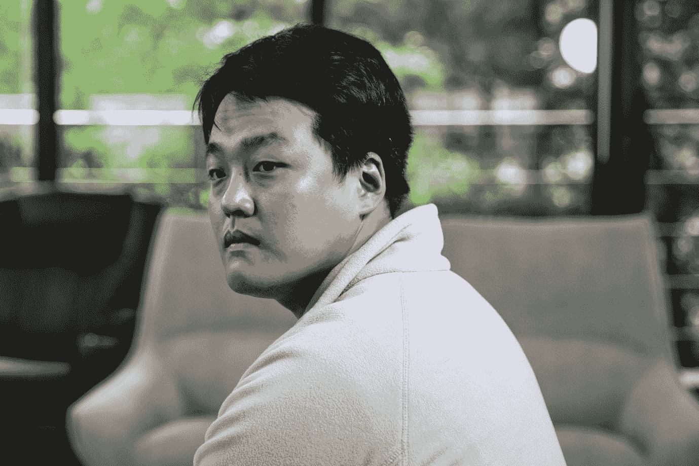

# Terraform Labs 联合创始人兼首席执行官 Do Kwon 否认价值 3960 万美元的冻结比特币的报道

> 原文：<https://medium.com/coinmonks/terraform-labs-co-founder-and-ceo-do-kwon-denies-reports-of-frozen-bitcoin-worth-39-6-million-4f6c12a200e2?source=collection_archive---------23----------------------->

图片来源:彭博

最近有媒体报道称，韩国检方已经冻结了他 562 亿韩元(相当于 3960 万美元)的加密货币资产，on Kwon 否认了这一报道。

**事情经过:**9 月 5 日，韩国媒体 News1 [报道](https://www.news1.kr/articles/?4823515)首尔南区检察官的联合金融证券犯罪调查小组已经冻结了属于首席执行官的价值 3960 万美元的加密资产，此外还冻结了 Kwon 试图隐藏的 6740 万美元中的 2750 万美元。

据报道，韩国当局要求两家加密交易所 OKX 和 KuCoin 冻结与 Kwon 有关的 3313 枚比特币。

在回应 CoinDesk 总结 News1 报道的推文时，Kwon 称该新闻是虚假的，并否认他的资金被冻结。

> “我不明白散布这种谎言背后的动机——肌肉收缩？但是为了什么？”Kwon 的推文说。“我再次声明，我不使用 KuCoin 和 OkEx，没有时间进行交易，没有资金被冻结。我不知道他们冻结了谁的资金，但这对他们来说是好事，希望他们能善加利用，”Kwon 补充道。

Kwon 在他的区块链网络崩溃后一直处于媒体的聚光灯下，当时稳定的币 TerraUSD 和网络的令牌 Terra 暴跌，在一周内抹去了投资者超过 400 亿美元的资金。

根据彭博的一份报告，上个月，国际刑警组织对 Terraform 实验室的联合创始人兼首席执行官发出了红色通缉令。然而，Kwon 坚持说，尽管他的位置不明，但他并没有在逃。一些人认为他在他通常居住的新加坡，但该国警方已经证实他不在那里。

> 交易新手？试试[加密交易机器人](/coinmonks/crypto-trading-bot-c2ffce8acb2a)或者[复制交易](/coinmonks/top-10-crypto-copy-trading-platforms-for-beginners-d0c37c7d698c)