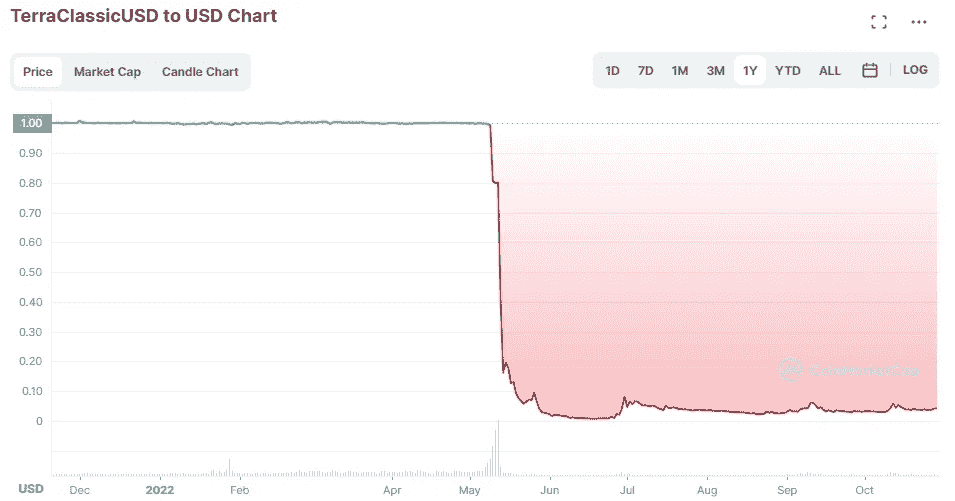

# Terra 的联合创始人因密码误导被起诉

> 原文：<https://medium.com/coinmonks/terras-co-founder-has-been-sued-for-crypto-misled-154c66549345?source=collection_archive---------26----------------------->

Terra 的联合创始人 Do Kwon 在新加坡面临 5700 万美元的诉讼。该诉讼是由一群 Terra 投资者提起的，他们声称 Kwon 在公司的财务状况上误导了他们。

这不是 Kwon 第一次被指控财务不当行为。2018 年，他在韩国被捕，罪名是挪用公款和诈骗。他后来被释放了…