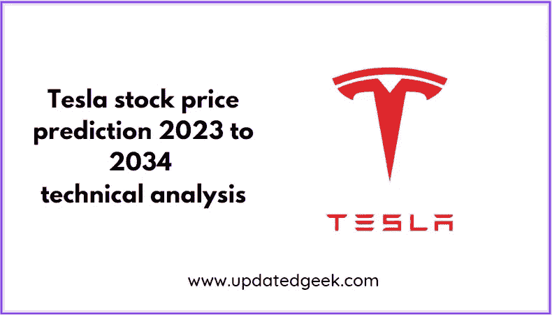
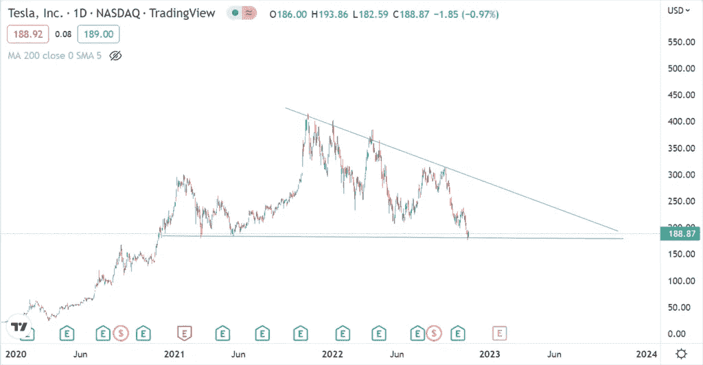
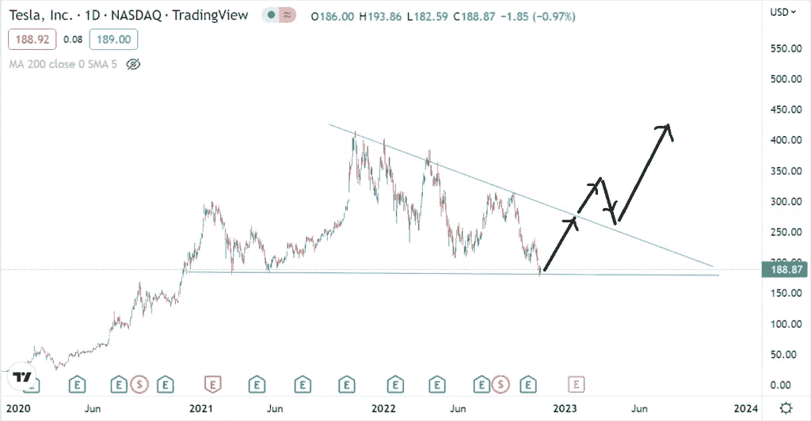
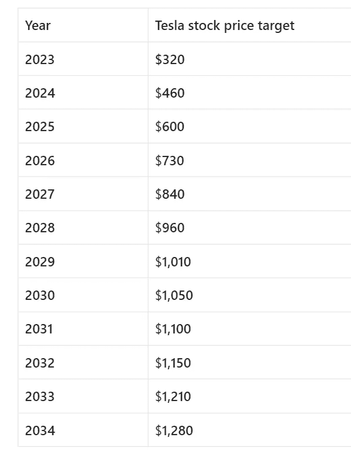

# 特斯拉股价目标 2023 年至 2034 年

> 原文：<https://medium.com/coinmonks/tesla-stock-price-target-2023-to-2034-26761fc1406e?source=collection_archive---------59----------------------->

# 特斯拉公司详情

Tesla Stock Price Target 2023 to 2034

**特斯拉**是一家总部位于美国的电动汽车公司，总部位于美国德克萨斯州奥斯汀。该公司设计和生产电动汽车，电池储能，太阳能屋顶瓦，太阳能电池板，以及相关产品。特斯拉是世界上最有价值的公司，市值约为 1 万亿美元。

该公司已在 2020 年占领了 23%的电动汽车市场。该公司成立于 2003 年，由埃隆·马斯克(首席执行官)、罗宾·丹农(董事长)、扎克·柯克霍恩(首席财务官)和德鲁·巴格里诺(首席技术官)领导。

> 从顶级交易者那里复制交易机器人。免费试用。

# 特斯拉最新收益

该公司报告的 2021 年收入为 538 亿美元，净收入为 55.2 亿美元。截至 2022 年 4 月，特斯拉的员工人数为 11 万。

**亦读**

[苹果公司 2023 年至 2030 年的股价目标](https://updatedgeek.com/apple-inc-share-price-target/)

# 特斯拉技术分析

目前**特斯拉股价**为 192.42 美元。特斯拉股票触及的最高价格是 414 美元。

Tesla stock price

价格运动已形成三角形形态，当前价格位于水平线附近。当前价格是正确的进入点，因为该股在过去 2 年中一直保持着 180 的最低价格水平。目前的价格对保守和激进的投资者来说都是完美的切入点。

Tesla price breakout

价格一爆发，就有望给予巨大的投资回报。

# 特斯拉股价目标

Tesla stock price target

# 特斯拉的竞争对手

特斯拉的竞争对手有福特、日产、通用、本田、Nio 等。然而，当谈到电动汽车细分市场时，特斯拉占据了首位。

# 特斯拉的未来

技术进步帮助特斯拉创新了其业务流程。特斯拉是首批推出电动汽车的汽车制造商之一，这一点显而易见。特斯拉通过提供从高档车到大众车的全系列电动汽车，彻底改变了购车体验。

特斯拉允许他们的客户参观商店，以获得互动体验。客户也可以配置自己的跑车。策略是鼓励顾客与他们的朋友分享他们在脸书的经历。

该公司拥有从车辆设计到客户交付的整个流程，便于工程师和销售团队之间的密切沟通。

# 特斯拉是买的好股票吗？

特斯拉是一只成长股，有几个因素支持这项投资。

首先，该公司在电动汽车行业拥有巨大的市场份额。

接下来是特斯拉拥有的其他公司，如 Nio 和 Rivian，没有的好处。

第三，特斯拉拥有电动汽车生产所需的基础设施，比如最大的超级充电站网络。

[要在印度最好的经纪人处开立加密钱包账户，请点击此处](https://wazirx.com/invite/jkwe73z9)

**亦读**

[你应该买天然钻石还是实验室培育的钻石？](https://updatedgeek.com/should-you-buy-diamonds-or-lab-grown-diamonds/)

[为什么 2022 年小金融银行适合投资？](https://updatedgeek.com/why-small-finance-banks-are-good-for-investment-in-2022/)

[为什么信用卡比现金或借记卡更好？](https://updatedgeek.com/why-credit-cards-better-than-cash-or-debit-cards/)

# 常见问题

**1。2030 年特斯拉股票预测是多少？**

特斯拉 2030 年的库存预测为 1，050 美元

****2。特斯拉的 12 个月价格目标是什么？****

**特斯拉股票预计将达到 460 美元**

****3。特斯拉是买入持有还是卖出？****

**特斯拉处于买入位置**

****4。特斯拉股票预测会涨吗？****

**是的，特斯拉股票预计将上涨**

****5。特斯拉是 2023 年的好股票吗？****

**是的，特斯拉是 2023 年的好股票。**

****免责声明**:如果你想投资股市，在做出购买决定之前，你应该咨询你的理财顾问。你应该评估风险，研究公司细节。**

****相关搜索****

**为什么信用卡或借记卡会有有效期？**

**为什么美元对印度卢比的汇率在上升？**

**[你应该知道的 10 堂理财课](https://updatedgeek.com/10-money-lessons/)**

**[共同基金优于股票的 5 个理由](https://updatedgeek.com/mutual-funds-better-than-stocks/)**

**30 岁前理财的 10 件事**

**[只有一种股票投资策略可以帮助你在 2022 年获得良好的回报](https://updatedgeek.com/one-stock-investment-strategy-gain-good-returns-2022/)**

**[投资实物黄金或数字黄金前需要考虑的事情](https://updatedgeek.com/things-to-consider-before-investing-in-physical-gold-or-digital-gold-in-2022/) l**

> **加入 Coinmonks [电报频道](https://t.me/coincodecap)和 [Youtube 频道](https://www.youtube.com/c/coinmonks/videos)了解加密交易和投资**

# **另外，阅读**

*   **[加密货币储蓄账户](/coinmonks/cryptocurrency-savings-accounts-be3bc0feffbf) | [YoBit 审核](/coinmonks/yobit-review-175464162c62)**
*   **[Botsfolio vs nap bots vs Mudrex](/coinmonks/botsfolio-vs-napbots-vs-mudrex-c81344970c02)|[gate . io 交流回顾](/coinmonks/gate-io-exchange-review-61bf87b7078f)**
*   **[CoinFLEX 评论](https://coincodecap.com/coinflex-review) | [AEX 交易所评论](https://coincodecap.com/aex-exchange-review) | [UPbit 评论](https://coincodecap.com/upbit-review)**
*   **[AscendEx 保证金交易](https://coincodecap.com/ascendex-margin-trading) | [Bitfinex 赌注](https://coincodecap.com/bitfinex-staking) | [bitFlyer 点评](https://coincodecap.com/bitflyer-review)**
*   **[Bitget 回顾](https://coincodecap.com/bitget-review)|[Gemini vs block fi](https://coincodecap.com/gemini-vs-blockfi)cmd |[OKEx 期货交易](https://coincodecap.com/okex-futures-trading)**