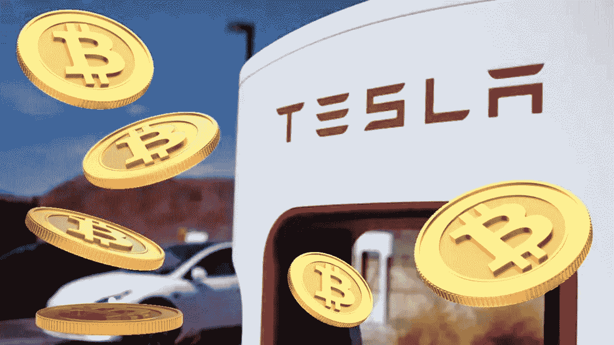

# 特斯拉最近向 SEC 提交的文件显示，其持有的比特币价值 2.22 亿美元。

> 原文：<https://medium.com/coinmonks/teslas-most-recent-sec-filing-reveals-holdings-in-bitcoin-at-222-million-ce71d99cf79?source=collection_archive---------65----------------------->

特斯拉披露，尽管出售了 75%的加密货币资产，但仍持有市值 2.22 亿美元的比特币。当该公司最近将比特币转换为法定现金时，它实现了 6400 万美元的收益。

# 特斯拉通过出售比特币赚了 6400 万美元

美国证券交易委员会(SEC)周一收到了特斯拉公司的一份报告。

正如 Bitcoin.com 新闻上周披露的那样，该公司表示，它已将其约 75%的比特币资产转换为法定货币。由于 BTC 的转换，这家电动汽车制造商的资产负债表上现在多了 9.36 亿美元的现金。

根据特斯拉第二季度提交给 SEC 的文件，

***我们在一些比特币兑换成法定货币的交易中获利 6400 万美元，由于比特币账面价值的波动，我们损失了 1.7 亿美元。***

在 Q1 2021 中，特斯拉以 15 亿美元收购了比特币。该公司在同一时期出售了价值 2 . 72 亿美元的 BTC。在 Q1 2021 中，比特币的价格在 3.2 万美元至 59.2 万美元之间。

这家电动汽车制造商在美国证券交易委员会的文件中表示，通过将其比特币兑换成法定货币，它在 Q1 2021 中获得了 1.28 亿美元。此外，在 Q2 2021 和 2021 年上半年，该公司分别经历了 2300 万美元和 5000 万美元的比特币减值损失。

# 比特币是特斯拉投资组合中的主要数字资产

特斯拉在周一提交给 SEC 的报告中澄清说，它在 Q1 2021 购买了价值 15 亿美元的比特币。今年上半年，它还收购了“数量微不足道”的数字资产。

虽然特斯拉没有提到它拥有的其他加密货币，但它从 1 月份开始接受 meme 加密货币 dogecoin (DOGE)来换取一些商品。

***根据特斯拉的财务报表，其数字资产在第二季度末的账面价值为 2.18 亿美元。电动汽车的制造者澄清:***

截至 2022 年 6 月 30 日，持有的这些数字资产的公允市值为 2.22 亿美元。

在短暂跌至 18，784 美元后，BTC 的价格在 6 月 30 日徘徊在 2 万美元左右。根据 Bitcoin.com 市场的信息，在撰写本文时，BTC 目前的交易价格为 21，869 美元。

特斯拉首席执行官埃隆·马斯克(Elon Musk)本周在该公司 Q2 财报电话会议上表示，鉴于中国的 Covid 关闭，该公司出于对“公司整体流动性”的担忧，出售了大部分比特币马斯克强调，这不应被解读为对比特币的判断，并指出特斯拉没有出售任何比特币，而且“我们对未来增加我们的比特币持有量持非常开放的态度。”

> 交易新手？试试[加密交易机器人](/coinmonks/crypto-trading-bot-c2ffce8acb2a)或者[复制交易](/coinmonks/top-10-crypto-copy-trading-platforms-for-beginners-d0c37c7d698c)