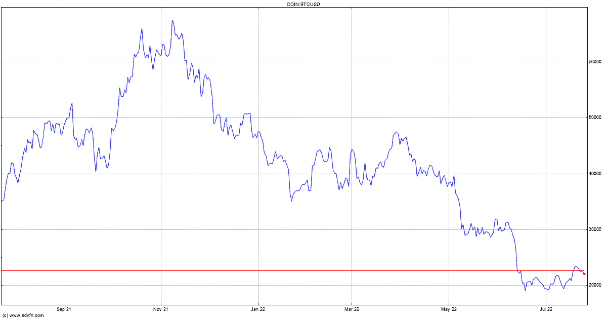

# Tether、Bitfinex、Hypercore Collab 推出加密 P2P 应用

> 原文：<https://medium.com/coinmonks/tether-bitfinex-hypercore-collab-to-launch-encrypted-p2p-apps-de191bcd1f84?source=collection_archive---------59----------------------->

遵循“熊市是为了建设”的格言，加密交易所 Bitfinex 与系绳(USDT)和 Hypercore 一起宣布推出一个完全加密的平台 Holepunch，用于构建点对点应用程序。作为该计划的一部分，三人组推出了 Keet，这是一个加密的应用程序，能够促进实时音频和视频通话、文本聊天和文件共享。

根据公告，合作伙伴旨在通过 Holepunch 打破技术垄断，同时控制数据。Tether 和 Bitfinex 资助了 Holepunch 平台的开发。Tether 和 Bitfinex 的首席技术官 Paolo Ardoino 将作为首席战略官领导这项新举措。

Ardoino 代表 Tether 和 Bitfinex 强调了解决日益增长的隐私问题的必要性，他说:

> “它(泰瑟和 Bitfinex)认为，选择、交流和金融自由是未来的生命线，任何能增强这些自由的东西都值得放大。”

Holepunch 目前在其 alpha 或预发布阶段作为封闭源代码协议运行，该协议将在 2022 年底前转向开源代码。在这样做的过程中，Holepunch 将不会使用区块链技术作为其核心，而是转向由 Lightning 网络支持的内部支付 API。

基于 Holepunch 协议构建解决方案的开发人员将能够使用 USDT 作为小额支付的默认设置。然而，该公司尚未透露对其他加密货币和稳定货币的支持。

基于区块链的元宇宙和 Web3 平台携手成立了 Web3 开放元宇宙联盟(OMA3)，这是一个建立在四个核心原则基础上的联盟——透明、包容、去中心化和民主化。

据 Cointelegraph 报道，该联盟将专注于特定的元宇宙相关主题，包括为不可伪造令牌(NFT)、协议、可转移身份、虚拟世界之间的门户、映射和索引制定标准。

点击这里，关注我们的更多故事[。](http://t.me/etellworld)

> 交易新手？试试[密码交易机器人](/coinmonks/crypto-trading-bot-c2ffce8acb2a)或[复制交易](/coinmonks/top-10-crypto-copy-trading-platforms-for-beginners-d0c37c7d698c)