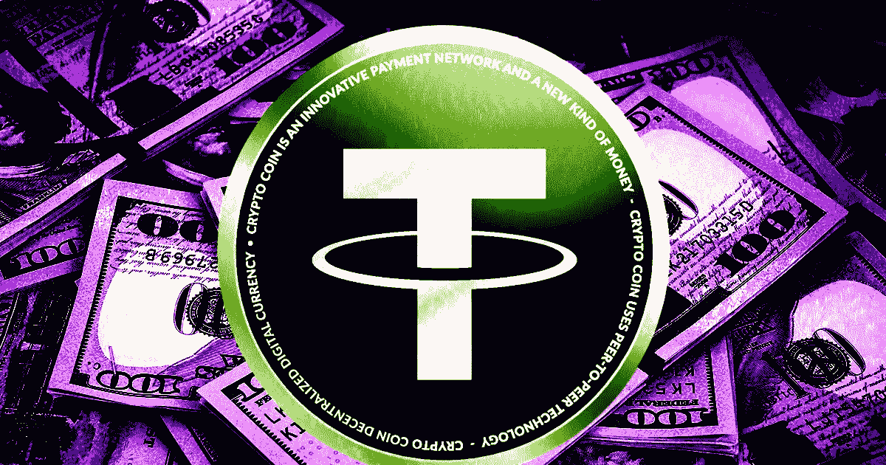

# 泰瑟表示，它大幅削减了所有商业票据，代之以美国国债

> 原文：<https://medium.com/coinmonks/tether-says-it-slashed-all-commercial-paper-replaced-with-us-treasury-bills-a0ec953d2676?source=collection_archive---------53----------------------->

世界上最大的稳定币的发行者 Tether 在一篇博客文章中说，它已经将其商业票据持有量削减到零，并用美国国库券取而代之。

*   泰瑟公司是 USDT 稳定币的发行者，这种代币声称与美元 1:1 挂钩。由于 2021 年 2 月与纽约州司法部长的和解，Tether 被要求发布关于其储备的季度报告，该报告暴露出其约 50%的储备由商业票据支持，这被视为高风险资产。
*   Tether 于 2021 年 9 月开始大幅削减其商业票据。
*   稳定货币是一种加密货币，其价值与基础资产(如美元)的价值挂钩，持有的资产等于或大于加密货币的总市值。根据 CoinMarketCap 的数据，USDT 的市值约为 680 亿美元。
*   短期国库券被认为比商业票据更稳定，商业票据是公司为增加融资而发行的短期债务产品。
*   Tether 在其博客文章中表示，此举是朝着“更大的透明度和信任”迈出的一步
*   2021 年 2 月，Tether 与美国纽约州总检察长达成了 1850 万美元的和解，并披露了月度储备，因为后者起诉前者的储备不足以支持 stablecoin。

> 交易新手？试试[加密交易机器人](/coinmonks/crypto-trading-bot-c2ffce8acb2a)或者[复制交易](/coinmonks/top-10-crypto-copy-trading-platforms-for-beginners-d0c37c7d698c)