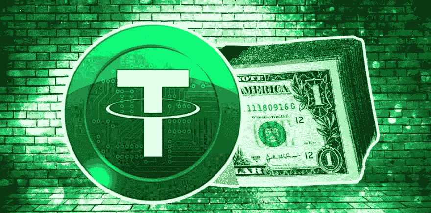
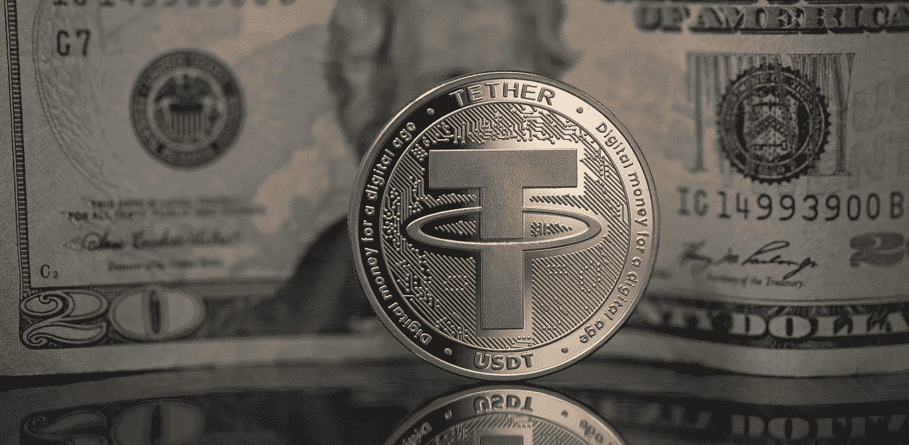
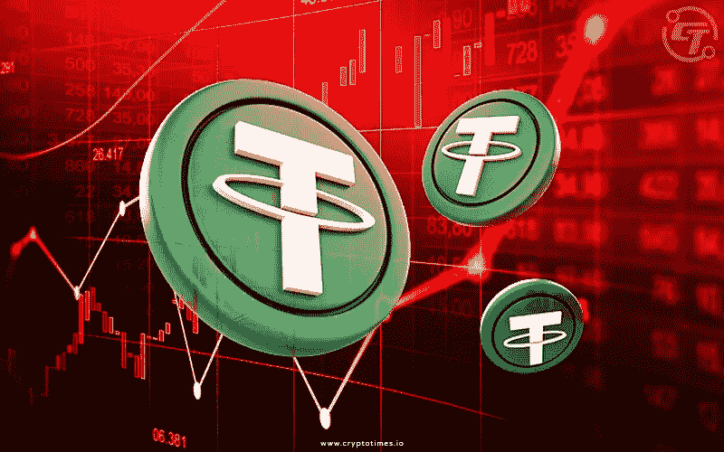
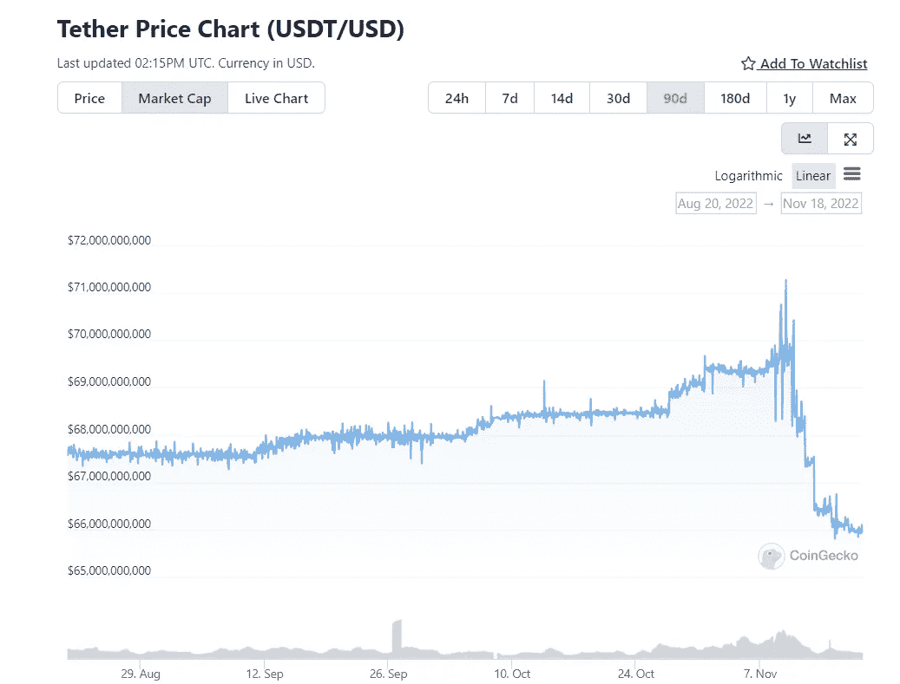

# 系绳:好的，坏的，丑陋的

> 原文：<https://medium.com/coinmonks/tether-the-good-the-bad-the-ugly-db14a9715438?source=collection_archive---------15----------------------->

Tether has lost over $5 billion in market cap last week and many speculate that USDT will collapse soon

想象一下，有一个**印钞机**，它是**不受任何中央实体控制**，位于**离岸**，**未经审计**，**在他们喜欢的任何时候印刷数十亿美元**…

听起来**粗略**对吧？

我必须告诉你:这是存在的，而且实际上是市值排名第三的加密货币。这就是为什么 **Tether** 对 crypto 来说是最大的风险:

## 什么是系绳？

Tether is the largest stablecoin with a current market cap of $60 billion

**系绳**是一种**加密货币**，即**与**的**美元**挂钩。**一根系绳**等于**一美元**等于**一美元**。Tether 声称 **100%由美元储备支持**。这意味着每一个流通中的栓绳，就有一个美元储备。Tether 通过 Omni 层协议构建在**比特币区块链**之上。

让我们来看看**像**系绳**一样的**稳定绳**的优点**:

## 好人

使用 Tether 的主要优势是它比其他加密货币更不稳定**。这使得它非常适合**需要保值**但不希望比特币或以太坊等加密货币波动的用例。**

**例如:**假设你是一个接受加密支付的商家，但由于波动性，你不想持有加密。你可以将你的比特币或以太币兑换成 USDT，然后持有它，直到你需要将其兑换回法定货币以供提款或其他用途。

尽管有这个优势，**系绳也有一些**可怕的缺点**:**

## 坏事

Tether’s collapse could have catastrophic consequences on the whole crypto market

多年来，Tether 的批评者一直说 **USDT 没有得到**的完全支持，并且**没有足够的美元储备**来覆盖所有流通中的 Tether。这意味着不是每个人都能把他们的 USDT 兑换成法定美元。

此外，在 2019 年 10 月 14 日， **Bitfinex —** 与 Tether 密切相关的领先加密货币交易所——宣布它已经**损失了 8.5 亿美元**，并将**使用 Tether 的储备资金**来弥补损失。

更让人担心的是**泰瑟的 USDT 还没有被审计**。由于该公司在**离岸**，他们没有义务向**提供每日/每月审计，以证明他们的储备是完全支持的**。

但是它变得更加可怕

阿拉米达研究公司(FTX 的合作公司)是系绳的最大用户。他们获得了价值 366.5 亿美元的 USDT(Tether 目前的市值为 600 亿美元)。许多人推测阿拉米达正处于崩溃的边缘，这对 Tether 和整个加密市场来说将是灾难性的。

## 丑陋的

Over $5 billion have been converted out of Tether the last week alone

在过去的 7 天里，超过 50 亿 USDT 被售出。这在市场崩盘期间是非常不寻常的，因为人们会预期随着加密卖家将现金投入到 Tether 中，Tether 的市值会上升。

潜在的阿拉米达崩溃给 USDT 带来了很多恐慌，这可能会导致储备耗尽。如果这样的银行挤兑发生，这将导致大范围的恐慌，并可能导致数十亿美元在一夜之间从加密市场中消失！

崩溃的系绳肯定会让**比特币跌破 1 万美元**和**以太坊**很可能**跌破 500 美元**。

🤑加入我们的 [**电报频道**](https://t.me/officialcryptohub) 与志同道合者互动

🐦也可以查看我们的 [**推特账号**](https://twitter.com/CryptoHub210?s=20&t=ts3bUBYtX7g0s5_ClYnL_A) 获取更简短的分析

💰欢迎 [**关注我们**](/@officialcryptohub0) 获取更多此类分析

👋业务请求: [**电报:联系人@cryptohubtiktok**](https://t.me/cryptohubtiktok)

> 交易新手？尝试[加密交易机器人](/coinmonks/crypto-trading-bot-c2ffce8acb2a)或[复制交易](/coinmonks/top-10-crypto-copy-trading-platforms-for-beginners-d0c37c7d698c)