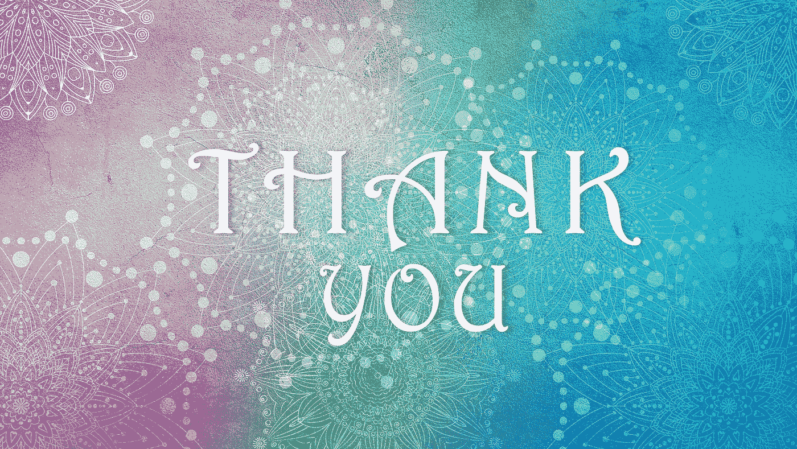

# 谢谢你们——我的读者和支持者们！

> 原文：<https://medium.com/coinmonks/thank-you-my-readers-and-supporters-f3d7b280862b?source=collection_archive---------11----------------------->

## 在我的一周年纪念日，非常感谢我的读者和支持者们！

今天是我作为媒体内容创作者的一周年纪念日！

我想借此机会*感谢我所有的读者和捐赠者*对你们的支持和鼓励！我真的很感激你和你在过去的一年里给予我的关注。

Image Courtesy of [Alexandra Koch](https://pixabay.com/users/alexandra_koch-621802/?utm_source=link-attribution&utm_medium=referral&utm_campaign=image&utm_content=6909896), Pixabay

在过去的三个月里，我的中型账户增长惊人。所以昨晚，我收到了一条*直觉*信息，要求我写一篇文章感谢我的读者和支持者！当我开始这篇文章时，我决定翻到我的故事目录，却惊讶地发现我的第一篇关于媒介的文章竟然在整整一年前的今天发表了！

这个名为[艺术的形而上学](https://jamenmendes.medium.com/the-metaphysics-of-art-b3514851943b)的故事，仍然是我最喜欢的作品之一。这是我工作的基石。它从精神的角度看待“艺术”这个词，同时指出支撑“艺术”这个词的“自然力量”。

当时我还不知道，这篇文章中提出的形而上学分析将继续影响我所有的工作，特别是我关于比特币、Luna Classic 的文章，以及写作本身的精神行为。

然而，我必须承认，如果没有你的鼓励，我可能会放弃为这本刊物写作的想法。当你开始订阅并关注我的作品时，我被深深地感动了，我要继续走下去。

今天，我对我在 Medium 上的全部目录感到满意，在过去的一年里我写了 110 篇文章。老实说，我不知道这些故事从何而来！

我还必须说，起初，我非常怀疑将我的工作货币化，担心这会减损我的精神实践的原则。再次，你们的鼓励和读者让我相信，通过与世界分享我的想法和智慧来谋生是可以的。

最后，我想*感谢*所有为我的写作计划直接捐款(小费)并利用我的会员链接注册 Medium 的人。我很感激你的礼物！

这是充满挑战和精神转变的一年。我很高兴在这段旅程中有你们所有人的陪伴。而且，因为你的善良和欣赏，我更好地准备去面对未知的写作！

谢谢大家！

附:一个建议:)

我希望 Medium 能创建一个*功能*,允许与捐赠者和会员订阅者直接互动，就像与读者互动一样。如果作家可以单独感谢他们所有的捐赠者和订阅者，那该多好啊。

> 交易新手？试试[加密交易机器人](/coinmonks/crypto-trading-bot-c2ffce8acb2a)或者[复制交易](/coinmonks/top-10-crypto-copy-trading-platforms-for-beginners-d0c37c7d698c)