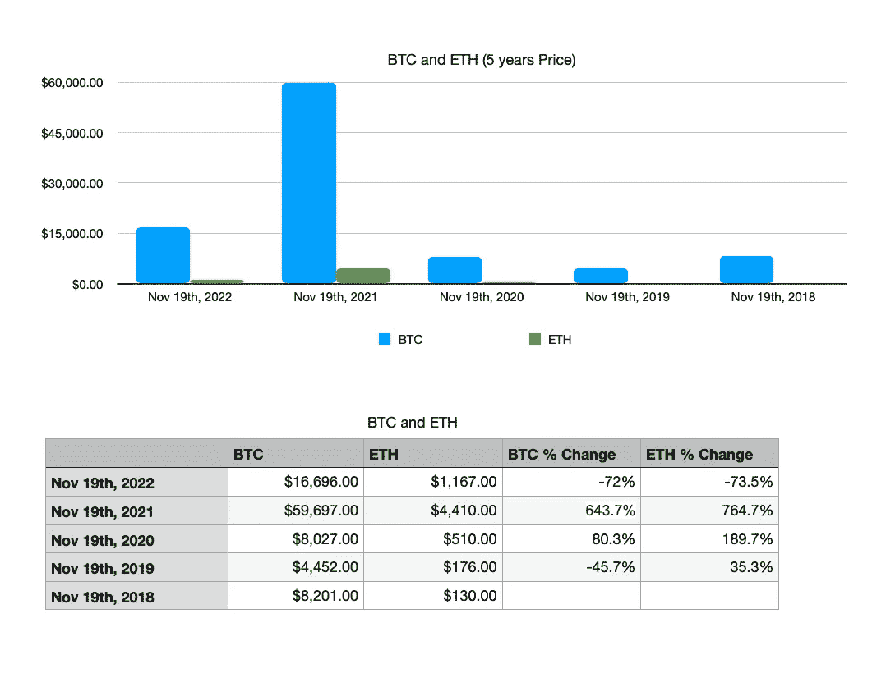
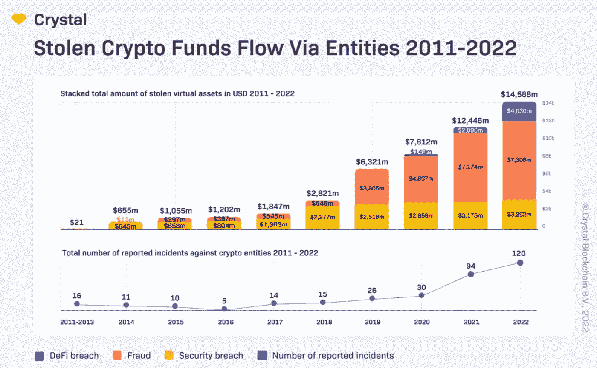
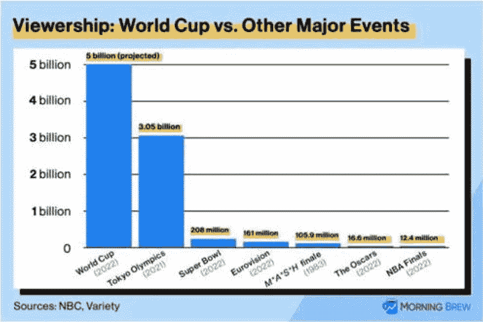
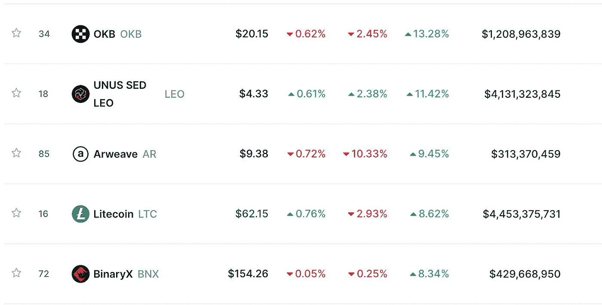

# 🦃感恩节对话将被点燃

> 原文：<https://medium.com/coinmonks/thanksgiving-conversations-will-be-lit-3d5f81c869c?source=collection_archive---------33----------------------->

*   🦃感恩节对话将被点燃
*   ⚽世界杯在这里…
*   💰本周硬币
*   🐦本周推特:
*   📰热门阅读
*   🙏🏻感激…

# 🦃感恩节对话将被点燃

感恩节是美国的一个全国性节日，通常在每年 11 月的最后一个星期四庆祝。它最初是为了感谢 T2 丰收和前一年的祝福，在不同的国家没有庆祝，比如 T4、加拿大、格林纳达、圣卢西亚和利比里亚。

美国神话认为清教徒和印第安人在 400 年前联合起来庆祝第一个感恩节，但是和平并没有持续多久。一代人之后，定居者和他们曾经的盟友开始了战争。对一些人来说，这个节日只是提醒人们印第安人所经历的压迫，一些人认为这个节日应该被取消。

一年中的这个时候，家人聚在一起，这意味着与所爱的人相聚，分享我们一直在做的事情，以及进行艰难的谈话，尤其是在喝了几杯之后。

今年关于加密的对话将会很有趣。Crypto 的支持者会听到很多“我告诉过你”的话，可能很难支持这个空间。

密码市场在一年内从 2.6 万亿美元下降到 8220 亿美元。在过去的几个月里，大多数资产都贬值了。

仅今年到目前为止，我们已经看到了比任何一年都多的黑客、诈骗、[依赖和](https://financial-dictionary.thefreedictionary.com/Depegging)[交换运行](https://en.wikipedia.org/wiki/Bank_run)。

订阅

> ***这个为什么重要？——****不管我们对市场的看法是乐观还是悲观。这些假期可能是倾听我们的朋友和家人对市场的看法，以及他们对这项技术的看法，并创造一个更广阔的世界观的好时机。如果我们乐于学习，每个人都有东西可以教我们。也许，我们被刚刚成形的区块链和加密技术的力量蒙蔽了双眼，但我们负担不起我们一生的积蓄和人们的信任来倡导一些可能需要更长时间才能被理解和大规模采用的东西。*
> 
> 就像熊市最适合建设一样，熊市也非常适合学习和拓展我们的视野。

# ⚽世界杯在这里…

国际足联世界杯已经开始，大多数“世界”对其处理方式不满。

这是人类历史上最重要的体育赛事。本届世界杯预计将有 50 亿人观看(占世界人口的 62.5%，因为我们刚刚触及了 80 亿世界居民)。

所以…

*   比赛时不喝啤酒。 —仍将在指定的球迷区和高价体育场套房为赛事官员和富人提供酒水。全卡塔尔只有两家酒类商店，在公共场合喝酒和被人灌醉都是违法的，游客行李中发现的任何酒精都会被没收。此外，该国在 2019 年对酒精进口征收 100%的税，因此卡塔尔拥有世界上最贵的啤酒，根据[Expensivity](http://expensivity.com/)2021 年的一份报告，一瓶 11 盎司的啤酒售价为 11.26 美元。
*   [分享 Yaro 的技术、区块链和网络 3](https://yarocelis.substack.com/?utm_source=substack&utm_medium=email&utm_content=share&action=share)
*   **侵犯人权。**——据《卫报》报道，自 2010 年卡塔尔获得世界杯主办权以来，已有超过 6500 名来自南亚的移民工人死亡(该报道还称这是一个极端的低估数字)。卡塔尔在获得世界杯主办权之前只有一个体育场。他们不得不建造更多的工厂，基本上是奴役外国工人，一旦不再需要他们，就把他们赶出去。
*   **肮脏的国际足联。**——2020 年，经过长达一年的调查，美国司法部指控卡塔尔和俄国(2018 年世界杯主办国)[的代表贿赂国际足联官员](https://www.nytimes.com/2020/04/06/sports/soccer/qatar-and-russia-bribery-world-cup-fifa.html)以赢得主办权。没什么新鲜的，看看新的[国际足联网飞纪录片](https://www.netflix.com/title/80221113)，准备好大吃一惊吧。

# 💰本周硬币

> [*OKB*](http://okx.com/) *是由 OK 区块链基金会和马耳他密码交易所(OKEx)发布的加密货币。*
> 
> *该交易所是世界上最大的交易所之一，* [*目前在流动性方面排名第三，在交易量方面排名第四，并提供了广泛的交易对选择。*](https://coinmarketcap.com/exchanges/okex/)

OKEx 在许多方面与加密货币交易所巨头币安相似，但也有一些关键差异。OKEx 平台拥有自己的云挖掘服务，该公司更专注于为用户提供期权交易。与此同时，币安努力在全球范围内提供广泛的加密服务。

[分享](https://yarocelis.substack.com/p/will-defi-be-regulated?utm_source=substack&utm_medium=email&utm_content=share&action=share&token=eyJ1c2VyX2lkIjo4NzI4NzQyLCJwb3N0X2lkIjo4MDA4MzMzNywiaWF0IjoxNjY3MTc0NDI5LCJleHAiOjE2Njk3NjY0MjksImlzcyI6InB1Yi0yODIwMjIiLCJzdWIiOiJwb3N0LXJlYWN0aW9uIn0.C81cUJ8Y1qum-eXUC33tUVOk_UChL_PElDd80H9571w)

# 🐦本周推特:

随着假期的临近，自我意识将有助于我们更好地享受家庭和自己，更好地相互包容，并提高自我认识。我喜欢 LePera 博士的这条推文。希望有帮助..

Nicole LePera 博士@ the holisticpsych

[如何变得更有自知之明一根线🧵:](https://twitter.com/Theholisticpsyc/status/1594365914702831616)

[https://Twitter . com/Theholisticpsyc/status/1594365914702831616](https://twitter.com/Theholisticpsyc/status/1594365914702831616)

# 📰热门阅读

*   [Stablecoin 发行人泰瑟解释了 FTX 和阿拉米达的崩溃如何对 USDT 没有影响](https://dailyhodl.com/2022/11/20/stablecoin-issuer-tether-explains-how-ftx-and-alameda-collapse-has-no-effect-on-usdt/)
*   DeFi 是解决 FTX 危机的方法——但是我们必须更好地传播它
*   [FTX 欠其 50 大债权人超过 30 亿美元:申请破产保护](https://cointelegraph.com/news/ftx-owes-over-3-billion-to-its-50-biggest-creditors-bankruptcy-filing)
*   [FTX 的惨败意味着 DC 密码即将面临的后果](https://cointelegraph.com/news/ftx-fiasco-means-consequences-for-crypto-out-of-washington-dc)
*   看多比特币的人正勇敢地面对 FTX 下跌前后的风暴，但比特币价格暴跌至 10，000 美元真的不远了吗？
*   [尽管可能会有短期收益，但 AVAX 投资者必须谨慎行事的原因](https://ambcrypto.com/reasons-avax-investors-must-tread-carefully-despite-probable-short-term-gains/)
*   [密码专家正在收集这些便宜的密码——找出原因](https://cryptonews.com/news/crypto-experts-are-accumulating-these-cryptos-while-theyre-cheap-find-out-why.htm)

> 交易新手？尝试[加密交易机器人](/coinmonks/crypto-trading-bot-c2ffce8acb2a)或[复制交易](/coinmonks/top-10-crypto-copy-trading-platforms-for-beginners-d0c37c7d698c)