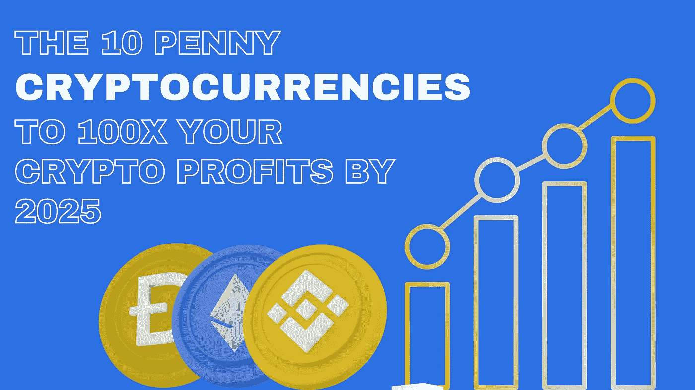

# 到 2025 年，10 便士的加密货币将是您加密利润的 100 倍

> 原文：<https://medium.com/coinmonks/the-10-penny-cryptocurrencies-to-100x-your-crypto-profits-by-2025-1e5792de9b9f?source=collection_archive---------1----------------------->

# 便士加密货币是比特币和以太坊等大型加密货币的选择

*[***分步指南开始***](https://thecryptolab.groovesell.com/a/hxfZKodDqjTa) ***你的交易之旅****

*如今市场上有大量的加密货币。比特币和以太坊等大型货币是显而易见的选择，然而，还有其他不同的适度选择，如对您的投资组合更具发展潜力的便士加密货币。许多个人选择加密货币，这种货币可以让他们在更短的时间内获得高回报。鉴于今年加密成本的爆发方式，它们是这些天的愤怒，每个人都在调查它们。随着许多人寻找合理的投机方式，这篇文章包括了主要的 10 便士加密货币，可以让你以后变得富有。*

## *韦钱*

*VeChain 是一个区块链作为一个管理阶段，通常用于需要使用物联网的力量来防止重复的企业。在交换过程中，IoT 需要跟踪并验证确认劳动力和产品。其中一个最杰出的便士加密货币可以让你以后变得富有。*

## *奶妈*

*戴是一种基于以太坊的稳定币，它的发行和发展受到创造者大会和马克道分散独立协会的监督。戴的成本微妙地固定在美元上，并由其他加密形式的货币混合作为抵押，每当另一个戴被盖章时，这些货币就保存在精明的合同金库中。*

## *币安*

*币安在 2017 年开始时是一个汇集的数字货币交易，按日交易量计算，它已成为最大的加密货币交易。今天，聚会同样运行着一个被称为币安链的区块链，在这个链上，许多任务和应用都得到了促进。币安链支持币安指数，这是一个分散的贸易币安贸易申请。*

## *塔玛多吉*

*TAMA 正处于预售期，这个一分钱密码最大的股票是 20 亿代币。金融支持者应该考虑这种密码的一个原因是，金融支持者应该考虑这种密码，因为从长远来看，它减少了正在进行的储备。*

## *涟漪*

*毫无疑问，这是目前市场上最知名的加密货币之一。它在 2012 年发行时被称为 OpenCoin。瑞安·富格尔和杰德·麦卡勒创建了 Ripple，他们的私人资助人是克里斯·拉森。最令人惊讶的一便士加密形式的钱可以让你以后变得富有。*

## *Dogecoin*

*也许，图像硬币的统治者 Dogecoin 开始是一个笑话，但已经将一些金融支持者变成了大亨。这种硬币利用了工作挖掘计算的验证，就像比特币一样。它有助于将每个区块的确认时间减少到 1 分钟左右。同样，它在一些舞台上被用作分期付款的代币，是一种受欢迎的小费硬币。一个最令人惊讶的便士数字货币可以让你以后变得富有。*

## *柴犬*

*随着 Dogecoin 的崛起，许多图像密码同样获得了突出地位。自 2021 年推出以来，这种硬币中的一种已经闻名遐迩，那就是柴犬。在 2021 年的最后一个季度，柴犬的成本将飙升 1，400%，因为它通过虚拟娱乐舞台的发展普及。*

## *头顶*

*Calvaria 是一个闪亮的新的加密项目，围绕着从播放到采购的机制工作。这个任务的目标是通过一个由比较游戏推动的现象级战斗游戏来传播对货币加密形式的大众接受，比如社会事件巫师。舞台需要克服密码和现实之间的任何障碍。*

## ***Dash 2 Trade***

*Dash 2 交易是一个社会交换和加密调查阶段，你可以使用其本地令牌 D2T 进行访问。它于 2022 年 10 月 19 日开始了第一轮预售，截至目前已筹集超过 60 万美元。运行 2 交换提供了渐进的交换信号，进入社会和专门的指针，以提供有益的交换方法加密商人。*

## *奇利兹*

*这是一个区块链阶段，参与市场的垂直承诺管理，让体育团体向粉丝出售特定的利益，如提前入场门票，决定他们上场时的团体球衣计划，等等。这些优势然后在区块链上作为“粉丝代币”出售*

# *在加密货币市场分散投资组合*

*现在你可以自己为自己建立一个持续的被动收入流*

*➤一步步引导你开始交易之旅*

*➤初学者友好，并适用于有经验的交易者*

*➤不仅一个，但 10 个不同的策略将被详细教授*

## *[**现在加入**](https://thecryptolab.groovesell.com/a/hxfZKodDqjTa)*

****免责声明:*** 本文提供的信息仅代表作者观点，并非投资建议——仅用于教育目的。*

> *交易新手？在[最佳加密交易](/coinmonks/crypto-exchange-dd2f9d6f3769)上尝试[加密交易机器人](/coinmonks/crypto-trading-bot-c2ffce8acb2a)或[复制交易](/coinmonks/top-10-crypto-copy-trading-platforms-for-beginners-d0c37c7d698c)*