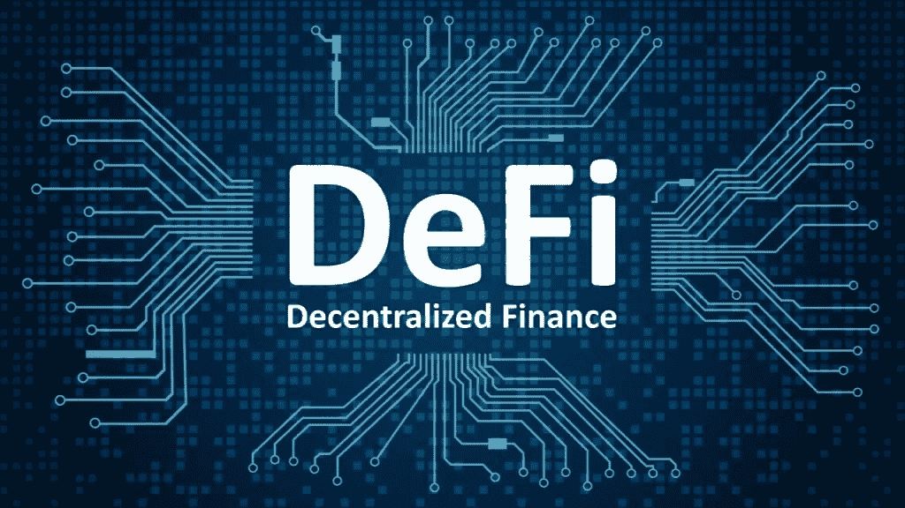

# DeFi 的 101

> 原文：<https://medium.com/coinmonks/the-101s-of-defi-95e72980d860?source=collection_archive---------54----------------------->

世界正在进入一个新的时代，一个一切都变得数字化的时代，因此在这个新时代，必然会有新的技术出现。所以，今天我将谈论这些新技术之一，DeFi。如果你最近一直在阅读你的加密新闻，那么你很可能在某个地方听说过这个术语。让我们开始吧。

> “定义是金融的未来。”——以太坊联合创始人 Vitalik buter in

## **什么是 DeFi？**

DeFi 是华尔街的数字化替代品，但不包括办公空间、停车等所有成本。它有能力创造一个更加自由、开放和公平的市场，让每个人都可以交易，尽管大多数交易都是使用加密货币进行的，目前主要是比特币和以太坊，但许多人认为它将成为金融建筑师。

## **有什么好处？**

**自行保管**

此功能使您能够完全控制您的数据，这也意味着您是唯一负责确保您的数据安全的人。这降低了黑客攻击的风险，并且您不必支付任何费用，因为该功能是完全分散的。

> 交易新手？尝试[加密交易机器人](/coinmonks/crypto-trading-bot-c2ffce8acb2a)或[复制交易](/coinmonks/top-10-crypto-copy-trading-platforms-for-beginners-d0c37c7d698c)

**无权限**

在银行界，要想存取你的大部分资金，你需要获得多家机构的许可，才能存取你的资金，但在 DeFi，你只需点击一个按钮，就可以随时随地存取你的资金。最棒的是，因为它是分散的，你的资金是安全的，没有任何限制，而且世界各地都有几份拷贝。

**不变性**

这意味着数据不能被改变，并成为防篡改，你和你自己有能力改变它。此外，审计过程变得更快，成本更低。

**透明度**

这主要适用于以太坊，所有为以太坊提供动力的代码都是开源的，任何人都可以查看，任何人都可以访问，这使得该工具尽可能地透明。

## 它是如何工作的？

用户使用 DeFi 的主要方式是通过称为分散应用程序的应用程序访问它，这种应用程序允许他们访问所有的服务。目前，这项工作只在区块链以太坊进行。你可以获得的一些服务包括贷款、借贷、交易、储蓄等等，它的潜力是无限的。

留下评论，告诉我你对 DeFi 的看法。

感谢阅读！下次见——Ryu

[https://www . btchaber . com/WP-content/uploads/2020/09/DeFi-Token-Incelemeleri-2-1-1024 x576 . jpg](https://www.btchaber.com/wp-content/uploads/2020/09/DeFi-Token-Incelemeleri-2-1-1024x576.jpg)