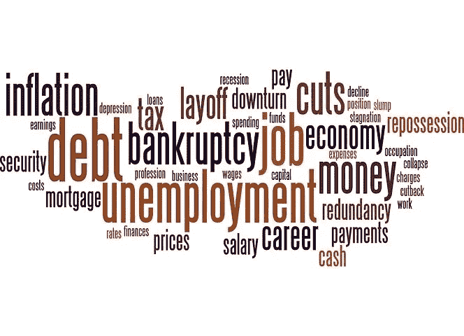

# 2022 年的衰退及其对 cryptoverse 的影响

> 原文：<https://medium.com/coinmonks/the-2022-recession-and-its-impact-on-the-cryptoverse-ca7a14871580?source=collection_archive---------23----------------------->

pixabay

人们可能会悄悄地谈论它，而 7 月 28 日的 Q2(第二季度)GDP(国内生产总值)报告将证实我们对衰退即将来临的担忧。

根据定义，衰退意味着连续两个季度的经济收缩。Q1 国内生产总值下降了 1.6%。亚特兰大联邦储备银行于 2022 年 7 月 1 日下调了对 Q2 GDP 的预测，至-2.1%