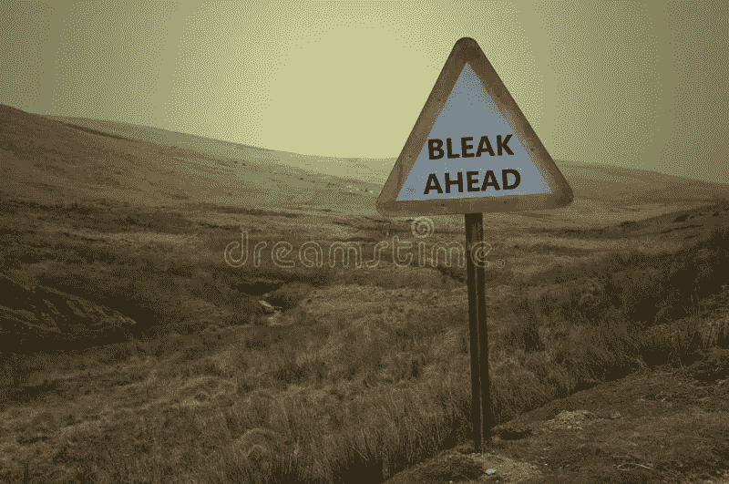

# 2023 年的 cryptoverse 前景:黯淡还是幸福？

> 原文：<https://medium.com/coinmonks/the-2023-cryptoverse-outlook-bleak-or-bliss-39e2b6520aca?source=collection_archive---------21----------------------->

dreamstime

**比特币**

随着 2022 年的到来，2023 年的到来，人们会从后视镜中看到很多反思、遗憾，或许还有一点庆祝。但是 2023 年的隐文会是什么样子呢？

Ark Invest 的首席执行官 Cathie Wood(一位著名的比特币倡导者)认为，大型金融机构可以踩刹车说:“好吧，我们真的理解这个(加密)吗？”

摩根大通(JPMorgan Chase & Co .)认为，cryptoverse 的加密底部仍在前方。他们预计比特币将在 13000 美元左右触底。

马克·墨比尔斯博士是 Mobius Capital Partners 的联合创始人，他不会对比特币在 2023 年跌至 1 万美元感到惊讶。他还认为(至少在一定程度上)上一轮牛市是由美联储的“长期运转的印钞机”推动的大量的资金提供了“大量的现金来投机加密”

美联储激进的利率上调产生了相反的效果，导致加密投资者持有他们仅有的少量投资。

加密分析师凯文·斯文森预测牛市将于 2023 年 4 月左右开始。他认为长达 80 周的熊市将在那个时候结束。

关于 2023 年的比特币，另一个有趣的事实是密码体的扩张。去中心化金融(DeFi)、去中心化自治组织(DAO)、GameFi、不可兑现代币(NFT)和 Web3 都已经很成熟，每个空间都利用 ETH(而不是比特币)在其中移动。

比特币仍然是加密领域的黄金标准，但扩大这些其他项目意味着更多的投资选择，这可能意味着加密市场之王的适度增长。

**以太坊**

围绕以太坊的新闻没什么不同。合并的好处，以证明利害关系，还没有转化为更高的价值排名第二的加密。

CoinLedger 首席执行官 David Kemmerer 说:“联邦理工学院尚未从最近发起的股权证明合并中获益。部分原因是因为隐秘的冬天。”

凯默勒认为，未来六个月内，ETH 可能上涨至 2500 美元，但可能会跌至 1000 美元以下——就像 2022 年夏天的情况一样。

**山寨币**

普遍的共识是，altcoins(比特币以外的硬币)只适用于在肆虐的熊市中具有超高风险承受力的人。在市场流动性如此之低的情况下，许多代币很难找到稳固的立足点。

话虽如此,《福布斯顾问》特约撰稿人丹·阿什莫尔认为，以下硬币可能会在 2023 年引起轰动。

这是投资建议。我没有研究或购买任何这些硬币。包括他们是为了显示关于隐文的各种意见。

# $RIA 收益

$RIA 的基本目标是维护颅盖骨生态系统并确保其正常运行。

# IMPT

为了减少他们的碳影响，个人和公司可以通过 IMPT 倡议购买碳信用额，每个信用额相当于抵消 1 吨碳。

# 1.奔向贸易(D2T)

Dash 2 交易的目标是提高您的加密货币交易。Dash 2 Trade 通过帮助您开发和测试交易策略，跟踪最新的新闻和链上数据，让您保持在市场的顶峰。

**Stablecoins**

马鬃也没有逃脱这个西伯利亚冬天的蹂躏。但他们正在为 2023 年定位，部分原因是政府支持央行数字货币(CBDC)的增加。

Circle 创造了美元硬币(USDC)，这是第五大加密货币，市值为 430 亿美元。尽管最近在币安退市，但 Circle 准备在 2023 年年中之前在 Solana 平台上推出欧元支持的 stablecoin。

日本银行是最新一家宣布创建 CBDC 的金融机构，也计划于 2023 年初推出。

中国的 CBDC 希望在 2023 年超越局部地区，进行更广泛的适应。

金融科技公司 Modulus Global 的首席执行官理查德·加德纳(Richard Gardner)认为，“稳定的银行确实处于困境，因为毫无疑问，CBDCs 的出现将蚕食他们的市场。”

曲折的时间之路将揭示他可能有多准确。

**对普通人意味着什么**

在通往牛市和更高价格收益的道路上，全球不确定性仍然是一个坑(或冲刷)。越来越多的经济问题(在美国和国外)也成为复苏的障碍。

唯一可以确定的是隐文不会消失。事实证明，它能够经受住这场风暴，并东山再起。正如佛罗里达人在遭受飓风伊恩的影响后正在恢复并回归新常态一样，在 2022 年残酷的西伯利亚冬季后，隐密体正在回归新常态。

隐文会留在这里，它可能是给你的。跟着我学；你会学到的，我们可以探索隐密体。

*免责声明:我是一名狂热的加密学生。当新冠肺炎占领世界并锁定全球经济时，隐密体引起了我的注意。从那以后，我花了一部分时间来学习这种货币——未来的货币——和国际商业。作为一名作家，我决定记录我的发现。我选择把它们写成短小精悍的文章，以帮助任何有兴趣了解这个领域的人。这些文章不是用密码或投资写的，而是简单易懂的文章。我不是在提供建议，仅仅是我在意外进入隐密体的旅程中发现的信息。经验丰富的投资者可能会从阅读中获得一些东西，但我的重点是对密码的好奇。*

> 交易新手？试试[加密交易机器人](/coinmonks/crypto-trading-bot-c2ffce8acb2a)或者[复制交易](/coinmonks/top-10-crypto-copy-trading-platforms-for-beginners-d0c37c7d698c)