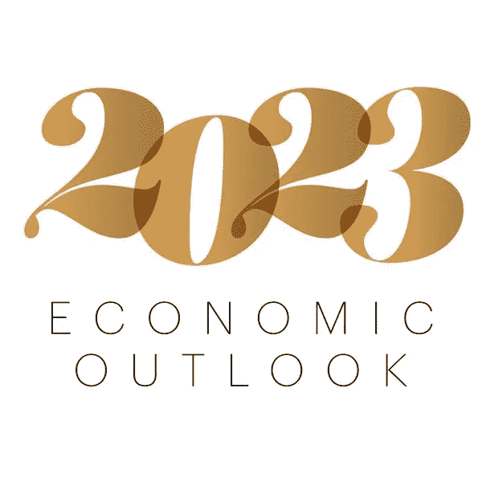

# 2023 年经济展望。现在是时候…

> 原文：<https://medium.com/coinmonks/the-2023-economic-outlook-now-is-the-time-to-4c4f71c5921b?source=collection_archive---------35----------------------->

google pictures

花旗全球财富投资公司:

"美国明年可能会陷入“温和”衰退，失业率将超过 5% . "

“随着失业率攀升至 5.25%，预计 2023 年美国经济可能会失去 200 万个工作岗位。”

“我们认为，美联储加息和缩减债券投资组合的力度已经足够大，足以引发一场…