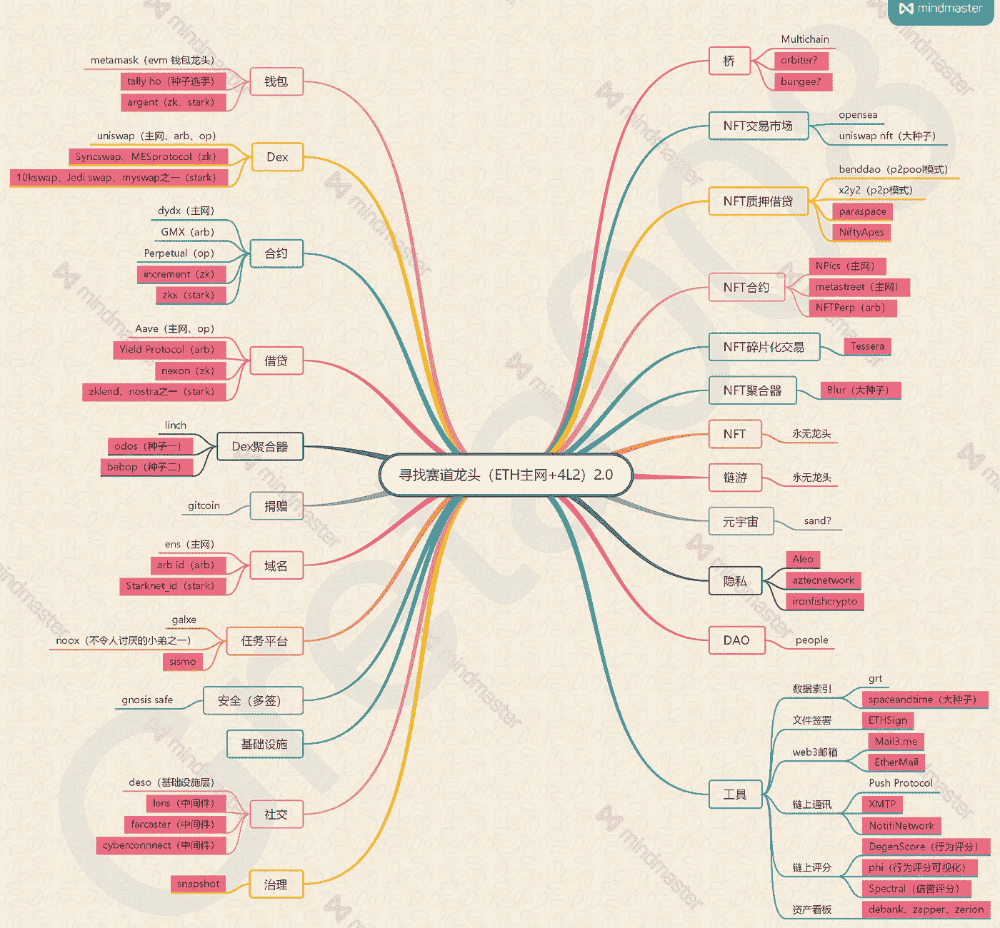
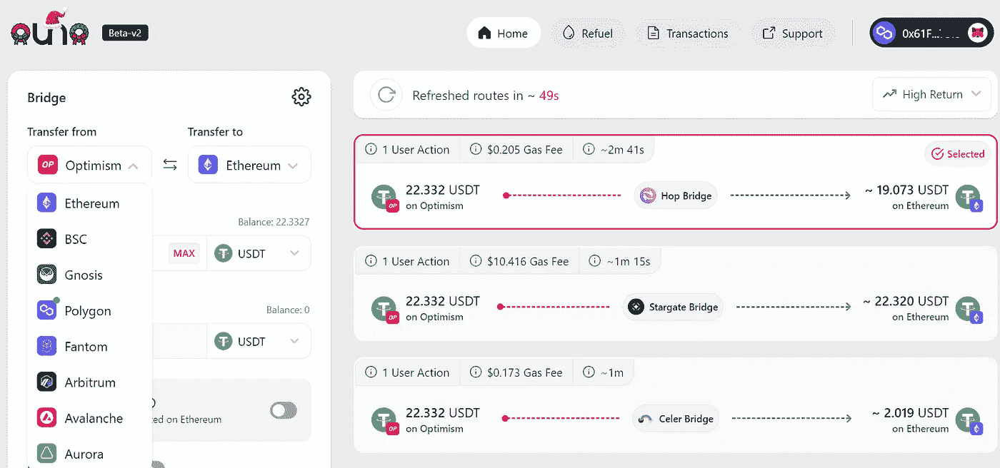
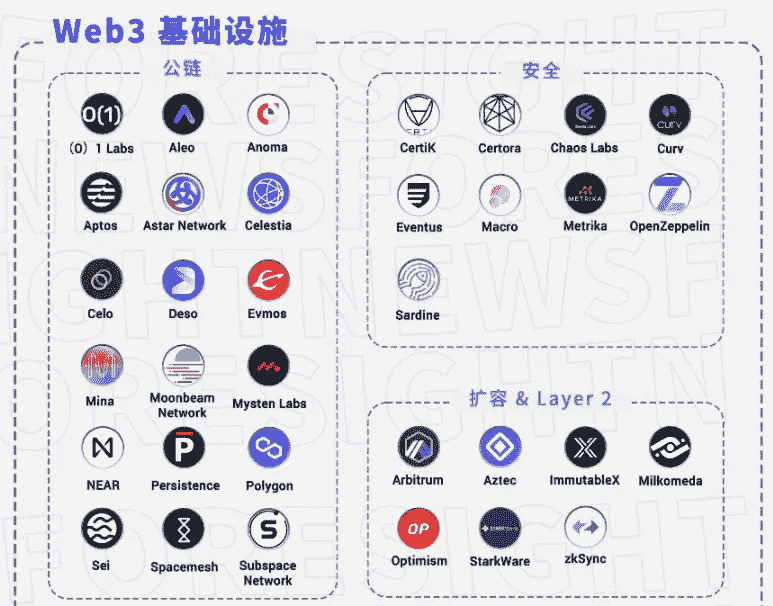
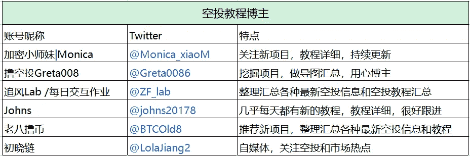

# 2023 年不能错过的 24 个赛道领先项目

> 原文：<https://medium.com/coinmonks/the-24-track-leading-projects-that-cannot-be-missed-in-2023-8d665585e5db?source=collection_archive---------6----------------------->

最近关注了一个空投大亨，他非常用心的整理了未发行曲目的龙头项目，包括道、Defi、Dex、、social 等 24 个曲目，以及近百个不同的项目。

当然，这个“赛道领袖”是她总结出来的。继续互动，看项目，总结综合数据，都是很好的参考。

The leading projects of each track organized by a certain player

比如钱包赛道除了 Metamask，Argent 最近也很火。刷 ZK 和 Starknet 互动的时候，用的是 Argent。

在社交赛道上，镜头社区很受欢迎，有很多生态项目。已经制作了近 100，000 个 NFT 项目透镜协议轮廓的 NFTs

> 交易新手？在[最佳密码交易所](/coinmonks/crypto-exchange-dd2f9d6f3769)上尝试[密码交易机器人](/coinmonks/crypto-trading-bot-c2ffce8acb2a)或[复制交易](/coinmonks/top-10-crypto-copy-trading-platforms-for-beginners-d0c37c7d698c)

另外，蹦极用起来真的很方便。几秒钟到账，手续费可以接受。

目前支持 ETH、BSC、Polygon、OP 等 9 个网络相互交叉链接；以后跨链不用回交易所，省时省力。

Cross-chain platform Bungee

熊市漫长，谁也不知道短时间内会跌多少。尽管它对长期持乐观态度，但它必须度过低迷时期。只有在熊市做足功课，才能在牛市中有所收获。这可能是一个了解这个行业的好时机。

比如也可以多关注 ForesightNews 整理的各大机构投资的赛道项目。了解大型机构如何规划未来市场，优化投资方向和玩法。

下图显示了 coinbase ventures 投资的 web3 基础设施，包括 Aptos、Sei 和 Celo 等公共链，以及 Arbitrum、乐观和 StarkWare 等 L2 项目。

其中 Aptos 已经在 10 月空投了，其他的都是最近流行的刷互动。

web3 project invested by coinbase

滑动交互不一定有 airdrop 结果。在过程中了解不同的项目，可以帮助你更好地了解区块链不同的赛道和不同功能的产品，这也是一种深入行业的方式。

Twitter 上有很多做空投教程的博主。有的博主深挖有价值的项目，或者第一时间关注空投机会，稳步积累。

楚小莲最近也在做互动。我跟随了几个教程，获得了一些成果。比如借贷、聚合器、治理、桥接、DAO、基础设施、任务平台等玩法。更清晰。

贷款项目中的基本交互包括交换、质押、流动性和合同等操作；在社交赛道上，了解新社交方式的可能性；

通过桥接平台，可以直接跨链转移资金，无需回到交易平台；还有各种 web3 工具平台，有工具真的方便很多。

Some bloggers who do airdrop tutorials

我收获的第一个空投是 ENS，去年在做 gitcoin 活动，注册了。eth 域名。没想到捐赠的项目没有一个有空投，反而花了 200 美元；但后来收到了 138 个 ENS 空投，并以 6000 美元的价格出售。这是一个意外的收获。

在世界上，互动不一定有直接的结果，但在体验项目中，可能是无意的。

Harvest ENS airdrop

当然，更有可能的是完成所有的交互测试，不空投，但是要交油费；很有可能，辛苦的项目还不如在 BTC 的固定投资。

加密市场充满了不确定性，没有必胜的方法，但是这个行业确实有很多机会。

对于从零开始，没有资源和资金的新手玩家来说，是一个学习和积累的平台。有不确定性才有可能收获很多。

以上只是我个人观点，没有投资建议。我是楚小莲，我正在关注元宇宙和 web3。

> 加入 Coinmonks [电报频道](https://t.me/coincodecap)和 [Youtube 频道](https://www.youtube.com/c/coinmonks/videos)了解加密交易和投资

# 另外，阅读

*   [如何在 Uniswap 上交换加密？](https://coincodecap.com/swap-crypto-on-uniswap) | [A-Ads 审核](https://coincodecap.com/a-ads-review)
*   [加密货币储蓄账户](/coinmonks/cryptocurrency-savings-accounts-be3bc0feffbf) | [YoBit 评论](/coinmonks/yobit-review-175464162c62)
*   [Botsfolio vs nap bots vs Mudrex](/coinmonks/botsfolio-vs-napbots-vs-mudrex-c81344970c02)|[gate . io 交流回顾](/coinmonks/gate-io-exchange-review-61bf87b7078f)
*   [CoinFLEX 评论](https://coincodecap.com/coinflex-review) | [AEX 交易所评论](https://coincodecap.com/aex-exchange-review) | [UPbit 评论](https://coincodecap.com/upbit-review)
*   [AscendEx 保证金交易](https://coincodecap.com/ascendex-margin-trading) | [Bitfinex 赌注](https://coincodecap.com/bitfinex-staking) | [bitFlyer 点评](https://coincodecap.com/bitflyer-review)