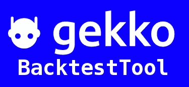

# 3 个最好的免费加密交易机器人(2022)

> 原文：<https://medium.com/coinmonks/the-3-best-free-crypto-trading-bots-2022-eb5e80c4e4c6?source=collection_archive---------11----------------------->

Photo by [m.](https://unsplash.com/@m_____me?utm_source=medium&utm_medium=referral) on [Unsplash](https://unsplash.com?utm_source=medium&utm_medium=referral)

人们已经厌倦了订阅。当这个月结束时，你必须支付你的网飞、亚马逊 Prime、迪士尼+和其他一切费用，你无法想象还要再增加一笔费用。所有这些都会很快堆积起来——即使你是一名密码交易员。

但是交易者仍然需要额外的工具来竞争和盈利交易——比如加密交易机器人。如果你想探索自动化交易而不付费订阅，你仍然可以在免费加密交易机器人的帮助下这样做。

在这篇文章中，我将解释什么是交易机器人以及它们是如何工作的。你还会发现如何选择最好的加密交易机器人，并阅读免费版的 3 个最好的机器人。

# 什么是加密交易机器人？

加密交易机器人是交易员用来部署和执行自动化交易策略的特殊工具。由于波动性和竞争的增加，金融市场需要自动化。机器人提供了有利可图的交易优势，这也是为什么它们需求量很大的原因。

交易机器人节省时间，比普通市场参与者执行交易更快，交易更精确。作为唯一的全天候市场，加密货币交易受益于交易自动化。

熟练的开发人员可以利用他们的编码知识开发自己的密码交易机器人。不具备所需技术知识的零售用户被迫依赖第三方软件。

许多交易机器人需要按月或按年订阅。你可能有机会接触到一个演示来测试这个平台，但是你不能测试这个平台足够长的时间来看看你是否喜欢它。然而，一些加密交易机器人是免费的——尽管它们的功能非常有限。

# 免费的加密交易机器人有用吗？

是的，加密交易机器人的工作和做他们的工作。但是请记住，他们的成功率受到市场条件和你自己的交易技巧的严重限制。

交易机器人和其他算法一样，只做被告知要做的事情。机器人背后并没有疯狂的魔力让它们比人工交易更好。但是你将得到的最低保证回报是节省时间。

重要的是要记住，尽管它们是自动化的，但加密机器人仍然需要某种程度的管理。你不能简单地运行你的交易策略而不进行监控或调整。你需要积极主动才能保持盈利。

自动化只能到此为止。确认你的策略实际上是有利可图的，然后再使用免费的加密交易机器人。

# 如何选择最好的加密交易机器人

当选择一个好的加密交易机器人时，你应该记住某些指标和特征——第一个是**安全性**。

机器人安全吗？是由信誉好，值得信赖的公司开发的吗？平台有没有经历过被利用？这些只是你在检查机器人时应该问自己的一些问题。

接下来，你要考虑交易机器人软件本身。搜索社交媒体页面，寻找关于**停机**和**服务器停机**的报道。如果机器人不稳定，你也可以放弃它。一个不能 24/7 运行的 24/7 交易自动化软件的目的是什么？

**连通性**是另一个问题。确保机器人支持您的交换。这不应该是一个大问题，因为大多数机器人都具有与大多数高流动性交易所集成的功能。你不太可能在连接上遇到麻烦——除非你在 b 层交易所交易。

最后但同样重要的是，搜索带有**免费试用的机器人。在你承诺花钱购买一个机器人之前，试用它是很重要的。很多机器人允许你免费试用，这是一件很棒的事情！**

# 最好的免费密码交易机器人是什么？

现在终于是时候看看 2022 年最好的加密交易机器人了，看看是什么让它们如此特别。本文中回顾的机器人包括:Gekko、Quadency 和 Shrimpy。

请记住，机器人没有任何特定的排名顺序。

# 盖柯

Gekko 是一个完全免费的开源加密交易机器人。该机器人在 Github 上有着令人难以置信的高评级，是开发人员最受欢迎的机器人之一。该机器人是用 javascript 编写的，允许用户绘制图表、自动交易和回溯测试任何交易策略。

该交易机器人具有预制的交易策略，您可以使用这些策略来交易比特币。这些战略基于技术指标，包括:

*   DEMA
*   MACD
*   聚苯醚（Polyphenylene Oxide 的缩写）
*   RSI
*   斯托赫西
*   CCI
*   塔利卜-麦克德
*   郁金香-macd
*   多+130 个指标

如果你有所需的技术知识和交易经验，你可以通过 Gekko 编写自己的机器人。您还可以创建一个利用多个指标的策略。

Gekko 还能让你利用实时交易数据，用你的策略进行纸上交易——但用的是假钱。

根据创始人的说法，Gekko 不是为更高时间框架(HTF)交易或高频交易而建的。造物主是这样说的:

> *Gekko 是一款免费的开源工具，旨在为加密市场的自动化交易提供一个入门套件。Gekko 的目标是低门槛地编写自己的策略。*

关于 Gekko 最好的事情是它广泛的文档和活跃的社区。然而，虽然您仍然可以使用 Gekko，但问题是作者已经放弃了 bot，以便从事其他项目。盖柯从 2020 年开始就没有被作者更新过。

优点:

*   易于设置
*   简约的用户界面
*   具有预先构建的交易策略
*   该机器人的所有方面都有清晰的文档记录

缺点:

*   需要一些脚本和编码知识才能使用
*   它不再处于活跃的开发阶段
*   没有提供足够的回溯测试信息

# 四元制

[**Quadency**](https://quadency.com/) 代表了市场上最著名的加密交易机器人之一。Quadency 是一个为所有技能水平的投资者设计的交易平台。它让你只需点击几下就可以将你的交易所账户连接到应用程序，之后你就可以探索和使用几十个机器人和交易自动化功能。

Quadency 为您提供 1500 多种加密货币的访问权限，您可以从一个易于使用的仪表板中管理这些货币。还值得一提的是，该交易所与许多高交易量的交易所合作，如币安、OKX 和 Kucoin。这意味着你永远不会遇到任何流动性问题。

该机器人具有许多基于指标的自动交易功能。一些最受欢迎的机器人包括:

*   多级 RSI
*   布林线
*   MACD
*   平均值回复
*   蓄电池

此外，Quadency 还提供网站平台和手机应用程序。该移动应用程序支持 iOS 和 Android。您可以连接币安、Bittrex、北海巨妖、Kucoin、币安美国、Bitfinex、HitbBTC 和 Poloniex 等交易所。

别忘了，你可以免费试用 Quadency。探索他们的机器人选择，并了解 Quadency 如何使加密货币交易成为无缝体验。

# 多虾的

[**Shrimpy**](http://shrimpy.io/) 是一个自动化的投资组合管理平台，专门从事投资组合再平衡。再平衡是一种投资者出售和购买资产的行为，目的是让他们的配置回到原来的价值。

该策略使投资者能够从表现良好的资产中获利，并将资金再投资于现有资产。目标是高卖低买。它还使人们能够通过降低风险资产的暴露程度来有效地管理风险。

除了重新平衡之外，Shrimpy 还提供了以下特性

*   美元成本平均法
*   投资组合自动化
*   投资组合止损
*   复制交易
*   定制指数基金
*   回溯测试
*   多交换管理

Shrimpy 以其与各种加密交换和加密钱包的广泛连接而闻名。该机器人支持 30 多个交易所和非托管钱包。这使得 Shrimpy 成为那些希望从一个地方管理多个投资组合的人的一个很好的选择。

您可以通过测试他们的[免费演示来试用 Shrimpy。](https://dashboard.shrimpy.io/demo)该演示允许您测试上述所有功能。

优点:

*   极大地简化了投资组合管理。
*   允许你复制主要投资基金的交易组合。
*   让您连接冷钱包和热钱包。
*   具有高效的再平衡机器人

缺点:

*   没有交易终端。
*   目前不提供移动应用程序

# 结论:加密机器人物有所值吗？

加密交易机器人提供了一种简单易行的方法来管理您的投资组合，并通过自动化交易策略交易加密货币。他们帮助您准确地执行交易，在您离线时进行交易，并通过完成多余的任务来节省时间。

交易机器人并不是一个神奇的工具，仅仅通过自动化就能提高你的盈利能力。无论你是手动交易还是自动交易，盈利的前提是一个好的交易策略。没有一个，你注定要吃亏。

如果你有交易获利所需的技术知识和交易经验，加密机器人是值得的。你必须监控你的机器人的性能，并做出调整，以保持与其他市场参与者的竞争力。

机器人提供的最大特点是回溯测试。你可以在用真正的资本在市场上部署策略之前对其进行回溯测试。回溯测试允许你在使用策略之前分析它，避免不必要的损失。

如果你想节省时间，执行精确的交易，交易加密 24/7，加密交易机器人是最好的工具。但是请记住:如果没有一个有利可图的战略，你就不能使用机器人。

# 关于我们

Shrimpy 是一个自动化的投资组合管理平台，通过使用简单直观的应用程序帮助加密货币投资者管理他们的资本，借助自动化的力量节省时间和金钱。

要了解我们平台的更多信息，并了解它如何帮助您开启加密之旅，请随时访问我们的 [**主网站。**](https://www.shrimpy.io/)

我们还在 [**虾米学院**](https://academy.shrimpy.io/) 和 [**Youtube**](https://www.youtube.com/channel/UCcT9S2PBM70Ly14SZ6VdSHg) 为群众提供免费的区块链教育。

> 加入 Coinmonks [电报频道](https://t.me/coincodecap)和 [Youtube 频道](https://www.youtube.com/c/coinmonks/videos)了解加密交易和投资

# 另外，阅读

*   [Bookmap 评论](https://coincodecap.com/bookmap-review-2021-best-trading-software) | [美国 5 大最佳加密交易所](https://coincodecap.com/crypto-exchange-usa)
*   [如何在 FTX 交易所交易期货](https://coincodecap.com/ftx-futures-trading) | [OKEx vs 币安](https://coincodecap.com/okex-vs-binance)
*   [CoinLoan 评论](https://coincodecap.com/coinloan-review) | [YouHodler 评论](/coinmonks/youhodler-4-easy-ways-to-make-money-98969b9689f2) | [BlockFi 评论](https://coincodecap.com/blockfi-review)
*   [XT.COM 评论](https://coincodecap.com/profittradingapp-for-binance) | [币安评论](https://coincodecap.com/xt-com-review)