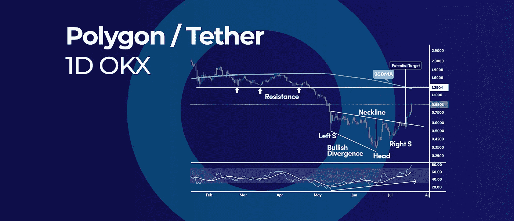
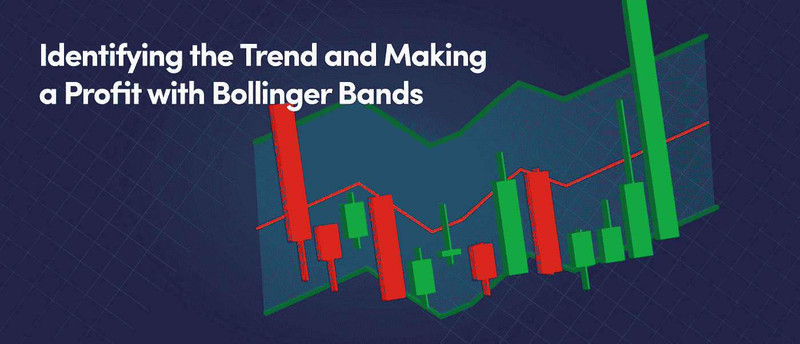

# 帮助发现底部的 3 个信号|以及本周的加密更新。

> 原文：<https://medium.com/coinmonks/the-3-signals-to-help-spot-a-bottom-and-more-in-this-weeks-crypto-update-7435e17f64ee?source=collection_archive---------20----------------------->

This Weeks Crypto Update

*   多边形逆 H&S 模式需要反转
*   比特币可以测试 3 万美元的 3 个原因
*   技术分析 101:帮助发现底部的 3 个信号

# 多边形逆 H&S 模式需要反转

Polygon Inverse H&S Pattern Calls For a Reversal

polygon(MATIC)的看涨图表模式可能指向 1.2 美元，这意味着加密货币的价格可能几乎翻倍。然而，日线图的反向头肩形态通常预示着先前趋势的反转。

## 反向头肩模式

反向头肩顶形态是看涨信号。价格形态在 0.50 美元的低点印刷了左肩，而头部在 0.31 美元的低点印刷。从这里开始，右肩上涨至 0.41 美元。

事实上，我们有一个巨大的分歧之间的左肩和头部是另一个积极的迹象，有利于头部和肩部模式。

## 什么是逆头肩底形态？

反向头肩形态是一种图表形态，它预示着趋势方向的潜在反转。该图案由三个不同的峰组成，中间的峰最高，两个外侧的峰较低。“肩膀”通常是等高的。这种形态发生在资产价格由低变高和由高变低的时候，被认为是看涨信号。

## H&S 价格目标

通常，H&S 形态的利润目标是形态的高度(头部和颈线之间的距离)加上突破价格。因此，只要我们在该模式的颈线上方交易，1.2 美元的目标就可以对加密货币发挥作用。

1.2 美元的目标也几乎完全符合 200 天移动平均线，这有可能限制反弹。

与此同时，RSI 振荡器开始花更多的时间在 50 的中间水平之上，这对于看涨的价格场景是令人鼓舞的。

# 比特币可以测试 3 万美元的 3 个原因

3 Reasons Why Bitcoin Could Test $30,000

比特币(BTC)已升至一个月来的最高价格，经历了一轮轻松的反弹，有可能变成更实质性的东西。让我们探讨支持看涨情况的 3 个关键技术因素，以及是否有可能再次测试 30，000 美元。

## 布林线挂钩

当两条布林线指向相反的方向时，布林线的勾形通常是大幅上涨的信号。当价格沿着上带爬行时，我们可以期待一个持续的向上运动。

在 5 月初和 6 月，我们有一个类似的信号，但当时 BTC 的价格正沿着较低的波段爬行，这导致价格下降。

## 什么是布林线挂钩？

布林线挂钩是一个技术指标，可以用来识别市场中潜在的反转点。它是通过在图表上画两条线来创建的。上线通常是 20 日均线以上两个标准差，下线是 20 日均线以下两个标准差。当一种资产的价格达到布林带上轨时，被认为是超买，当它达到布林下轨时，被认为是超卖。

在我们的[博客](https://www.cryptohopper.com/blog/4976-crypto-trading-101-identifying-the-trend-and-making-a-profit-with-bollinger-bands)中阅读更多关于布林线的信息。

## 楼梯踏步模式已损坏

比特币还试图逆转当前熊市周期中形成的阶梯模式。基本上，阶梯形态是随着下跌趋势发展的，因为价格在下跌前会横盘几天。

上一次盘整的价格区间可以用来预测下一个可能的目标。在我们的案例中，测量的移动目标可以在 28，500 美元左右完成。

## RSI 振荡器

就动量读数而言，RSI 振荡器已攀升至 4 月以来的最高读数，同时，我们突破了 50 的中间水平，这是一个积极的价格发展。

比特币的价格仍有一座大山要爬，但一旦 22，400 美元的阻力位被清除，我们前面的阻力很小甚至没有。下一个真正的阻力位只有在 28，000 美元，之前的阶梯底部。

展望未来，30，000 美元的目标是一个很大的心理水平，如果看涨势头继续下去，比特币有可能再次贴上标签。

# 技术分析 101:帮助发现底部的 3 个信号

Technical Analysis 101: The 3 Signals to Help Spot a Bottom

在技术分析中，三个标准信号会帮助你发现底部，这样你就可以低买高卖。虽然没有交易者或投资者可以 100%确定地预测底部，但一些标准的技术信号出现在即将触及底部的加密货币中。

## 什么是技术分析？

技术分析是交易者用来帮助预测证券未来价格变动的工具。它基于这样一个前提，即价格在趋势中运动，并且这些趋势可以被识别和利用。技术分析师使用图表和其他工具来寻找可能表明价格走向的模式。技术分析师最常用的一些信号是移动平均线，支撑位和阻力位，以及动量指标。

## 信号#1 音量增大

交易量的回升是我们即将触底的首批重要迹象之一。可惜写的时候，比特币交易量还是低迷在低平均值。

价格和成交量是市场结构的基石，当交易活动在持续下跌后开始回升时，这是我们可能触底的迹象。

## 信号#2 销售高潮

在价格图表上，当下跌趋势突然逆转时，可以很容易地识别出卖出高潮。

通常，下跌趋势在长时间的移动后会自然耗尽，通常以高潮抛售事件结束。抛售高潮往往伴随着过度的悲观情绪。

## 当坏消息被市场忽视时，信号 3

一个被忽视的迹象是，当价格开始忽略负面消息时，加密货币即将触底。当负面消息冲击市场时，自然趋势是价格下跌。然而，当这种行为不再可见时，它标志着市场情绪的根本转变。

有句老话说:“牛市忽略坏消息，任何好消息都是进一步反弹的理由。”

## 我们还写了一篇博客，内容是:如果你是一个完全的初学者，如何阅读密码图表？

在技术分析中，使用蜡烛图进行交易是必须学习的技能。蜡烛图可以帮助我们确定进场，出场，趋势的方向和强度，反转等等。

点击此处阅读博客。

订阅我们的媒体每周博客和更新。
在推特[上关注我们](https://twitter.com/cryptohopper) | [脸书](https://www.facebook.com/cryptohopper)|[Reddit](https://www.reddit.com/r/CryptoHopper/)|[insta gram](https://www.instagram.com/cryptohopper/?hl=nl)

在 [Cryptohopper](https://www.cryptohopper.com/) 开始交易！

> 交易新手？尝试[加密交易机器人](/coinmonks/crypto-trading-bot-c2ffce8acb2a)或[复制交易](/coinmonks/top-10-crypto-copy-trading-platforms-for-beginners-d0c37c7d698c)