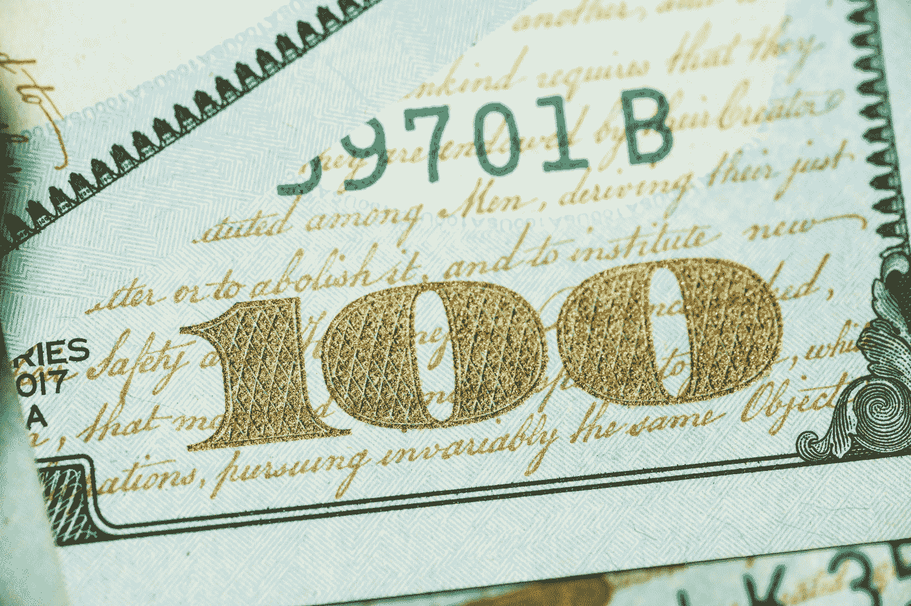

# 尽快投资 4 只最佳 ETF

> 原文：<https://medium.com/coinmonks/the-4-best-etfs-to-invest-in-asap-a1b35ed958c4?source=collection_archive---------23----------------------->

## 自 2022 年初以来，标准普尔 500 下跌了 16%以上。而且我们非常接近进入 ***熊市*** 的领地。

Photo by [Giorgio Trovato](https://unsplash.com/@giorgiotrovato?utm_source=medium&utm_medium=referral) on [Unsplash](https://unsplash.com?utm_source=medium&utm_medium=referral)

此外，美国经济在今年第一季度略有收缩，国内生产总值下降了-1.4%。