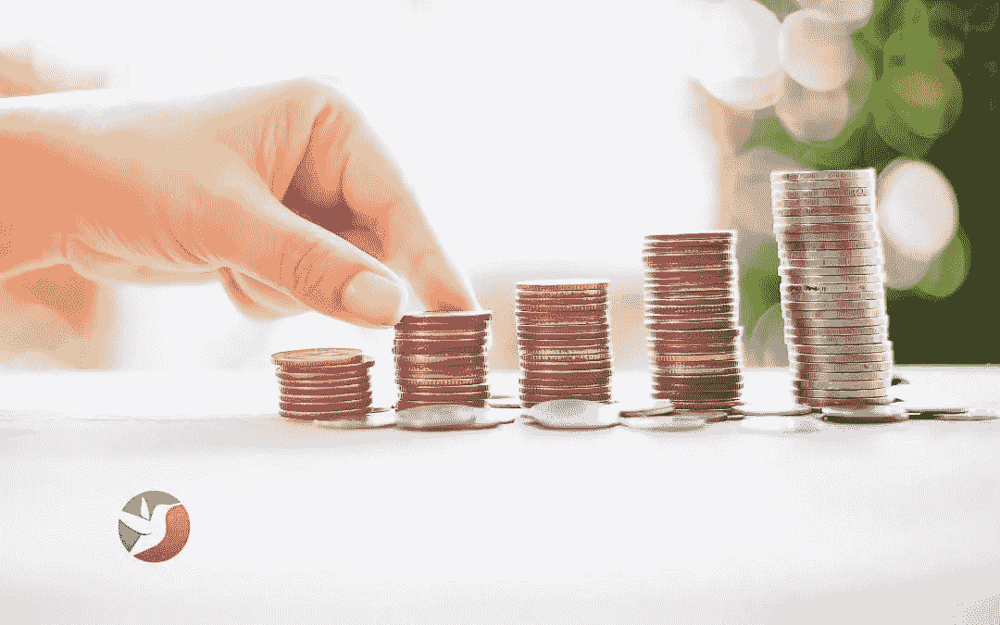
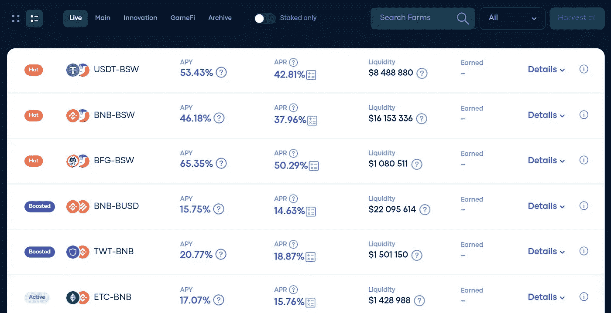
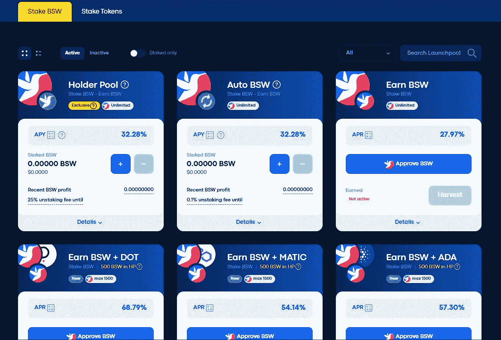
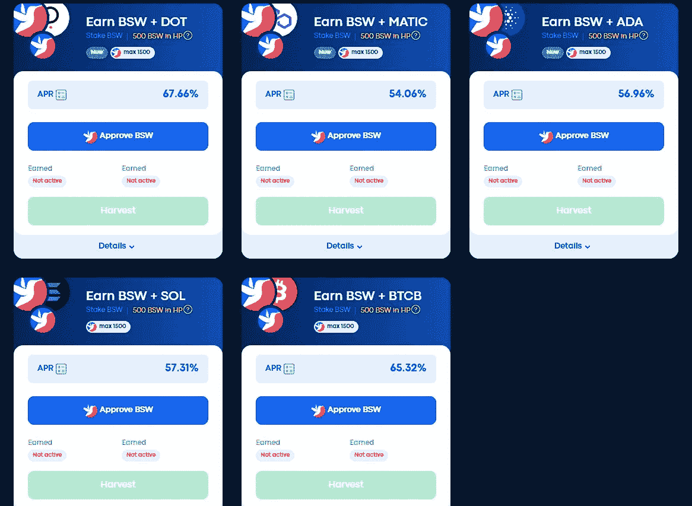
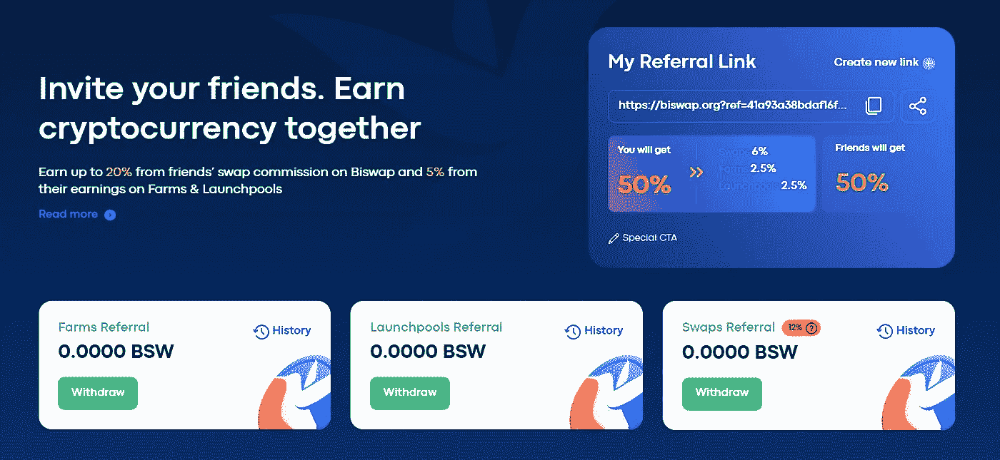
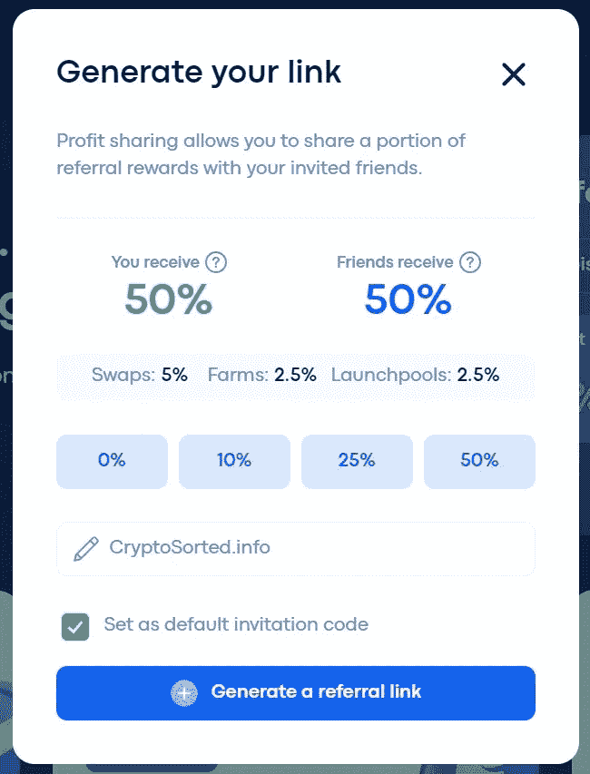
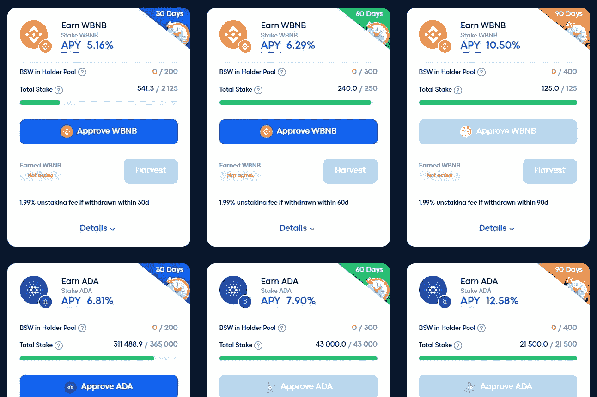

# Biswap 上的 4 个有利可图的被动收入机会

> 原文：<https://medium.com/coinmonks/the-4-lucrative-passive-income-opportunities-on-biswap-27719fce94cd?source=collection_archive---------62----------------------->

扩大加密组合的最佳方式是让现有资产发挥作用。

所以，当你努力增加收入的时候，你已经赚到的钱也在增长和增值。

为你工作的钱越多，你为增加财富而工作的时间就越少。

这就是为什么我想分享一个最好的平台，在那里你可以让你的密码发挥作用，并每天赚取被动收入。

Biswap 是 BNB 智能链(BSC)上的第二大 DEX，是所有 DEX 中费用最低的。

*如果这是你第一次听说* [*Biswap*](https://biswap.org?ref=e1c115c1b7975b28a3db) *，你可以在这里* *阅读我的项目回顾了解更多。*

解决了这个问题，让我们来探索在 [Biswap](https://biswap.org?ref=e1c115c1b7975b28a3db) 上赚取被动收入的不同方法。

# Biswap 上 4 个有利可图的被动收入机会

下面是在 Biswap 上获得被动的 4 种简单而有利可图的方法。

1.  [Biswap 农场](#h_660419630351659080972168)
2.  Biswap Launchpools
3.  [Biswap 多类型转诊计划](#h_877906781641659097091835)
4.  [Biswap 固定桩](#h_7163719132641653072771550)

# 1.比斯沃普农场

Biswap 农场允许你用你的流动性提供者(LP)代币来赢取 BSW。

这是一种激励流动性提供者的方式，鼓励他们向平台上选定的交易对提供流动性。

截至今天(2022 年 7 月 28 日)，Biswap 上大约有 80 个不同的农场，都有非常有利可图的 APR。

要从这些 Biswap 农场中获利，您需要向相应的池中提供流动性，并相应地下注您的 LP 令牌。

你将从流动资金池的交易活动中赚取费用，并从农场中赚取 BSW。

在 [Biswap 农场](https://biswap.org/farms?ref=e1c115c1b7975b28a3db)上没有自动复利，所以你必须手动获得你的 BSW 奖励，然后出售或添加到流动资金池中复利。

# 2.Biswap 启动池

Biswap Launchpools 允许您下注一个代币，以赢取更多相同或额外的代币。

Biswap 上有两个不同的 Launchpools。

1.  赌注 BSW 启动池
2.  赌注代币启动池

让我们来看看下面的每个启动池。

## 1.BSW 发起的赌注

BSW 赌注启动池允许您对 BSW 下注，以赚取更多的 BSW 或 BSW +其他支持的代币，有或没有自动复利。

在 Stake BSW 启动池下有 4 种不同类型的池:

1.  [BSW 持有者池](#h_5443512976981653058900008)
2.  [BSW 自动配料池](#h_33467191101659096261727)
3.  [BSW 非混合池](#h_9271577171659096270655)
4.  [BSW 赚取 BSW 的赌注+其他代币池](#h_283643488231659096279257)。

下面就来简单解释一下。

**1。BSW 持有者池**

Biswap 持有人池允许您下注 BSW 以赚取更多 BSW，每 5 分钟自动复利。

此外，在这方面下注 BSW 将为您提供独家特权，例如:

*   参与 IDO 和 NFT Launchpads(购买新代币或在 Biswap 上发布的 NFTs)。
*   根据您下注的 BSW 金额，赚取更高的掉期推荐奖励(12%-20%)。
*   参加 Biswap NFT 游戏
*   Biswap 多重奖励池的股份。
*   对 Biswap 治理提案进行投票。

…以及将来会添加的其他功能。

当您第一次在持有人池中下注或向现有赌注中添加更多 BSW 时，您的代币将被锁定 90 天。

在此期间，你不能撤回它，除非你愿意支付 25%的提前拆箱费。

因此，在你把你的 BSW 放入持有者池之前，确保你在前三个月内不会需要它。

2.BSW 自动配料池

此工具允许您下注 BSW 代币以赚取更多 BSW，每 5 分钟自动复利。

这与上面讨论的 BSW 持有者池相同，但没有最初的 90 天固定赌注期或特权。

您可以随时从池中提取代币，但如果您在前 72 小时内提取代币，将收取 0.1%的提前退押费。

BSW 自动复合池也具有与持有者池相同的 APY。

3.BSW 非复合池

这个池允许你的股份 BSW 赚取更多的 BSW 没有自动复利。

如果你想定期收获和出售你的奖励作为获利策略，这个池是很好的。

您也可以随时使用页面上的手动复合按钮将您的奖励添加到赌注余额中。

这个资金池没有特权、锁定期或提前提款费。所以你可以随时下注或下注你的代币。

4.BSW 赢得 BSW +其他代币池的股份

目前，有 5 个活跃的池，你可以下注 BSW 赢得 BSW +其他代币，如点，MATIC，ADA，SOL，BTCB 等。

# 3.Biswap 多类型转诊计划

Biswap 是第一家实施多类型推荐计划的 DEX，在该计划中，您可以推荐您的朋友并获得 BSW。

目前，您最多可以获得:

*   20%的推荐交易或掉期费用，取决于你在 [BSW 持有者池](#h_5443512976981653058900008)中下注的 BSW 金额。
*   5%的推荐[农场](#h_660419630351659080972168)和 Launchpools 奖励。
*   他们在 NFT 赢得的 3%的奖金，
*   他们购买彩票的 2%。

下面是根据你在 BSW 持有人池中下注的 BSW 的数量，你将从推荐交换费用中得到的细分。

*   0–199 BSW 赌注，你赚取 10%的介绍费。
*   200-999 BSW 赌注，你赚取 12%的介绍费。
*   1，000–2，999 BSW 赌注，您将获得 14%的推荐佣金。
*   3，000–6，999 BSW 赌注，你赚取 16%的推荐佣金。
*   7，000–9，999 BSW 赌注，你赚取 18%的推荐佣金。
*   10，000+ BSW 押上你赚的 20%的介绍费。

Biswap 推荐奖励从分配给推荐计划的每日 BSW 区块排放量的 4.3%中支付。

当您邀请的朋友通过您的推荐链接连接到 Biswap 时，您可以与他们分享您的推荐奖励。

例如，在生成您的推荐链接时，您可以选择与他们分享 10%、25%或 50%的推荐奖励，如下所示。

> *如果您* [*使用此推荐链接*](https://biswap.org?ref=e1c115c1b7975b28a3db) *，连接 Biswap，您将获得我 50%的推荐奖励。*

作为一名热情的 Biswap 推广者，如果你加入他们的[太空代理计划](https://biswap.org/space_agents) (SAP)，你可以赚得更多。

例如，这篇文章提交给该计划，除了您的推荐佣金之外，还有机会在 BSW 赢得高达 1500 美元的奖金。

# 4.Biswap 固定桩

Biswap [固定赌注](https://biswap.org/fixed_staking?ref=41a93a38bdaf16fdd8c5)功能允许您在固定期限(30 至 90 天)内下注其他代币，以赢取相同的代币。

目前，有一个固定的赌注池，如 BNB，阿达和多汁 APYs 点优质硬币。

Biswap fixed staking 是那些在[持有者池](#h_5443512976981653058900008)中已下注所需 BSW 量的人的专属功能。

每个固定赌注池都有它自己的所需 BSW 金额，你必须在持有者池中下注才有资格获得。

例如，你需要持有 200、300 和 400 BSW 才能分别持有 BNB 30、60 和 90 天。

这同样适用于 ADA 和 DOT 固定桩。

Biswap 声称是在 BSC 上实现这一独有的固定赌注特性的 DEX。

# 用 Biswap 连接

想了解更多？

然后加入 Biswap 社交媒体和当地社区

*   [网站](https://biswap.page/home)
*   [社区](https://biswap.page/community)

# 结论

Biswap 是我热衷的少数几个项目之一，因为它有创新的赚钱机会，充满活力的社区，以及有能力和忠诚的团队。

该平台的交易费用在所有 dex 中也是最低的，并在 BSW 向您返还高达 70%的费用。

此外，Biswap 仅在其[农场](https://biswap.org/farms?ref=e1c115c1b7975b28a3db)、[启动池](https://biswap.org/pools/stake_bsw?ref=e1c115c1b7975b28a3db)和[固定赌注池](https://biswap.org/fixed_staking?ref=e1c115c1b7975b28a3db)中推广高级代币。

因此，将你的投资组合只暴露给市场上最好的代币或项目，帮助你在自动驾驶上增加你的财富。

然而，请注意，像加密中的所有东西一样，存在被黑客攻击、利用等固有的风险，并且只投资你觉得舒服的东西。

*最初发布于 2022 年 7 月 29 日*[*https://cryptosered . info*](https://cryptosorted.info/passive-income-opportunities-on-biswap/)*。*

> 交易新手？试试[加密交易机器人](/coinmonks/crypto-trading-bot-c2ffce8acb2a)或者[复制交易](/coinmonks/top-10-crypto-copy-trading-platforms-for-beginners-d0c37c7d698c)